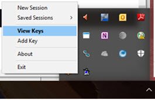
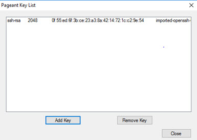
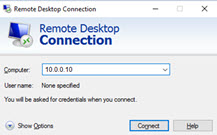
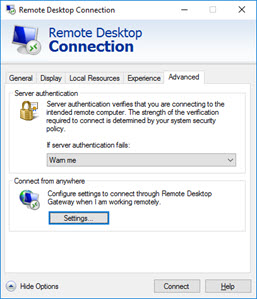
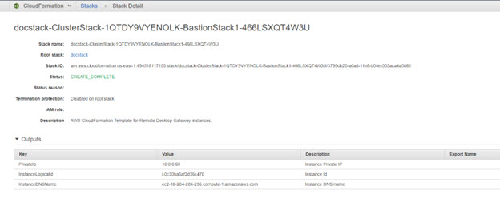
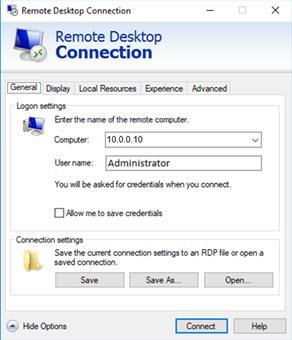

# RadiantOne Configuration

## RadiantOne Nodes Running on Linux

You can connect to any Bastion host running in any availability zone. Through the Bastion host, you can connect to and manage any RadiantOne node. The .pem file generated when you created the key pair in AWS must be converted to use it in your SSH session to connect to the Bastion. The following steps describe how to use Puttygen to convert .pem files to .ppk files on Windows clients.

1. Download PuTTY, Puttygen and Pageant.

2. Start Puttygen and select “Load”.

3. Select your .PEM file and click **Open**.

4. Click **OK** to exit the confirmation.

5. Select “Save Private Key”. A passphrase is not required but can be used if additional security is required. Puttygen converts the .PEM format to .PPK format.

6. After you convert the private key, close Puttygen and run Pageant (pageant.exe).

7. To import the PuTTY-formatted key into Pageant, right-click the Pageant icon in the System tray and choose “View Keys”.

    

8. The Pageant window shows the private keys Pageant is holding. Click “Add Key”.
9.  Select the .ppk and click Open. If your key is associated with a passphrase, you are prompted to enter it.

    

10. Click Close in the Pageant Key List window.
11. Run C:\"Program Files"\PuTTY\plink.exe -l ec2-user -N -L 7070:10.0.0.10:7070 -L 8089:10.0.0.10:8089 `<ec2DNSname>`

    >[!warning]
    >All Linux instances configured with the Cloud Formation Templates are using the ec2-user account EXCEPT for CentOS which is using centos. Use the DNS name of the bastion server for the `<ec2DNSname>` in the command.

From your local machine, access the control panel on the RadiantOne node.
E.g. [http://localhost:7070/main/login](http://localhost:7070/main/login)

## RadiantOne Nodes Running on Windows

The steps in this section describe how to configure a Remote Desktop Connection to the Remote Desktop Gateway.

1. Open Remote Desktop Connection. It should be installed by default on any Windows computer.

2. Enter the computer name (or IP address) of the RadiantOne node.

    

3. Click **Show Options**.

4. On the Advanced tab, click **Settings**.

    

5. Click **Use these RD Gateway server settings**.

    

6. For Server Name, enter the address of the gateway instance (e.g. ec2-18-204-206-236.compute-1.amazonaws.com). You can view the instance DNS name in the AWS stack details for the bastion server. An example of the stack details is shown below.

    

7. Select the Logon method Ask for password.

8. Check Bypass RD Gateway server for local addresses.

9.  Uncheck the Use my RD Gateway credentials for the remote computer.

10. Click **OK**.

11. In General tab, provide the RadiantOne Computer name (or IP address) and User name (Administrator).

    

12. Click **Connect**.

13. After the remote desktop connection is established, launch a web browser and navigate to [http://localhost:7070](http://localhost:7070) to launch the Main Control Panel.

## Connecting to Data Sources On-Premises

The network configuration required for connectivity to your on-premises network is not handled by the Cloud Formation Templates. Contact your Network Administrator to configure the network between the AWS VPC and your on-premises network to ensure it complies with your corporate security policy. This would involve setting up a Customer Gateway, Virtual Private Gateway, and VPN connection.