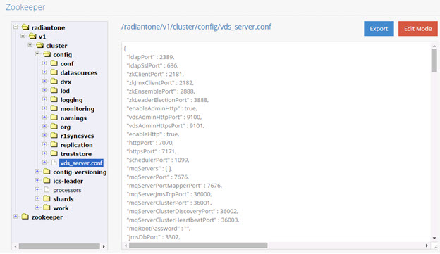
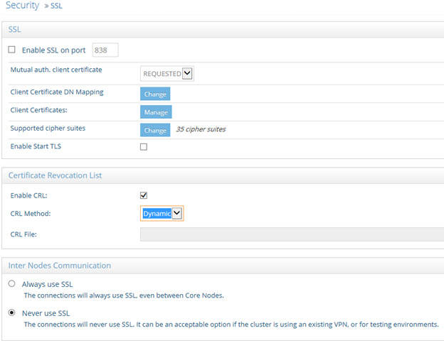

# Global Configuration Commands

Many properties can be modified manually from the Main Control Panel > Zookeeper tab (edit mode).



RadiantOne properties can also be defined on the Settings tab in the Main Control Panel.

This chapter explains how to display and set RadiantOne configuration property values using <RLI_HOME>/bin/vdsconfig instead of using the UI mentioned above.

## product-info

This command displays the product information for RadiantOne. This includes Product (name), Version, Build, Build-Id, Date (build date), RadiantOne home (install directory), License type, Licensed product, Licensed to, License expires (if temp license) and License ID.

**REST (ADAP) Example**
<br> The following example describes how to issue the request through ADAP.

```
https://<rli_server_name>:8090/adap/util?action=vdsconfig&commandname=product-info
```
## list-properties

This command displays the contents of the RadiantOne configuration.

**Usage:**
<br> `list-properties [-instance <instance>]`

**Command Arguments:**

`- instance <instance>`
<br> The name of the RadiantOne instance. If not specified, the default instance named vds_server is used.

**REST (ADAP) Example**
<br> In the following example, a request is made to display RadiantOne configuration information.

```
https://<rli_server_name>:8090/adap/util?action=vdsconfig&commandname=list-properties
```
## get-property

This command displays the value of a property in the RadiantOne configuration.

**Usage:**
<br> `get-property -name <name> [-instance <instance>]`

>**Notes – properties that contain a password value do not return with the get-property command. A message is returned indicating, “The property XXX contains a password and cannot be displayed.”

To list supported SSL cipher suites, use the list-cipher-suites command.

**Command Arguments:**

**`- name <name>`**
<br> [required] The name of the property. This is case sensitive, except for vdshttpPort and vdshttpsPort.
**`- instance <instance>`**
<br> The name of the RadiantOne instance. If not specified, the default instance named vds_server is used.

**REST (ADAP) Example**
In the following example, a request is made to display the RadiantOne service LDAP port number.

```
https://<rli_server_name>:8090/adap/util?action=vdsconfig&commandname=get-property&name=ldapPort
```
## set-property

This command sets the value of a property in the RadiantOne configuration.

**Usage:**
<br> `set-property -name <name> -value <value> [-instance <instance>] [-pwdfile <path to file>]`

>**Note – Updating properties containing a password value requires the super user (e.g. cn=directory manager) credentials. You are prompted to enter this password interactively. To pass the credentials in the command, use the - pwdfile flag. See the Examples section below. To set the current list of enabled SSL cipher suites, use the set-cipher-suites command.**

**Command Arguments:**

**`- name <name>`**
<br> [required] The name of the property. This is case sensitive, except for vdshttpPort and vdshttpsPort.

**`- value <value>`**
<br> [required] The value of the property. The value can be provided in a file. To indicate a file, use the following syntax: file:::/path/to/file. An example is shown below:

```
radiantone/vds/bin/vdsconfig.sh set-property -name virtualStaticGroupDNs -value file:::/home/files/dyngroup.txt
```

**`- instance <instance>`**
<br>The name of the RadiantOne instance. If not specified, the default instance named vds_server is used.

**`- pwdfile <full path to file>`**
<br>To pass the super user (e.g. cn=directory manager) credentials in a file instead of interactively in the command. To use, save the current password into a text file and then pass the full path to this file in the -pwdfile flag. This is only applicable when setting the value of a property that contains a password, as this requires the directory manager credentials. See examples below for more details.

## Examples

### REST (ADAP)

In the following example, a request is made to modify the LDAP port to 9999.

```
https://<rli_server_name>:8090/adap/util?action=vdsconfig&commandname=set-property&name=ldapPort&value=9999
```

### SSL

The SSL settings for RadiantOne can be defined in the Control Panel from the Settings tab, Security section, SSL.



This section explains how to display and set these property values using
<RLI_HOME>/bin/vdsconfig instead of using the UI mentioned above.

#### Enable SSL

```
C:\radiantone\vds\bin>vdsconfig.bat get-property -name enableSsl

C:\radiantone\vds\bin>vdsconfig.bat set-property -name enableSsl -value true
```

#### Change SSL (LDAPS) Port

C:\radiantone\vds\bin>vdsconfig.bat get-property -name ldapSslPort

C:\radiantone\vds\bin>vdsconfig.bat set-property -name ldapSslPort -value 639

#### Change Mutual Authentication

```
C:\radiantone\vds\bin>vdsconfig.bat get-property -name mutualAuthClientCert

C:\radiantone\vds\bin>vdsconfig.bat set-property -name mutualAuthClientCert -value
REQUESTED
```

>**Note - accepted values are NONE, REQUESTED, REQUIRED. Values are case-sensitive.**

#### Change Supported Cipher Suites

C:\radiantone\vds\bin>vdsconfig.bat get-property -name ciphersList

>**Note – if the ciphersList is empty the default ciphers included in the JDK are used.**

```
C:\radiantone\vds\bin>vdsconfig.bat set-property -name ciphersList -value
"SSL_DH_anon_WITH_RC4_128_MD5,SSL_DHE_DSS_WITH_3DES_EDE_CBC_SHA,SSL_
DHE_RSA_WITH_3DES_EDE_CBC_SHA,SSL_RSA_WITH_3DES_EDE_CBC_SHA,SSL_RS A_WITH_RC4_128_MD5 "
```

#### Enable Start TLS

```
C:\radiantone\vds\bin>vdsconfig.bat get-property -name enableStartTls

C:\radiantone\vds\bin>vdsconfig.bat set-property -name enableStartTls -value true
```

#### Enable CRL

```
C:\radiantone\vds\bin>vdsconfig.bat get-property -name enableCheckCRL

C:\radiantone\vds\bin>vdsconfig.bat set-property -name enableCheckCRL -value true
```

#### Change CRL Method

```
C:\radiantone\vds\bin>vdsconfig.bat get-property -name checkCRLmethod

C:\radiantone\vds\bin>vdsconfig.bat set-property -name checkCRLmethod -value Static
```

>**Note – Possible values are: Dynamic, Static, Failover.**

#### Configure CRL File

```
C:\radiantone\vds\bin>vdsconfig.bat get-property -name checkCRLfile

C:\radiantone\vds\bin>vdsconfig.bat set-property -name checkCRLfile -value C:\\path\\to\\file
```

#### Configure Inter Nodes Communication (SSL)

```
C:\radiantone\vds\bin>vdsconfig.bat get-property -name clusterCommunicationMode

C:\radiantone\vds\bin>vdsconfig.bat set-property -name clusterCommunicationMode -value
SSL_ALL
```

>**Note - Possible values are PLAIN, SSL_ALL. Use SSL_ALL for “Always use SSL”, and PLAIN for “Never use SSL”.

#### Updating Passwords

The properties containing a password value are: directoryManagerPassword, kerberosServicePassword, and computerAccountPassword. Updating any of these properties requires the super user (e.g. cn=directory manager) credentials.

The credentials can be passed interactively in the command like shown in the example below. The -value property sets the new password and the directory manager credentials are passed interactively in the command:

C:\radiantone\vds\bin>vdsconfig set-property -name directoryManagerPassword -value secret4444

```
Using RLI home : C:\radiantone\vds
Using Java home : C:\radiantone\vds\jdk\jre
1 [ConnectionStateManager-0] WARN
com.rli.zookeeper.ZooManagerConnectionStateListener - Curator connection state change: CONNECTED
9 [ConnectionStateManager-0] WARN
com.rli.zookeeper.ZooManagerConnectionStateListener - VDS-ZK connection state changed: CONNECTED
10 [ConnectionStateManager-0] WARN com.rli.zookeeper.ZooManager - ZooManager connection state changed: CONNECTED
Please enter the directory manager password and press [Enter]:
```
```
Property 'directoryManagerPassword' has been modified.
Configuration has been updated successfully.
```
If you do not want to pass the directory manager credentials interactively, you can save the password into a file and use the -pwdfile flag in the command. The -value property sets the new password and the directory manager credentials are passed in a file named pwd.txt in the example below.

>**Note – for security, the password value is shown as **** in <RLI_HOME>/logs/vdsconfig.log.**

```
C:\radiantone\vds\bin>vdsconfig set-property -name directoryManagerPassword -value secret4444 -pwdfile C:\pwd.txt
```
```
Using RLI home : C:\radiantone\vds
Using Java home : C:\radiantone\vds\jdk\jre
0 [ConnectionStateManager-0] WARN com.rli.zookeeper.ZooManagerConnectionStateListener - Curator connection state change: CONNECTED
8 [ConnectionStateManager-0] WARN com.rli.zookeeper.ZooManagerConnectionStateListener - VDS-ZK connection state changed: CONNECTED
8 [ConnectionStateManager-0] WARN com.rli.zookeeper.ZooManager - ZooManager connection state changed: CONNECTED
Property 'directoryManagerPassword' has been modified.
Configuration has been updated successfully.
```

If you do not want to pass the new value in the command, you can save the new password into a file and use file:::<path_to_file> in the command. The file contains the new password and the directory manager credentials are passed in a file named pwd.txt in the example below:

```
C:\radiantone\vds\bin>vdsconfig set-property -name directoryManagerPassword -value file:::C:\newpwdvalue.txt -pwdfile C:\pwd.txt
```

#### Bypass Hostname Verification of Server Certificate for Internal HTTPS Communication

Cluster nodes communicate with each other via the Admin HTTP port (Main Control Panel> Settings > Server Front End > Administration > Admin HTTP Service) and Web Services port (Main Control Panel > Settings > Server Front End -> Other Protocols). This communication can be enabled to use SSL from Main Control Panel > Settings > Security > SSL > Inter Nodes Communication. If the Always Use SSL option is selected and you want RadiantOne to bypass the hostname checking of the certificate for this communication you can see the specialsSettings(SKIP_HOSTNAME_VERIFICATION) setting to true. An example is shown below.


```
C:\radiantone\vds\bin>vdsconfig set-property -name
"specialSettings(SKIP_HOSTNAME_VERIFICATION)" -value "true"
```

><span style="color:red">**IMPORTANT NOTE - Bypassing the hostname checking of the certificate used for internal SSL (HTTPS) communication between cluster nodes is generally not recommended.**

#### Enabling Global Interception Script

Global interception scripts can be enabled from Main Control Panel > Settings > Interception > Global Interception.

To enable a global interception script for bind operations from command line, use the following command.

```
vdsconfig.bat set-property -name interceptionMask -value 1
```

The value indicates which operations the interception should be invoked for (the example shown above invokes the script on binds). Possible values are described here.

#### Configuring Alert Scripts

Alert scripts can be configured to deliver custom alerts for memory, connections, disk space and disk latency (Main Control Panel > Settings > Monitoring > Standard Alerts > Advanced (requires Expert Mode). Alert scripts can also be configured using the set-property command. To configure alert scripts, set the -name command argument to alertScript, and set the -value command argument to the pathname of the script. Examples are shown below. For more information on configuring alert scripts, refer to the Monitoring and Reporting Guide.

##### Enable Alert Script

```
vdsconfig.bat set-property -name alertScript -value "c:\radiantone\myalert.bat"
```

##### Disable Alert Script

If you want to stop the script from delivering alerts, run the set-property command, passing an empty value as follows.

```
vdsconfig.bat set-property -name alertScript -value ""
```