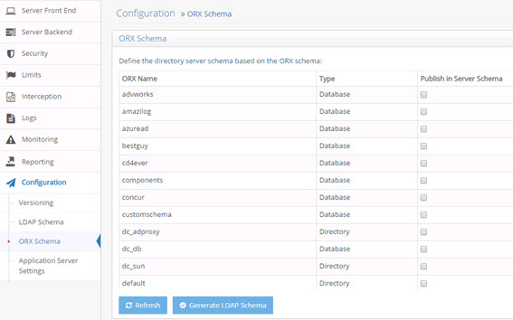

# LDAP Schema Commands

The RadiantOne LDAP schema can be extended with objects and attributes defined in a schema/orx file from the Main Control Panel > Settings tab > Configuration section > ORX Schema and can also be managed from command line using the <RLI_HOME>/bin/vdsconfig utility.



This chapter covers publishing and removing an ORX’s schema from the RadiantOne LDAP schema using commands instead of the GUI mentioned above.

## add-orx-schema

This command publishes/adds objects and attributes from a given ORX file to the RadiantOne LDAP schema.

**Usage:**
<br>`add-orx-schema -name <name> [-instance <instance>] [-ldap]`

**Command Arguments:**

**`- name <name>`**
<br>[required] The ORX name (must be an existing ORX file).

**`- instance <instance>`**
<br>The name of the RadiantOne instance. If not specified, the default instance named vds_server is used.

**`- ldap`**
<br>Indicates that the ORX name is an LDAP Schema, found in the 'lod' folder. If this option is not specified, the tool looks for the ORX in the 'org' folder.

**REST (ADAP) Example**

In the following example, a request is made to extend the RadiantOne LDAP schema with objects and attributes from a schema file extracted from an LDAP backend.

```
https://<rli_server_name>:8090/adap/util?action=vdsconfig&commandname=add-orx-schema&name=ds_vds__ou_hr_o_examples&ldap
```

## remove-orx-schema

This command removes objects and attributes defined in a given ORX file from the RadiantOne schema.

**Usage:**
<br>`remove-orx-schema -name <name> [-instance <instance>] [-ldap]`

**Command Arguments:**

**`- name <name>`**
<br>[required] The ORX name (must be an existing ORX file).

**`- instance <instance>`**
<br>The name of the RadiantOne instance. If not specified, the default instance named vds_server is used.

**`- ldap`**
<br>Indicates that the ORX name is an LDAP Schema, found in the 'lod' folder. If this option is not specified, the tool will look for the ORX in the 'org' folder.

**REST (ADAP) Example**

In the following example, a request is made to remove objects and attributes defined in a schema file extracted from an LDAP backend from the RadiantOne LDAP schema.

```
https://<rli_server_name>:8090/adap/util?action=vdsconfig&commandname=remove-orx-schema&name=ds_vds__ou_hr_o_examples&ldap
```
