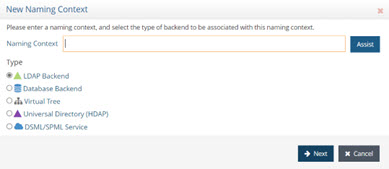
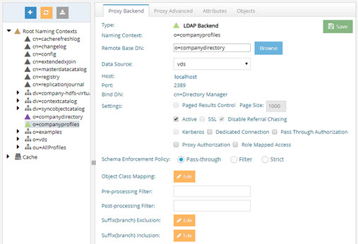
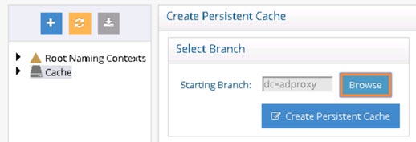
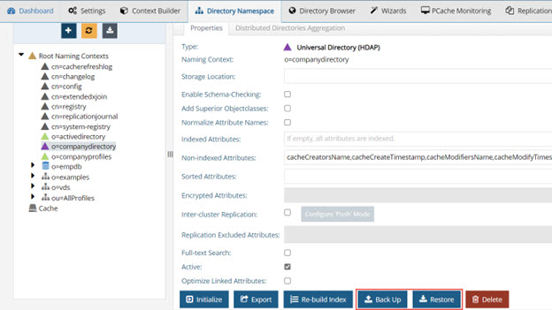

# Naming Context Commands

This chapter describes how to create persistent caches, naming contexts, proxy naming contexts, and backup images of RadiantOne Universal Directory (HDAP) stores. It also describes how to delete naming contexts and their caches. These commands can be set using <RLI_HOME>/bin/vdsconfig.

## Proxy Views and Universal Directory (HDAP) Stores

Proxy naming contexts and Universal Directory stores can be created and managed from the Main Control Panel, Directory Namespace tab.





The following commands can be used instead of the UI mentioned above.

### create-dbproxy

This command creates a new database proxy naming context.

**Usage:**
<br>`create-dbproxy -datasourcename <datasourcename> -namingcontext <namingcontext> - tables <tables> [-instance <instance>] [-rootnc <rootnc>]`

Command Arguments:

**`- datasourcename <datasourcename>`**
<br> [required] The name of the data source used to create the root naming context.

**`- namingcontext <namingcontext>`**
<br>[required] The name of the naming context.

**`- tables <tables>`**
<br>[required] The tables to include in your database proxy.

**`- instance <instance>`**
<br>The name of the RadiantOne instance. If not specified, the default instance named vds_server is used.

**`- rootnc <rootnc>`**
<br>true for root naming context, false to indicate a sub-level naming context.

**REST (ADAP) Example**
In the following example, a request is made to create a database proxy called o=DBProxy.

```
https://<rli_server_name>:8090/adap/util?action=vdsconfig&commandname=create-dbproxy&datasourcename=northwind&namingcontext=o=DBProxy&tables=APP.EMPLOYEES,APP.SHIPPERS,APP.SUPPLIERS,APP.CUSTOMERS
```

### create-ldapproxy

This command creates a new LDAP proxy naming context.

**Usage:**
<br>`create-ldapproxy -datasourcename <datasourcename> -namingcontext <namingcontext> [-instance <instance>] [-rootnc <rootnc>]`

**Command Arguments:**

**`- datasourcename <datasourcename>`**
<br> [required] The name of the data source used to create the root naming context.

**`- namingcontext <namingcontext>`**
<br> [required] The name of the naming context.

**`- remotebasedn <remotebasedn>`**
<br> [required] The base DN that the LDAP Proxy should point to on the remote LDAP data source.

**`- instance <instance>`**
<br> The name of the RadiantOne instance. If not specified, the default instance named vds_server is used.

**`- rootnc <rootnc>`**
<br> true for root naming context, false to indicate a sub-level naming context.

**REST (ADAP) Example**

In the following example, a request is made to create an LDAP proxy view (mounted at o=ldapproxy in the RadiantOne namespace) that points to a data source named corpdirectory with a base DN of o=companydirectory.

```
https://<rli_server_name>:8090/adap/util?action=vdsconfig&commandname=create-ldapproxy&datasourcename=corpdirectory&namingcontext=o=ldapproxy&remotebasedn=o=companydirectory
```

### create-hdapstore

This command creates a new RadiantOne Universal Directory (HDAP) store naming context.

Usage:
<br>`create-hdapstore -namingcontext <namingcontext> [-inactive] [-indexattr <indexattr>] [-instance <instance>] [-normalizenames] [-rootnc <rootnc>] [-schemacheck] [-sortedindexattr <sortedindexattr>]`

**Command Arguments:**

**`- namingcontext <namingcontext>`**
<br>[required] The name of the naming context.

**`- inactive`**
<br>Creates the naming context but sets it as inactive (active by default).

**`- indexattr <indexattr>`**
<br>The list of the attributes (comma-separated) to index.

**`- instance <instance>`**
<br>The name of the RadiantOne instance. If not specified, the default instance named vds_server is used.

**`- normalizenames`**
<br>ormalize attribute names (disabled by default).

**`- rootnc <rootnc>`**
<br>true for root naming context, false to indicate a sub-level naming context.

**`- schemacheck`**
<br>Enables schema checking on the RadiantOne Universal Directory (HDAP) store (disabled by
default).

**`- sortedindexattr (sortedindexattr)`**
<br>The list of the attributes (comma-separated) to maintain a sorted index for.

REST (ADAP) Example
In the following example, a request is made to create a Universal Directory store mounted at o=hdap in the RadiantOne namespace.

```
https://<rli_server_name>:8090/adap/util?action=vdsconfig&commandname=create-hdapstore&namingcontext=o=hdap
```
### create-vtree

This command creates a new virtual tree naming context.

**Usage:**
<br>`create-vtree -namingcontext <namingcontext> [-dvxname <dvxname>] [-instance <instance>] [-rootnc <rootnc>]`

**Command Arguments:**

**`- namingcontext <namingcontext>`**
<br>[required] The name of the naming context.

**`- dvxname <dvxname>`**
<br>The name of an existing view (dvx). If this is not specified, a new dvx is generated.

**`- instance <instance>`**
<br>The name of the RadiantOne instance. If not specified, the default instance named vds_server is used.


**`- rootnc <rootnc>`**
<br>True for root naming context, false to indicate a sub-level naming context.

**REST (ADAP) Example**

In the following example, a request is made to create a virtual tree naming context mounted at o=virtualtree in the RadiantOne namespace using a virtual view file named o_companyprofiles.dvx.

```
https://<rli_server_name>:8090/adap/util?action=vdsconfig&commandname=create-vtree&namingcontext=o=virtualtree&dvxname=o_companyprofiles.dvx
```

### delete-context

This command deletes a naming context.

**Usage:**
<br>`delete-context -namingcontext <namingcontext> [-instance <instance>]`

**Command Arguments:**

**`- namingcontext <namingcontext>`**
<br> [required] The name of the naming context.

**`- instance <instance>`**
<br>The name of the RadiantOne instance. If not specified, the default instance named vds_server is used.

**REST (ADAP) Example**

In the following example, a request is made to delete a Universal Directory store that is mounted at o=hdap in the RadiantOne namespace.

```
https://<rli_server_name>:8090/adap/util?action=vdsconfig&commandname=delete-context&namingcontext=o=hdap
```

## Persistent Cache

Persistent cache can be created and managed from the Main Control Panel, Directory Namespace tab.




The <RLI_HOME>/bin/vdsconfig utility can be used instead of the UI mentioned above.

#### create-pcache

T chisommand creates a persistent cache for a root naming context in the RadiantOne namespace. In multi-node clusters, this command must be executed on the RadiantOne leader node. For information on determining the RadiantOne leader, refer to the RadiantOne System Administration Guide.

>[!note]
>Use the [configure-real-time-pcache-sync-topology](real-time-persistent-cache-refresh-commands#configure-real-time-pcache-sync-topology) command to configure a real-time refresh.

**Usage:**
<br>`create-pcache -namingcontext <namingcontext> [-autorefresh] [-indexattr <indexattr>] [-instance <instance>]`

Command Arguments:

**`- namingcontext <namingcontext>`**
<br>[required] The name of the naming context.

**`- indexattr <indexattr>`**
<br>The list of the attributes (comma-separated) to index.

**`- instance <instance>`**
<br>The name of the RadiantOne instance. If not specified, the default instance named vds_server is used.

**REST (ADAP) Example**

In the following example, a request is made to create a persistent cache on o=companyprofiles.

```
https://<rli_server_name>:8090/adap/util?action=vdsconfig&commandname=create-pcache&namingcontext=o=companyprofiles&indexattr=cn,employeeNumber,employeeType,givenName,homePhone,l,mail,uid
```

### delete-cache

This command deletes an existing cache on a naming context.

**Usage:**
<br>`delete-cache -namingcontext <namingcontext> [-instance <instance>]`

**Command Arguments:**

**`- namingcontext <namingcontext>`**
<br>[required] The name of the naming context.

**`- instance <instance>`**
<br>The name of the RadiantOne instance. If not specified, the default instance named vds_server is used.

**REST (ADAP) Example**

In the following example, a request is made to delete a persistent cache on o= companyprofiles.

```
https://<rli_server_name>:8090/adap/util?action=vdsconfig&commandname=delete-
cache&namingcontext=o=companyprofiles
```

## Backup and Restore RadiantOne Universal Directory Stores

Universal Directory (HDAP) stores can be backed up and restored from the Main Control Panel,Directory Namespace Tab, selected Universal Directory store.



The <RLI_HOME>/bin/vdsconfig utility can be used instead of the UI mentioned above.

### backup-hdapstore

This command creates a backup image of a RadiantOne Universal Directory store. This command can also be used on persistent cache stores. In multi-node clusters, this command must be executed on the RadiantOne leader node. For information on determining the RadiantOne leader, refer to the RadiantOne System Administration Guide.

**Usage:**
<br>`backup-hdapstore -namingcontext <namingcontext> [-backupzip <backupzip>] [-instance <instance>] [-nocopy]`

**Command Arguments:**

**`- namingcontext <namingcontext>`**
<br>[required] The name of the naming context.

**`- backupzip <backupzip>`**
<br>The full path to the directory where backup archives will be kept. If not specified, the default location of <RLI_HOME>/vds_server/data/oldbackup/<storage_name>-backup is used.

A compressed backup file is created in the location, in a folder named after the root naming context being backed up (i.e. o_companydirectory-backup). The naming convention for the compressed file is yyyy-mm-dd_hh-mm-ss.zip. The compressed file is automatically encrypted using the RadiantOne server certificate keystore password.

**`- instance <instance>`**
<br> The name of the RadiantOne instance. If not specified, the default instance named vds_server is used.

**`- nocopy`**
<br>Indicates that the backup should not be archived (only the most recent backup image is kept). This means that a history of all backups is not maintained, and you won’t be able to restore a RadiantOne Universal Directory store from a previous, point in time. You will only be able to restore from the most recent backup. If -nocopy is not specified, a history of images is stored during every backup in the location dictated by the -backupdir argument.

**REST (ADAP) Example**

In the following example, a request is made to create a backup of a RadiantOne Universal Directory store located at o=hdap in the RadiantOne namespace.

```
https://<rli_server_name>:8090/adap/util?action=vdsconfig&commandname=backup-hdapstore&namingcontext=o=hdap&backupzip=c:/tmp/backup.zip
```

### restore-hdapstore

This command restores a RadiantOne Universal Directory store back to the state of a given backup image. In multi-node clusters, this command must be executed on the RadiantOne leader node. For information on determining the RadiantOne leader, refer to the RadiantOne System Administration Guide. To restore from the most recent backup image do not pass a backupid in the command. To restore from a specific point in time, pass the applicable backupid in the command. Use the -list argument to obtain a list of possible backup ids for the given naming context.

The restore is performed using the compressed file located in the folder indicated in the - backupdir or -backupid argument. The compressed file is automatically decrypted using the RadiantOne server certificate keystore password. The server where you are restoring the RadiantOne Universal Directory store must have the same server certificate keystore password than the server where you created the backup from.

**Usage:**
<br>`restore-hdapstore -namingcontext <namingcontext> [-backupzip <backupzip>] [-backupid <backupid>] [-instance <instance>] [-list]`

**Command Arguments:**

**`- namingcontext <namingcontext>`**
<br>[required] The name of the naming context.

**`- backupzip <backupzip>`**
<br>The full path to the directory containing the backup files. Do not specify this option if you use the - backupid option.

**`- backupid <backupid>`**
<br>The ID of an existing backup image. If this is not specified, the restore attempts to use the latest backup image found. Use the -list argument to obtain a list of possible backup ids for the given naming context.

**`- instance <instance>`**
<br>The name of the RadiantOne instance. If this is not specified, the default instance named vds_server is used.

**`- list`**
<br>Option used to print out the list of backup ids for the given naming context. Use this option first to get the list of backup ids as you must pass the backupid when you restore if you want to restore to a specific point in time.

**REST (ADAP) Example**

In the following example, a request is made to restore a RadiantOne Universal Directory store from a backup in the tmp directory.

```
https://<rli_server_name>:8090/adap/util?action=vdsconfig&commandname=restore-hdapstore&namingcontext=o=hdap&backupzip=C:\tmp\backup.zip\o_hdap-backup\ 2018 - 10 -
17_16- 42 - 49.zip
```

#### Examples

C:\radiantone\vds\bin>vdsconfig.bat backup-hdapstore -namingcontext o=companydirectory`

```
Using RLI home : C:\radiantone\vds
Using Java home : C:\radiantone\vds\jdk\jre
0 [ConnectionStateManager-0] WARN
com.rli.zookeeper.ZooManagerConnectionStateListener - Curator connection state change:
CONNECTED
10 [ConnectionStateManager-0] WARN
com.rli.zookeeper.ZooManagerConnectionStateListener - VDS-ZK connection state
changed: CONNECTED
10 [ConnectionStateManager-0] WARN com.rli.zookeeper.ZooManager - ZooManager
connection state changed: CONNECTED
A backup has been created for naming context 'o=companydirectory'.
```

C:\radiantone\vds\bin>vdsconfig.bat restore-hdapstore -namingcontext o=companydirectory -list

```
Using RLI home : C:\radiantone\vds
Using Java home : C:\radiantone\vds\jdk\jre
0 [ConnectionStateManager-0] WARN
com.rli.zookeeper.ZooManagerConnectionStateListener - Curator connection state change:
CONNECTED
8 [ConnectionStateManager-0] WARN
com.rli.zookeeper.ZooManagerConnectionStateListener - VDS-ZK connection state
changed: CONNECTED
9 [ConnectionStateManager-0] WARN com.rli.zookeeper.ZooManager - ZooManager
connection state changed: CONNECTED
Current backups for 'o=companydirectory':
Backup Id Date of Backup
-------------------------------------------
1440023312307 08/19/2015 15:28:32
1440023472460 08/19/2015 15:31:12
1440023524906 08/19/2015 15:32:05
1440088234257 08/20/2015 09:30:34
```
C:\radiantone\vds\bin>vdsconfig.bat restore-hdapstore -namingcontext o=companydirectory - backupid 1440023312307

```
Using RLI home : C:\radiantone\vds
Using Java home : C:\radiantone\vds\jdk\jre
0 [ConnectionStateManager-0] WARN
com.rli.zookeeper.ZooManagerConnectionStateListener - Curator connection state change: CONNECTED
9 [ConnectionStateManager-0] WARN
com.rli.zookeeper.ZooManagerConnectionStateListener - VDS-ZK connection state changed: CONNECTED
9 [ConnectionStateManager-0] WARN com.rli.zookeeper.ZooManager - ZooManager connection state changed: CONNECTED
The naming context has been successfully restored from its backup.
```

## Converting Persistent Cache to a RadiantOne Universal Directory store

For typical LDAP migration use cases where you are migrating from a legacy LDAP directory to the RadiantOne Universal Directory, you can have a persistent cache that is kept in sync with the backend LDAP directory with persistent cache refresh. Once you are ready to decommission the backend LDAP, you can convert the persistent cache into a RadiantOne Universal Directory store. The command to convert a persistent cache into a RadiantOne Universal Directory store is described in this section.

#### convert-pcache-to-hdap

Before converting a persistent cache to a RadiantOne Universal Directory store, the persistent cache refresh should be stopped. You can set the refresh method to “none” on the Main Control Panel -> Directory Namespace -> Cache -> `<cached branch>` -> Refresh Settings tab. Also, suspend inter-cluster replication if it is used by setting “replicationInSuspendMode” : true, in ZooKeeper at `/radiantone/<zk_version>/<clustername>/config/namings/<namingcontext_being_replicated>`

After the persistent cache has been converted to a RadiantOne Universal Directory store, [rebuild the index](task-launch-commands#rebuilding-indexes-for-radiantone-universal-directory-stores) to remove any persistent cache operational attributes. If inter-cluster replication is used, enable it by setting “replicationInSuspendMode” : false, in ZooKeeper at `/radiantone/<zk_version>/<clustername>/config/namings/<namingcontext_being_replicated>`

**Usage:**
<br>`convert-pcache-to-hdap -namingcontext <namingcontext> [-instance <instance>]`

**Command Arguments:**

- `namingcontext <namingcontext>`
<br>[required] The name of the persistent cache naming context to be converted to an HDAP store.

- `instance <instance>`
<br> The name of the RadiantOne instance. If this is not specified, the default instance named vds_server is used.

>[!note]
>Before the conversion, you are prompted to confirm the operation. Enter “y” to confirm, or “n” to discontinue. An example is shown below.

```
Conversion will remove the underlying virtual layer, both the pcache and its view/proxy will be replaced by a HDAP store. 
Virtual Naming context list to be removed:
o=db (VIEW)
Would you like to continue? (y/n):
```

>[!warning]
>The convert-pcache-to-hdap command is not supported through ADAP.
