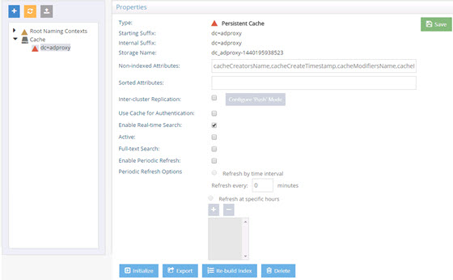
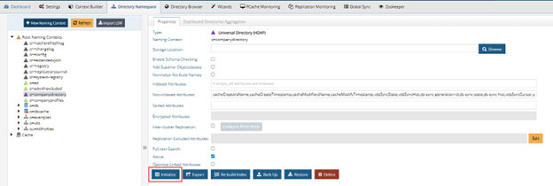
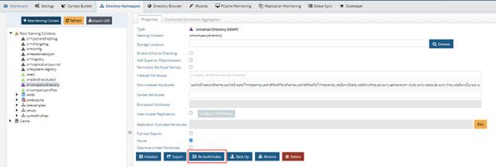

# Task Launch Commands

This chapter describes how to launch tasks to initialize a cache, initialize a RadiantOne Universal Directory (HDAP) store from LDIF file, import an LDIF file, export data from an LDAP data source to LDIF file, and rebuild an index for a Universal Directory store or persistent cache.

## Initializing Persistent Cache

Persistent cache can be initialized and exported from the Main Control Panel, Directory Namespace tab, selected branch below the Cache section.



The following command can be used with the <RLI_HOME>/bin/vdsconfig utility instead of the UI mentioned above.

### init-pcache

This command launches a task to initialize a persistent cache. In multi-node clusters, this command must be executed on the RadiantOne leader node. For information on determining the RadiantOne leader, refer to the [RadiantOne System Administration Guide](/documentation/sys-admin-guide/01-introduction).

**Usage:**
<br>`init-pcache -namingcontext <namingcontext> [-instance <instance>] [-interactive] [-ldif <ldif>] [-nthreads <nthreads>] [-useldifz] [-vpp]`

**Command Arguments:**

**`- namingcontext <namingcontext>`**
<br>[required] The name of the naming context.

**`- instance <instance>`**
<br>The name of the RadiantOne instance. If this is not specified, the default instance named vds_server is used.

**`- interactive`**
<br>When this argument is specified, the command launches the tasks and periodically displays their current state until they are finished. An error code is returned if the task ends with an error. If this argument is not specified, the command launches the tasks and terminates.

**`- ldif <ldif>`**
<br>The path to an LDIF file that is used to initialize the cache. If not specified, an LDIF is generated directly from the data source.

**`- nthreads <nthreads>`**
<br>Defines the number of threads to use during indexing. It is advised to let the system handle this automatically unless the vpp option is used.

**`- useldifz`**
<br>If this argument is specified, an LDIFz (secure and zipped) file will be generated to initialize the cache. If not specified, the default LDIF file format is used.

**`- vpp`**
<br>Use the virtual engine parallel processor (vpp) to speed up the cache image creation while indexing. This is useful when the virtual view to be cached contains many entries and other time-intensive configurations like joins, and computed attributes involving lookups. This option isn’t compatible with views associated with interception scripts. Initializing a view that is incompatible with the -vpp command results in an error that indicates why the view is incompatible.

**REST (ADAP) Example**
In the following example, a request is made to initialize a persistent cache for o=companyprofiles.

```
https://<rli_server_name>:8090/adap/util?action=vdsconfig&commandname=init-pcache&namingcontext=o=companyprofiles&interactive&vpp&nthreads=32
```

## Importing LDIF Files

LDIF Files can be imported from the Main Control Panel in the Directory Namespace and Directory Browser tabs.

The following command can be used instead of the Main Control Panel.

### import-ldif

This command launches a task to import an LDIF file.

**Usage:**
<br>`import-ldif -ldif <ldif or ldifz file> [-basedn <basedn>] [-datasourcename <datasourcename>] [-instance <instance>] [-interactive] [-override]`

**Command Arguments:**

**`- ldif <ldif>`**
<br>[required] The path to an LDIF file. If you have defined an LDIF Encryption Key from Main Control Panel > Settings > Security > Attribute Encryption (LDIFZ Encryption Key section), indicate an ldifz suffix on the file name to import (e.g. myfile.ldifz). LDIFZ is a zipped and encrypted file format used to prevent the data in the file from being read. Both the source and target RadiantOne services must be configured for the same LDIF Encryption Key in order to support the contents of the ldifz file.

**`- basedn <basedn>`**
<br>The base DN for a branch containing the entries that should be included in the import.

**`- datasourcename <datasourcename>`**
<br>The name of an LDAP data source. If this argument is not specified, the 'vds' data source will be used.

**`- instance <instance>`**
<br>The name of the RadiantOne instance. If not specified, the default instance named vds_server is used.

**`- interactive`**
<br>When this argument is specified, the command will launch the tasks and periodically print out their current state until they are finished. If this argument is not specified, the command launches the tasks and terminates.

**`- override`**
<br>If this argument is specified, existing entries may be overridden. By default, if not specified, existing entries are not overridden.

**REST (ADAP) Example**

In the following example, a request is made to import an LDIF file into o=employees2.

```
https://<rli_server_name>:8090/adap/util?action=vdsconfig&commandname=import-ldif&ldif=C:\radiantone\vds\vds_server\ldif\export\employees.ldif&basedn=o=employees2&datasourcename=vds&interactive&override
```

## Exporting Persistent Cache or RadiantOne Universal Directory (HDAP) Stores

Persistent Cache and Universal Directory (HDAP) stores can be exported from the Main Control Panel > Directory Namespace tab > selected branch (persistent cache or universal directory store).

The following command can be used instead of the Main Control Panel.

### export-ldif

This command launches a task to export data from a LDAP data source backend, Universal Directory store, or virtual tree to an LDIF file.

**Usage:**
<br>`export-ldif -basedn <basedn> -ldif <ldif or ldifz file> -scope <scope> [-csv] [-datasourcename <datasourcename>] [-filter <filter>] [-instance <instance>] [-interactive]
[-limit <limit>] [-mappedbasedn <mappedbasedn>] [-replication] [-returnattributes <return attributes>]`

**Command Arguments:**

**`- basedn <basedn>`**
<br>[required] The base DN that is used to export data to the LDIF.
**`- ldif <ldif>`**
<br>[required] The path to an LDIF file. If you have defined an LDIF Encryption Key from Main Control Panel > Settings > Security > Attribute Encryption (LDIFZ Encryption Key section), indicate an ldifz suffix on the file name (e.g. myfile.ldifz). LDIFZ is a zipped and encrypted file format used to prevent the data in the file from being read. Both the source and target RadiantOne services must be configured for the same LDIF Encryption Key in order to support the contents of the ldifz file.
**`- scope <scope>`**
<br>[required] The scope that is used to export data to the LDIF. Accepted values are: base, one, sub. Default value is one.

**`- csv`**
<br>Creates a CSV file after the LDIF file is created. The CSV file will be in the same directory as the LDIF file and have the same name as the LDIF file with .csv extension. If the CSV file exists, it will be overwritten. CSV files are not created if .ldifz is used.

**`- datasourcename <datasourcename>`**
<br>The name of an LDAP data source. If this argument is not specified, the 'vds' data source is used.

**`- filter <filter>`**
<br>Optional LDAP search filter to be applied before exporting the data to the LDIF file.
**`- instance <instance>`**
<br>The name of the RadiantOne instance. If not specified, the default instance named vds_server
is used.
**`- interactive`**
<br>When this argument is specified, the command will launch the tasks and periodically print out their current state until they are finished. If this argument is not specified, the command launches the tasks and terminates.
**`- limit <limit>`**
<br>The maximum number of entries to export to the LDIF. If this argument is not specified, all entries are exported. Note: when this argument is specified, the export task may throw a SizeLimitException and end in an ERROR state. However, the LDIF file will still be generated as expected with the specified number of entries.

**`- mappedbasedn <mappedbasedn>`**
<br>The optional remapped base DN that each entry will have in the LDIF file.

**`- replication`**
<br>If this is specified, the UUID attributes are included in the exported LDIF file. If you want to use the exported LDIF file to initialize a RadiantOne Universal Directory store (a replica), then you should pass -replication in the export-ldif command.

**`- returnattributes <returnattributes>`**
<br>Optional list of comma-separated attributes to return from the search and include in the exported LDIF file. If nothing is specified, all attributes are requested.

>[!note]
>returnattributes is not considered if the -replication option is used. This is because the -replication option automatically returns all attributes for export.

**REST (ADAP) Example**

In the following example, a request is made to export a backend to an LDIF file.

```
https://<rli_server_name>:8090/adap/util?action=vdsconfig&commandname=export-ldif&basedn=o=companyprofiles&scope=sub&ldif=C:\radiantone\vds\vds_server\companyprofiles.ldif&interactive
```

## Initializing RadiantOne Universal Directory (HDAP) Stores

RadiantOne Universal Directory (HDAP) stores can be initialized and exported from the Main Control Panel > Directory Namespace tab > selected naming context.



The following command can be used with the <RLI_HOME>/bin/vdsconfig utility instead of the UI mentioned above.

### init-hdap-store

This command launches a task to initialize a RadiantOne Universal Directory (HDAP) store from an LDIF file. In multi-node clusters, this command must be executed on the RadiantOne leader node. For information on determining the RadiantOne leader, refer to the [RadiantOne System Administration Guide](/documentation/sys-admin-guide/01-introduction).

**Usage:**
<br>`init-hdap-store -ldif <ldif> -namingcontext <namingcontext>[-instance <instance>] [-interactive]`

**Command Arguments:**

**`- ldif <ldif>`**
<br>[required] The path to the LDIF file used for initializing.

**`- namingcontext <namingcontext>`**
<br>[required] The name of the naming context.

**`- instance <instance>`**
<br>The name of the RadiantOne instance. If not specified, the default instance named vds_server is used.

**`- interactive`**
<br>When this argument is specified, the command launches the tasks and periodically displays their current state until they are finished. If this argument is not specified, the command launches the tasks and terminates.

**REST (ADAP) Example**

In the following example, a request is made to initialize a RadiantOne Universal Directory store from an LDIF file.

```
https://<rli_server_name>:8090/adap/util?action=vdsconfig&commandname=init-hdap-store&ldif=c:/radiantone/vds/vds_server/ldif/export/companydirectory.ldif&namingcontext=o=
companydirectory&interactive
```

## Rebuilding Indexes for RadiantOne Universal Directory Stores

RadiantOne Universal Directory stores can be re-indexed from the Main Control Panel > Directory Namespace tab > selected naming context.



The following command can be used instead of the UI mentioned above.

### rebuild-index

This command launches a task to rebuild an index for a RadiantOne Universal Directory store. In multi-node clusters, this command must be executed on the RadiantOne leader node. For information on determining the RadiantOne leader, refer to the [RadiantOne System Administration Guide](/documentation/sys-admin-guide/01-introduction).

**Usage:**
<br>`rebuild-index -namingcontext <namingcontext>[-instance <instance>] [-interactive]`

**Command Arguments:**

**`- namingcontext <namingcontext>`**
<br>[required] The name of the naming context that you want to rebuild the indexes for.

**`- instance <instance>`**
<br>The name of the RadiantOne instance. If not specified, the default instance named vds_server is used.

**`- interactive`**
<br>When this argument is specified, the command launches the tasks and periodically displays their current state until they are finished. If this argument is not specified, the command launches the tasks and terminates.

**REST (ADAP) Example**

In the following example, a request is made to rebuild the indexes for a RadiantOne Universal Directory store.

```
https://<rli_server_name>:8090/adap/util?action=vdsconfig&commandname=rebuild-index&namingcontext=o=companydirectory&interactive
```
Below is an example response from interactive mode:

```sh
{
"result": {
"Exitcode": 0,
"SystemOut": "[Tuesday, 5 Feb 2019 14:46:04 PST]\r\nFeb 5, 2019 2:46:06 PM
REBUILD_INDEX_PROCESS[vds_server][o_companydirectory] RUNNING\r\nFeb 5,
2019 2:46:16 PM
REBUILD_INDEX_PROCESS[vds_server][o_companydirectory] RUNNING\r\nFeb 5,
2019 2:46:26 PM
REBUILD_INDEX_PROCESS[vds_server][o_companydirectory] FINISHED"
}
}
```

## Scheduling Global Identity Viewer Reports

Reports can be configured and generated using the Global Identity Viewer tool. After you have used the Global Identity Viewer to configure a report, you can schedule the report to be generated using the command described in this section. For more information on the Global Identity Viewer, see the RadiantOne Global Identity Viewer Guide.

### schedule-report

This command launches a task scheduled according to report configuration that outputs reports in specified formats and emails them to specified recipients.

**Usage**
<br>`schedule-report -reportconfigdn <reportconfigdn> [-instance <instance>]`

**Command Arguments:**

**`- reportconfigdn <reportconfigdn>`**
<br>[required] The DN of global ID report configuration.

>[!note]
>This argument requires a configured query and report in the Global Identity Viewer. Refer to the Global Identity Viewer Guide for more information With a query and report configured, navigate to and expand ou=reports,o=<projectname>,ou=webapps,ou=globalsettings,cn=config on the Directory Browser tab. Select a report and view its filter, format, and frequency values to determine if it is the report you want to schedule. The entrydn value is used for the reportconfigdn.


**`- instance <instance>`**
The name of the RadiantOne instance. If not specified, the default instance named vds_server is used.

**REST (ADAP) Example**

In the following example, a request is made to schedule a report.

https://<rli_server_name>:8090/adap/util?action=vdsconfig&commandname=schedule-report&reportconfigdn=cn=0a91d6de-c124-4c4d-82b5-d10be9a0cc2b,ou=reports,o=project,ou=webapps,ou=globalsettings,cn=config

## Global Profile Upload Management

Global profiles can be configured in the Global Identity Builder. After you have configured the global profile, you can upload or reset the global profile using the commands described in this section. For more information on the Global Identity Builder, see the RadiantOne Global Identity Builder Guide.

### globalprofile-upload

This command launches a task to upload entries into an existing global profile.

**Usage:**
<br>`globalprofile-upload -project <project> [-createviews] [-identitysource <identitysource>] [-instance <instance>] [-interactive]`

**Command Arguments:**

`-project <project>`
<br> [required] The name of an existing Global Identity Builder project.

`-createviews`
<br> If this option is specified, the schemas and views that compose the global profile (the global profile view, and the identity source views) will be regenerated before the upload task is launched.

`-identitysource <identitysource>`
<br> The name of an existing identity source to upload. If not specified, all identity sources will be uploaded.

`-instance <instance>`
<br> The name of the VDS instance. The default vds instance will be used if not specified.

`-interactive`
<br> When this argument is specified, the command launches the tasks and periodically print out their current state until they are finished. If this argument is not specified, the command launches the tasks and terminates.

### globalprofile-reset

This command launches a task to reset entries in an existing global profile.

**Usage:**
<br>`globalprofile-reset -project <project> [-identitysource <identitysource>] [-instance <instance>] [-interactive]`

**Command Arguments:**

`-project <project>`
<br> [required argument] The name of an existing Global Identity Builder project.

`-identitysource <identitysource>`
<br> The name of an existing identity source to reset. If not specified, all identity sources are reset.

`-instance <instance>`
<br> The name of the VDS instance. The default vds instance will be used if not specified.

`-interactive`
<br> When this argument is specified, the command launches the tasks and periodically print out their current state until they are finished. If this argument is not specified, the command launches the tasks and terminates.

