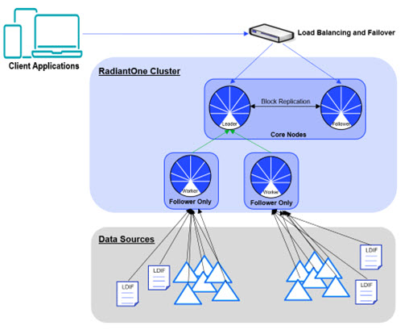

# Introduction

## Overview
RadiantOne includes a Capture Process for Large numbers of distributed Directory Stores (CPLDS). This feature leverages components known as Workers to detect changes in source LDAP directories, Active Directories, or LDIF files and refresh a RadiantOne Universal Directory (HDAP) replica. Due to the intense CPU and memory requirements of the Workers, they should not run on the same machines as the core RadiantOne cluster nodes. Workers are configured on Follower-Only nodes in the cluster in an effort to not impact the RadiantOne nodes that are servicing client applications.

At the sync interval (process schedule), the worker(s) connect to the backend(s) or read designated LDIF files and get all entries. The entries are sorted and compared against the current contents of the RadiantOne Universal Directory (HDAP) store. This operation is performed in memory without the need to generate LDIF files. The delta is determined and then the RadiantOne Universal Directory is updated to match the current image of the backend(s). The updates are issued to the RadiantOne Universal Directory store as standard LDAP operations meaning that the store continues to be accessible by clients during the sync cycles. A high-level architecture is shown below.

>[!note]
>During the first sync cycle, each worker initializes their own RadiantOne Universal Directory container(s).

 
## Use Case

For use cases involving aggregating LDAP backends, or Active Directory backends containing unique user populations into a single view in RadiantOne (for authentication), it might make more sense to use the CPLDS function instead of trying to build an aggregated virtual view that is then configured as persistent cache with real time refresh with hundreds of connectors. 

>[!warning]
>CPLDS has been tested with up to 2,500 LDAP backends.

The CPLDS functionality performs a one-way synchronization from the backend directories into a RadiantOne Universal Directory (HDAP) store. The store is essentially a read-only replica of the backends that can be used to identify users, authenticate users (can be validated locally only if passwords are able to be synchronized) and deliver attributes for authorization.

Potential use case candidates should generally match the following list:
-	LDAP or Active Directory backends with unique (no overlapping) user populations.
-	Client/consumers of the RadiantOne Universal Directory are read-only which means that synchronization is only one-way, from the backends into RadiantOne Universal Directory.

## Expert Mode

Some settings in the Main Control Panel are accessible only in Expert Mode. To switch to Expert Mode, click the Logged in as, (username) drop-down menu and select Expert Mode. 

 
>[!note]
>The Main Control Panel saves the last mode (Expert or Standard) it was in when you log out and returns to this mode automatically when you log back in. The mode is saved on a per-role basis.
