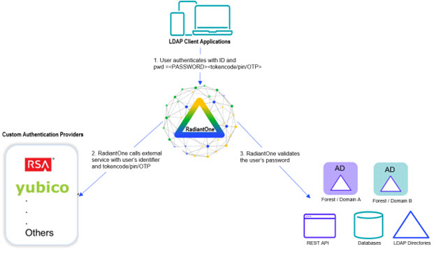

# Chapter 1: Overview

RadiantOne includes a framework for calling custom authentication services like RSA SecurID and Yubicloud. This allows standard LDAP applications to benefit from stronger, multi-factor security without requiring any changes to their authentication logic. Users of the application can log in with their existing ID and password + pincode/One Time Password (OTP). RadiantOne translates the standard LDAP authentication (bind) request into a validation of the user’s password to the authoritative source (whether that is local in HDAP or some other authoritative backend) and a call to your specialized authentication service (e.g. RSA SecurID or Yubicloud) to validate the rest of the credentials. The custom authentication service may provide validation for the entire credentials (e.g. user’s password plus additional tokencode/pin/OTP) or just a portion of the credentials (e.g. just validate the tokencode/pin/OTP).

 
Figure 1. 1: Integration with Custom Authentication Providers

>[!note]
>Logic for Custom Authentication Providers is invoked like an interception script. As such, any global interception scripts defined in RadiantOne are executed before custom authentication providers.

## Expert Mode

Some settings in the Main Control Panel are accessible only in Expert Mode. To switch to Expert Mode, click the Logged in as, (username) drop-down menu and select Expert Mode. 

 
Figure 1. 2: Main Control Panel, Expert Mode

>[!note]
>The Main Control Panel saves the last mode (Expert or Standard) it was in when you log out and returns to this mode automatically when you log back in. The mode is saved on a per-role basis.

