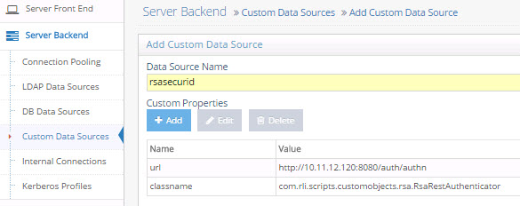
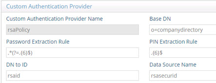
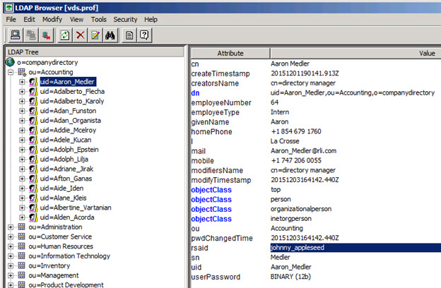
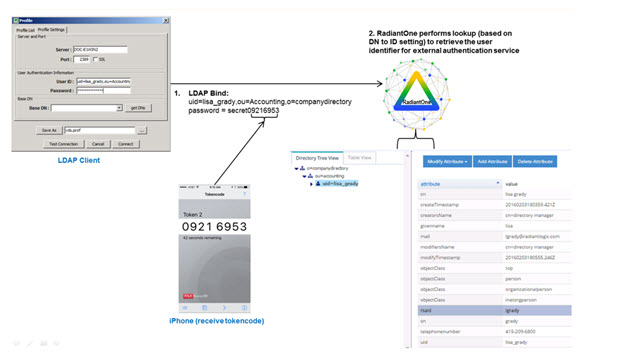

# RSA SecurID

RadiantOne includes code to call RSA SecurID as a custom authentication provider. The RSA Authentication Manager Integration Services (AMIS) feature is only implemented in RSA version 8 and above. This component exposes the REST APIs needed. RadiantOne calls the REST interface at: http://<rsa_auth_server>:8080/auth/authn

To use this example, follow the steps below.

1.	Navigate to the Main Control Panel > Settings tab > Server Backend section > Custom Data Sources.
2.	On the right, click ADD.

3.	Enter a unique data source name.

4.	In the Custom Properties section, click Add.

5.	Enter the property name: url  (make sure to use all lowercase)

6.	For the value of the url property, enter the url required to connect to your RSA SecurID Rest service. E.g. http://rsa.auth.server:8080/auth/authn

7.	Click OK.

8.	In the Custom Properties section, click Add. 

9.	Enter the property name: classname 

10.	For the value of classname, enter: com.rli.scripts.customobjects.rsa.RsaRestAuthenticator

    >[!warning] To view the script logic to call the RSA service, navigate to <RLI_HOME>\vds_server\custom\src\com\rli\scripts\customobjects\rsaRsaRestAuthenticator.java.

11.	Click OK.

12.	(Optional) Your RSA server might require a key to securely identify the authentication request. In the rsa-securidauthenticate-api.yaml file, this is the client-key. Your RSA Super Admin needs to generate this key and send it to you securely so you can include it in your RadiantOne custom data source. If your RSA server requires a client key to be passed in the header of the SOAP request, click Add.

13.	Enter the property name: client_key 

14.	For the value of the client_key property, enter the key value you received from your RSA Super Admin.

15.	Click OK.

16.	Click Save.
 
    

    Figure 2.1: RSA SecurID Custom Authentication Service

    >[!warning] If you edit the custom data source properties, you must restart RadiantOne FID. If deployed in a cluster, restart it on all nodes.

17.	Navigate to the Main Control Panel > Settings tab > Interception section > Custom Authentication Providers (requires [Expert Mode](01-overview#expert-mode)).

18.	On the right, click ADD.

19.	Enter a unique name for the custom authentication provider.

20.	Enter the location/naming context in the virtual namespace where the custom authentication should be invoked in the Base DN property.

21.	Using regular expression syntax, enter the criteria to extract the password part from the password value received in the LDAP bind request. E.g. .*(?=.{6}$)

22.	Using regular expression syntax, enter the criteria to extract the PIN/passcode part from the password value received in the LDAP bind request. E.g. .{6}$  -- which extracts the last 6 characters from the fullpassword as the pincode. Note, if you are using an RSA soft token (e.g. sent to a mobile phone), the default pincode is 8 characters.

23.	The DN to ID property is used by RadiantOne FID to lookup the user’s local entry and retrieve the attribute to identify the user in the external authentication service. In the DN to ID property, enter the attribute name in the virtual entry that stores the value of the user that uniquely identifies them in the external authentication service. In the example below, rsaid is the value entered in the DN to ID property. This means that the value of the rsaid in the user’s virtual entry is used to delegate the credentials checking to the external authentication service. 

    

    Figure 2.2: Example RSA Custom Authentication Provider

    Continuing with this scenario, in the example shown below, the unique ID of johnny_appleseed is sent to the external authentication service when the user identified by a DN of uid=Aaron_Medler,ou=Accounting,o=companydirectory authenticates to RadiantOne FID.
 
    

    Figure 2.3: Example Describing the Usage of the DN to ID Property

24.	In the Data Source Name property, enter the name of the custom data source you defined which contains the connection criteria for the custom authentication service. This was defined in steps 2-11 above.

25.	Select the EXTERNAL_REQUIRED mode. The EXTERNAL_IGNORE mode can be used to disable the call to the custom authenticator, in which case RadiantOne FID processes the bind request using the default behavior. 

26.	Click Save.

27.	Restart RadiantOne FID. If a cluster is deployed, restart it on all nodes.

## Testing the Configuration

This example uses the Advanced LDAP browser as the client.

In the connection information, enter the userDN (User ID). For the password, enter the user password (accessible in HDAP or some backend virtualized by RadiantOne) and append the current RSA SecurID token code to the end of it. This is shown in step 1 in the diagram below.

RadiantOne performs a lookup in its namespace to retrieve the identifier of user (associated with their account in the external authentication service. This is shown in step 2 in the diagram below.
 

Figure 2.4: High-level Authentication Flow

RadiantOne sends the external ID with the pincode (extracted from the full password received in the LDAP Bind Request, based on the rules defined in the Custom Authentication Provider) to the service defined in the Custom Data Source. This is shown in step 3 in the diagram below.

After the pincode is validated, RadiantOne FID validates the user’s password (extracted from the full password received in the LDAP Bind Request, based on the rules defined in the Custom Authentication Provider). This is shown in step 4 in the diagram below.
 

Figure 2.5: Validating Pincode

If both password and pincode are valid, the LDAP authentication is successful.
 
