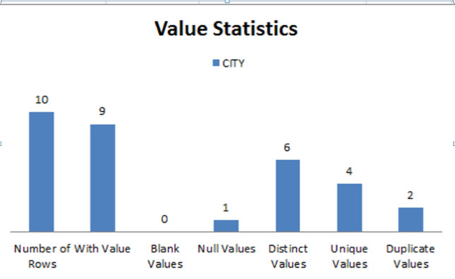
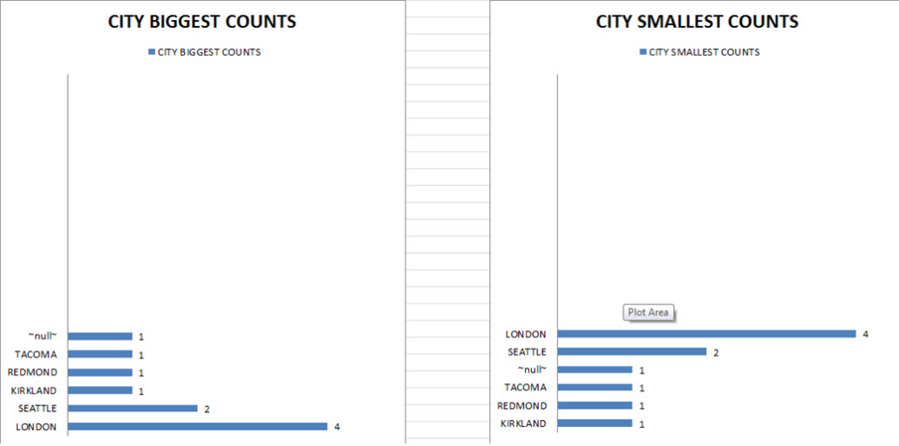
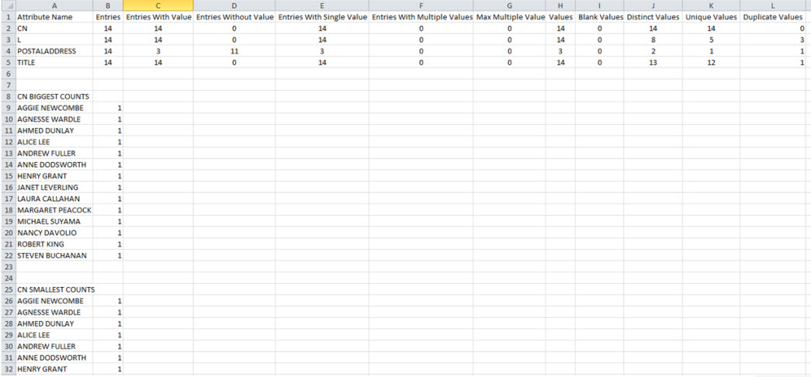
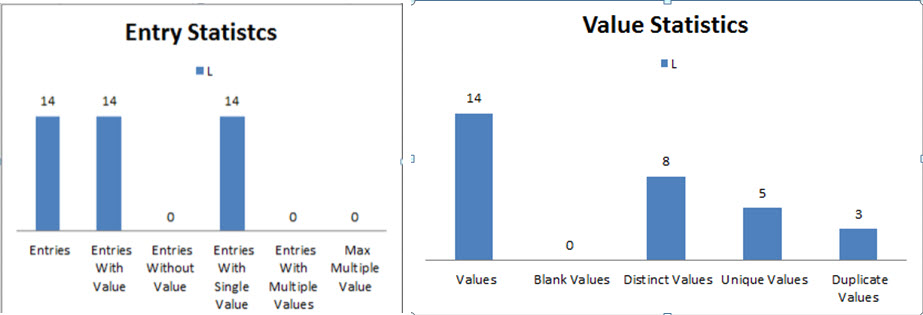
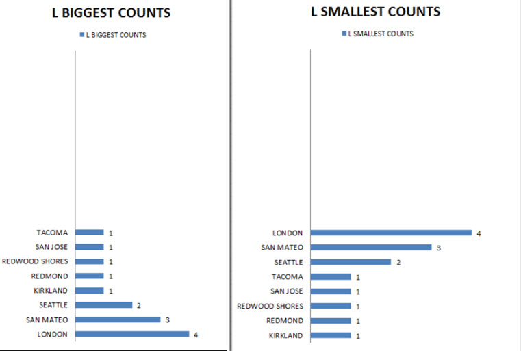

# Using Identity Data Analysis Command Line Tool

## Identity Data Analysis for Database Objects

This section describes how to virtualize database objects, run the data analysis tool and interpret the results.

### Virtualizing the Database Source

1.	From the Main Control Panel > Settings tab > Server Backend > DB data sources, create a connection to your backend database. Refer to the System Administration Guide if you need help with this step. 

2.	From the Main Control Panel, Directory Namespace tab, click  (new naming context button).

3.	Enter a unique naming context and select the database backend option.

4.	Click Next.

5.	Select the data source associated with your database backend and click OK.

6.	Select the table(s) that contain your identities and click OK.

7.	Click OK to exit the confirmation window.

8.	From the Main Control Panel, Directory Browser tab, click   (reconnect button).

9.	Click on the naming context you created in step 3 and click  (export LDIF button).

10.	You can customize the LDIF output, but generally accept the defaults (e.g. empty target DN, sub-tree scope, All Entries) and enter a file name (e.g. database.ldif). The default lo-cation of exported LDIF files is: <RLI_HOME>/vds_server/ldif/export.

11.	Click OK.

### Running the Data Analysis 

The LDIF data analysis tool is located in <RLI_HOME>/bin/advanced and is named data_analysis.bat (on Linux it is data_analysis.sh). 

From a command prompt, run this tool passing the following arguments (-d and -f are required.
-h, -o and -r are optional):

-d  The report directory where the report files are saved. The report directory should not contain path characters (/,\). The report directory is created under <RLI_HOME>/vds/r1syncsvcs/profiler.

-f	Full name of LDIF file (may include path).
 
-h  help
 
-o  This option allows you to overwrite files in the report directory. If you don’t pass this option, and the report directory already exists, no analysis is done and the report directory's files are not be changed.
 
-r   Remove detailed analysis files in the report directory. 

An example is shown below:

`C:\radiantone\vds\bin\advanced>data_analysis.bat -d DBANALYSIS -f 
"C:\radiantone\vds\vds_server\ldif\export\database.ldif"
Using RLI home : C:\radiantone\vds
Using Java home : C:\radiantone\vds\jdk\jre                                     ldifFile=C:\radiantone\vds\vds_server\ldif\export\database.ldif                
outputDir=DBANALYSIS
isOverwrite=false
isRemoveDetailedFiles=false
Done. Reports are in the following directory: C:\radiantone\vds\r1syncsvcs\profiler\DBANALYSIS`                                                                  
### Interpreting the Data Analysis Results for a Database Object

Files created from the data analysis process are located in <RLI_HOME>/r1syncsvcs/profiler/<value passed in the -d argument>. One is a CSV-formatted file named result.csv and contains the summary analysis and most/least used values. One is an XLS (Excel) file named result.xls that breaks down the analysis in more details. It contains a summary tab with a list of all column names, summarizing the results of the analysis (like shown below). In addition, there is one tab associated with each attribute selected for analysis containing details relevant for that particular attribute. All other files created by the LDIF data analysis tool are used for sorting.

>[!note] If double-byte characters do not display properly in your CSV file, use the following steps (based on Microsoft Office 365) to display them.

1.	Open the .csv file in Excel.

2.	In the menu bar, click Data. 

3.	Click Get Data > From File > From Text/CSV.

4.	Select the CSV file and click Import. 

5.	From the File Origin drop-down menu, select “650001:Unicode (UTF8)” or other language character identifier). 

6.	From the Delimiter drop-down menu, select Comma. 

7.	Click Load.

Figure 1: Sample Analysis

Below are details about each column of the data analysis report shown in the results.xls file.

**Column Name**: The column name contains the name of the attributes that were used for analysis.

**Number of Rows**: Number of rows is the number of entries in the analyzed Database object. This value is the same for all the attributes (10 in this case, as seen above). So this means there are 10 entries/rows containing these attributes.

**With Value**: Number of entries which contain values for each analyzed attribute. For example, the number of entries/records with a value for the attribute “CITY” is 9, which implies that out of the 10 entries in the database, 9 contain a value for the CITY attribute. 

**Blank Values**: Number of entries which contain blank (empty) values for the analyzed attributes. Before analysis, the value is trimmed (spaces are deleted at the beginning and end of the value). In this example, the Blank Values attributes have a value of 0, which implies that all the entries that have the analyzed attribute, contain a value for the attribute.

**Null Values**: Number of entries which contain NULL for the analyzed attributes. In the example used in this section, the Null Value column has value 1 for “CITY”. This implies that one of the entries in our database contains a NULL value for the CITY attribute. 

>**Note - Number or Rows = `<With Value>+<Blank Values>+<Null Values>`**

**Distinct Values**: Number of distinct (different) values among the attribute’s values. In the example above, the distinct values for “CITY” is 6. This implies that out of the 10 total entries in the database table, there are 6 distinct cities. So, for example, the employees in the sample database used in this section have values for the attribute “CITY” as shown in the table below. The number of Distinct Values in this case would be: Seattle, Tacoma, Kirkland, Redmond, London and (NULL). 

EmployeeID	| CITY
---|---
1	| Seattle
2	| Tacoma
3	| Kirkland
4	| Redmond
5	| London
6	| London
7	| London
8	| Seattle
9	| London
10	| (NULL)

**Unique Values**: Number of unique values among the attribute’s values. A unique value is seen only once in the attribute’s values meaning that only one entry has the value (the attribute value is unique to one entry). In the example above, there are 4 unique values for the attribute CITY- Tacoma, Kirkland, Redmond and (NULL).

**Duplicate Values**: A value that occurs more than once in the attribute’s values. In the table above, there are 2 duplicate values for the attribute CITY: London and Seattle meaning more than one entry has the same value for CITY.  

As mentioned previously, in the XLS file there is a tab associated with each attribute selected for analysis containing details relevant for that particular attribute. Based on the example used in this section, the next tab in the results.xls file contains more details related to the CITY attribute. 

One of the details available is a “BIGGEST COUNTS” analysis that lists the different values for the CITY attribute starting with the most-used value. There is a similar section named “SMALLEST COUNTS” that lists the values for the attribute CITY starting with the least-used value.   

Figure 2: Sample Attribute-Specific Analysis

This tab also contains charts and graphs that interpret the data for the attribute. The first bar chart represents the summary details (as seen below), showing the counts for the analysis of the CITY attribute in a graphical form.

Figure 3: Sample Attribute-Specific Analysis

The next two charts represent the details regarding the biggest and smallest counts, and a sample can be seen below.

Figure 4: Sample Attribute-Specific Analysis

The other tabs contain similar formatted details specific to the other analyzed attributes.

## Identity Data Analysis for LDAP Objects

This section describes how to virtualize LDAP objects, run the data analysis tool and interpret the results.

### Virtualizing the LDAP Source

1.	From the Main Control Panel > Settings tab > Server Backend > LDAP data sources, create a connection to your LDAP directory backend. Refer to the [RadiantOne System Administration Guide](/sys-admin-guide/01-introduction) if you need help with this step. 

2.	From the Main Control Panel, Directory Namespace tab, click  (new naming context button).

3.	Enter a unique naming context and select the LDAP backend option.

4.	Click Next.

5.	Select the data source associated with your LDAP backend.

6.	Click Browse to navigate to the container in your backend directory that contains your identities and click OK.

    >[!warning] Do not use special characters in the Base DN value.

7.	Click OK to finish the configuration.

8.	Click OK to exit the confirmation window.

9.	From the Main Control Panel, Directory Browser tab, click  (reconnect button).

10.	Click on the naming context you created in step 3 and click  (export LDIF button).

11.	You can customize the LDIF output, but generally accept the defaults (e.g. empty target DN, sub-tree scope, All Entries) and enter a file name (e.g. ldap.ldif). The default location of exported LDIF files is: <RLI_HOME>/vds_server/ldif/export.

12.	Click OK. 

### Running the Data Analysis 

The LDIF data analysis tool is located in <RLI_HOME>/bin/advanced and is named data_analysis.bat (on Linux it is data_analysis.sh). 

From a command prompt, run this tool passing the following arguments (-d and -f are required. -h, -o and -r are optional):

-d  The report directory where the report files are saved. The report directory should not contain path characters (/,\). The report directory is created under <RLI_HOME>/vds/r1syncsvcs/profiler.

-f	Full name of LDIF file (may include path). -h  help

-o  This option allows you to overwrite files in the report directory. If you don’t pass this option, and the report directory already exists, no analysis is done and the report directory's files are not be changed.

-r   Remove detailed analysis files in the report directory. 

An example is shown below:

C:\radiantone\vds\bin\advanced>data_analysis.bat -d LDAPANALYSIS -f "C:\radiantone\vds\vds_server\ldif\export\ldap.ldif"
 Using RLI home : C:\radiantone\vds
 Using Java home : C:\radiantone\vds\jdk\jre                                     ldifFile=C:\radiantone\vds\vds_server\ldif\export\ldap.ldif              
 outputDir=LDAPANALYSIS
 isOverwrite=false
 isRemoveDetailedFiles=false
 Done. Reports are in the following directory: C:\radiantone\vds\r1syncsvcs\profiler\LDAPANALYSIS

### Interpreting the Data Analysis Results for a LDAP Object

Files created from the data analysis process are located in <RLI_HOME>/r1syncsvcs/profiler/< value passed in the -d argument >. One is a CSV formatted file named result.csv containing the summary analysis and most/least used values. One is an XLS (Excel) file named result.xls that breaks down the analysis in more details. It contains a summary tab with a list of all column names, summarizing the results of the analysis (like shown below). In addition, there is one tab associated with each attribute selected for analysis containing details relevant for that particular attribute. All other files created by the LDIF data analysis tool are used for sorting.

>[!note] If double-byte characters do not display properly in your CSV file, use the following steps (based on Microsoft Office 365) to display them.

1.	Open the .csv file in Excel.

2.	In the menu bar, click Data. 

3.	Click Get Data > From File > From Text/CSV.

4.	Select the CSV file and click Import. 

5.	From the File Origin drop-down menu, select “650001:Unicode (UTF8)” or other language character identifier). 

6.	From the Delimiter drop-down menu, select Comma. 

7.	Click Load.

Figure 5: Sample Analysis Results

Below are details about each column of the data analysis report shown in the results.xls file. 

The Attribute Name column contains the attributes of the LDAP object that were selected for analyzing.

The analysis of each attribute is divided into two groups: Entry Statistics and Value Statistics.

Figure 6: Sample Analysis Results

#### Entry Statistics

Entries - Number of entries associated with the objectclass in the LDAP source. This value is the same for all attributes.

Entries with Value - Number of entries which contain some value for the analyzed attribute. In the example used for this section, the attribute postalAddress has a value of 3, which implies that out of the 14 entries in the LDAP source, only 3 have a value for the postalAddress attribute.

Entries without Value - Number of entries which contain no value for the analyzed attribute. This column is the opposite of the “Entries with Value” column. So, for postalAddress, the value for “Entries without value” is 11, implying that 11 identities do not have a value for the postalAddress attribute.

Entries with Single Value – Since LDAP entries can support multi-valued attributes, this indicates the number of entries which contain only one value for the analyzed attribute.

Entries with Multiple Values - Since LDAP entries can support multi-valued attributes, this indicates the number of entries which contain more than one value for the analyzed attribute. For example, let’s say an identity (uid=Aggie Newcombe) has 2 title values, one is “Guru Inside Sales Manager” and another is “Account Manager” (shown below).

Figure 7: Sample Analysis Results

In this case, the value for Entries with multiple values for the Title attribute would be 1 as shown in the example results below. 

Figure 8: Sample Analysis Results

**Max Multiple Value** – If entries have multi-values for the analyzed attribute, then the max multiple value column indicates the maximum number of values. In the screenshot above, the TITLE attribute is associated with one entry and this entry has 2 values for TITLE. So the counter for the Max Multiple Value column is 2.  Similarly, if the source contained an identity with 3 values for the title attribute and another identity contains 4 values for their title attribute then the Max Multiple Value column would have a value of 4 (and the “Entries with Multiple Values” would obviously be 2 in this scenario).

#### Value Statistics

Figure 9: Sample Analysis Results

**Values** - Number of attribute values among all entries. An entry that does not have values for the attribute does not contribute any amount for the value analysis; an entry that has one value contributes one value for the value analysis and so on. From the snapshot above, we see that the attribute POSTALADDRESS has a count of 3 for the Values column. This implies that this attribute has only 3 entries which are used for the value analysis.

**Blank Values** - Number of blank (empty) values for the analyzed attribute. Before analysis, the value is trimmed (spaces deleted at the beginning and end of the value). The result for blank values in the analysis used in this section is 0, which means that no entries had blank values for the attributes analyzed. 

**Distinct Values** - Number of distinct (different) values in the analyzed attributes. For example, based on the LDAP object analyzed, the count for number of distinct values for the attribute “l” is 8. A table with “Given Name” and “l” values for our LDAP looks something like the following:

givenName | l
---|---
Aggie	 | San Mateo
Agnesse	 | Redwood Shores
Ahmed	 | San Mateo
Alice	 | San Mateo
Andrew	 | Tacoma
Anne	 | London
Henry	 | San Jose
Janet	 | Kirkland
Laura	 | Seattle
Margaret	 | Redmond
Michael	 | London
Nancy	 | Seattle
Robert	 | London
Steven	 | London

The number of distinct values of “l” from the table above would be 8 (San Mateo, Redwood Shores, Tacoma, London, San Jose, Kirkland, Seattle, Redmond).

**Unique Values** - Number of values that occur only once in the attribute values. From the table above, the number of unique values of “l” for our LDAP source is 5 (Redwood Shores, Tacoma, San Jose, Kirkland, Redmond) since these are the values that occur only once in the LDAP source.

**Duplicate values** – Number of values that occur more than once in the LDAP source. To continue with the example above, this value would be 3 for the “l” attribute - San Mateo, London and Seattle.

>[!note] Distinct values = `<Unique Values> + <Duplicate Values>`.

As mentioned previously, in the XLS file there is a tab associated with each attribute selected for analysis containing details relevant for that particular attribute. Based on the example used in this section, the next tab in the results.xls file contains more details related to the L attribute. 

One of the details available is a “BIGGEST COUNTS” analysis that lists the different values for the L attribute starting with the most-used value. There is a similar section named “SMALLEST COUNTS” that lists the values for the attribute L starting with the least-used value.

Figure 10: Sample Analysis Results

This tab also contains charts and graphs that interpret the data for the attribute. The first bar chart represents the Entry Statistics and the other represents the Value Statistics (as seen below), showing the counts for the analysis of the L attribute in a graphical form. 

Figure 11: Sample Analysis Results 

The next two charts represent the Biggest and Smallest counts, as in the figure below. 

Figure 12: Sample Analysis Results

**Maximum Entry Size**

The biggest entry size in KB. This statistic is only found in the .csv output and is not in the .xls output.

 
**Average Entry Size**

The average entry size in KB. This statistic is only found in the .csv output and is not in the .xls output.

 
**Biggest 20 Entries**

The 20 biggest entries based on their size in KB. This statistic is only found in the .csv output and is not in the .xls output.
 
 
