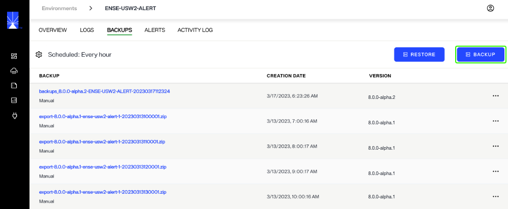
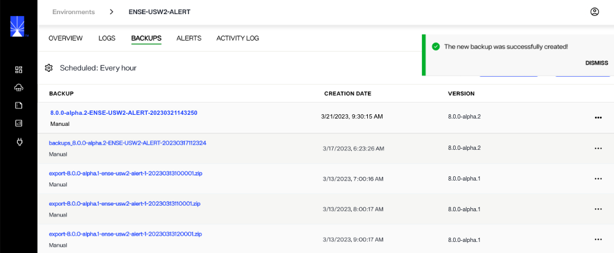
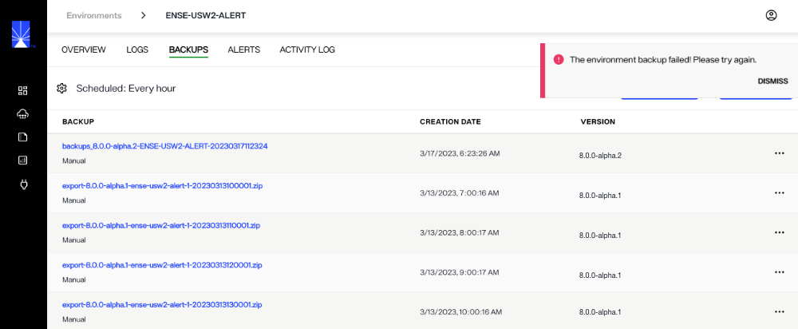

---
keywords:
title: Create an Environment Backup
description: Learn how to manually create backups of environments in Environment Operations Center.
---
# Create an Environment Backup

This guide provides an overview of the steps required to create environment backups manually. For details on scheduling automatic environment backups, see the [schedule backups](schedule-backup.md) guide.

## Getting started

To begin creating a manual backup of an environment, select the **Backup** button.

## Backup details

On the *Create Backup* screen, the "Backup Name" field must be completed in order to submit the form to create a backup. A unique backup name will automatically generate in the name field. You can adjust the provided name but it must be unique. If a backup with the same name exists, you will not be able to save the backup.

Once you have completed the name field, select **Save** to create the backup.

## Backup confirmation

While the backup is being created, you will return to the main *Backups* tab and a "Creating Backup" message is displayed below the name of the new backup.

If the backup was successfully created, you will receive a confirmation message and the new backup will be visible in the list of backups on the main *Backups* screen. Select **Dismiss** to close the message.

If the backup could not be successfully created, you will receive an error message indicating that the backup creation failed and it will no longer be listed on the main *Backups* screen. Select **Dismiss** to close the message and proceed to try creating the backup again.

## Next steps

After reading this guide you should have an understanding of the steps required to create an environment backup. To learn how to schedule automatic environment backups, review the guide on [scheduling backups](schedule-backup.md).
