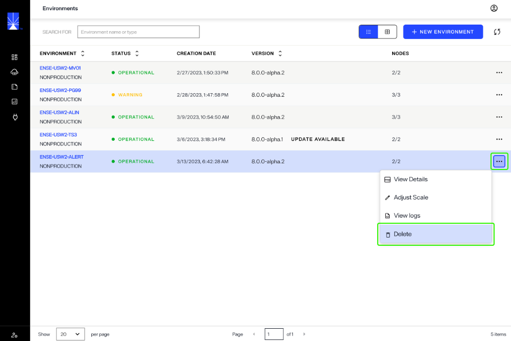
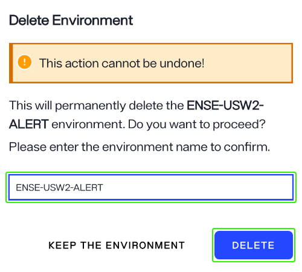
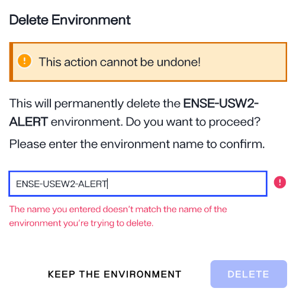
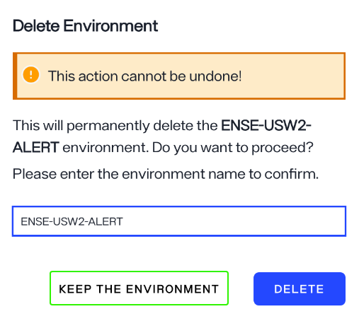
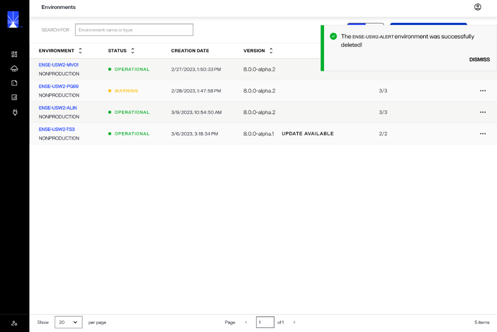

---
keywords:
title: Delete an Environment
description: Learn how to delete an environment in Environment Operations Center.
---
# Delete an Environment

This guide outlines the required steps to delete an environment while on the *Environments* home screen in Environment Operations Center. For information on deleting an environment from its detailed view, see the [delete an environment from its detailed view](../environment-details/delete-environment.md) guide.

[!note] Only non-production environments can be deleted by users. To delete a production environment, please contact Radiant Logic.

## Select the environment

From the *Environments* home screen, locate the environment you would like to delete from the list of environments. Select the ellipsis (**...**) located within the environment's row to expand the **Options** dropdown menu. From the **Options** menu, select **Delete** to open the delete environment confirmation dialog.

## Delete environment

[!note] Deleting an environment is a permanent action and cannot be undone once submitted.

To delete the selected environment, enter the name of the environment in the space provided and select the **Delete** button. 

The environment name entered must match the actual environment name exactly, otherwise you will receive an error message and will not be able to submit the delete request.

If you would like to keep the environment and exit out of the confirmation dialog, select **Keep the Environment** to return to the *Environments* home screen.

## Confirmation

After selecting **Delete** in the confirmation dialog you will return to the *Environments* home screen. Here, you'll receive a confirmation message that the environment was successfully deleted and the environment will be removed from the environments list.

If the environment could not be deleted, you will receive an error notification indicating that the attempt to delete the environment failed. The environment will still be listed on the *Environments* home screen.

## Next Steps

After reading this guide you should have an understanding of the steps required to delete an existing environment. If you would prefer to update an existing environment, please refer to the guide on [updating an environment](update-an-environment.md).
