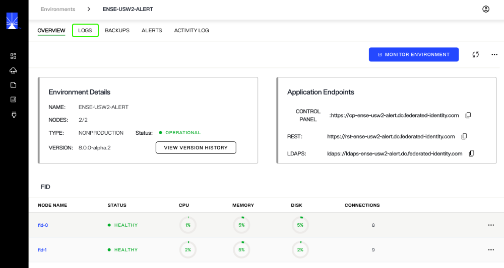
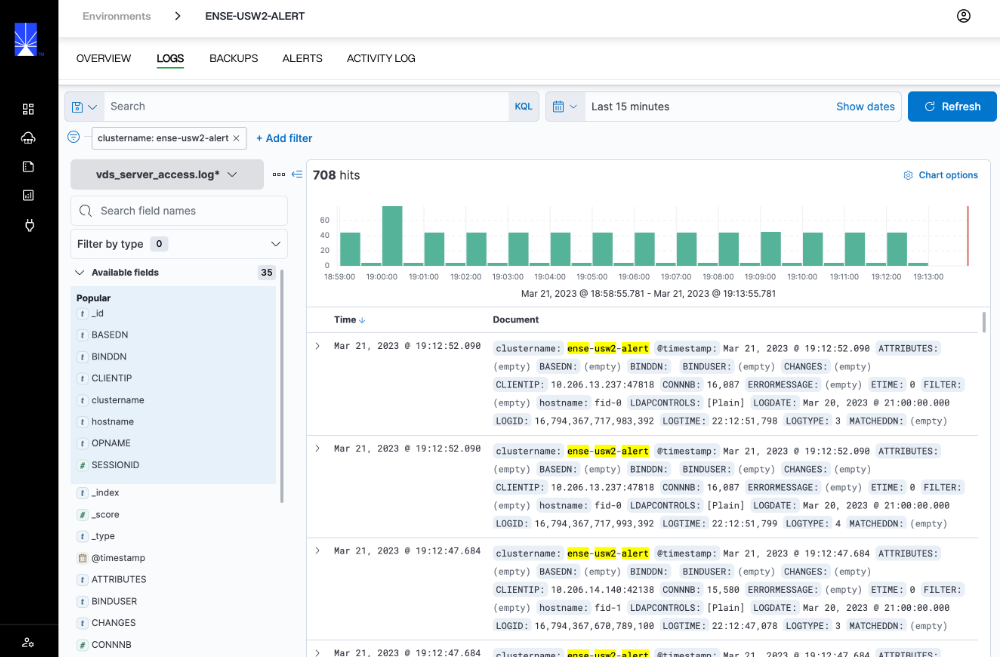
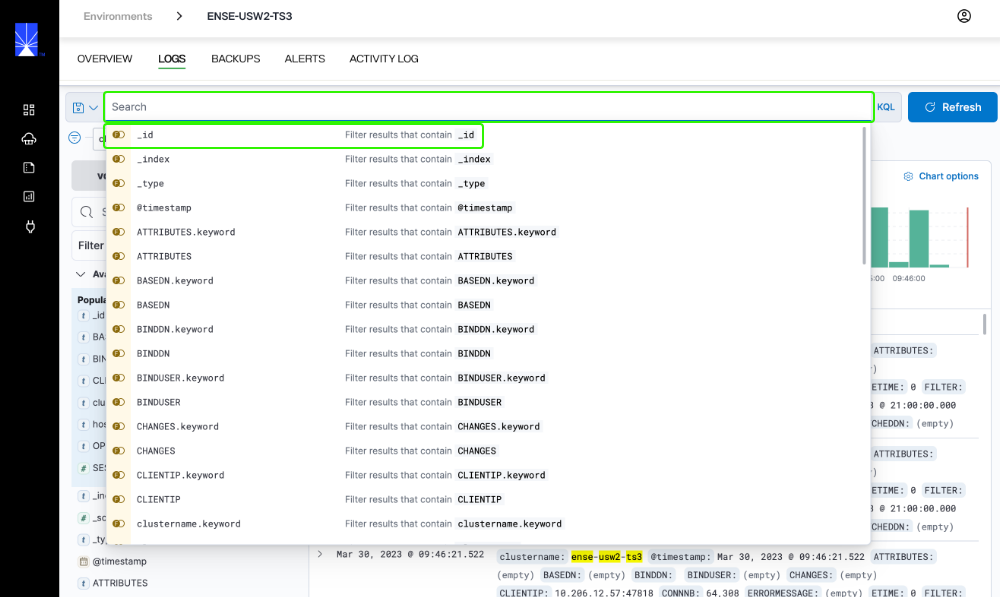
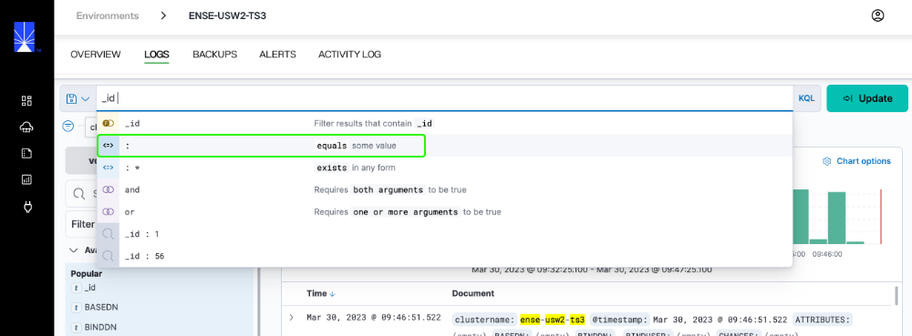
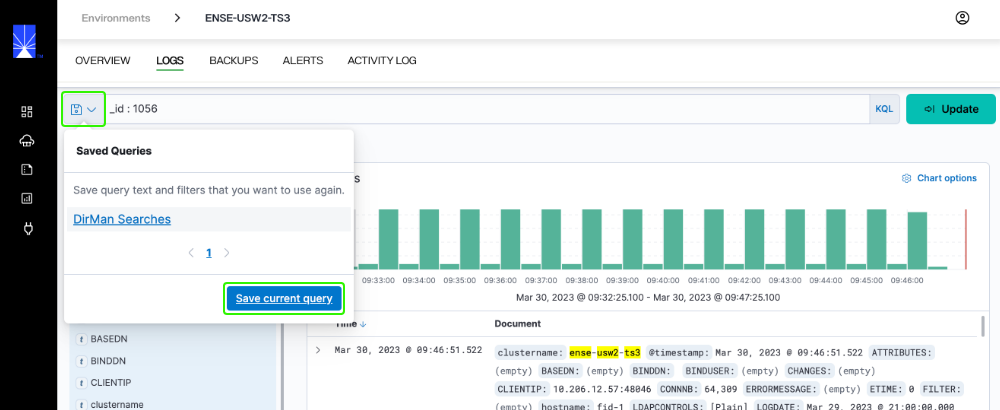
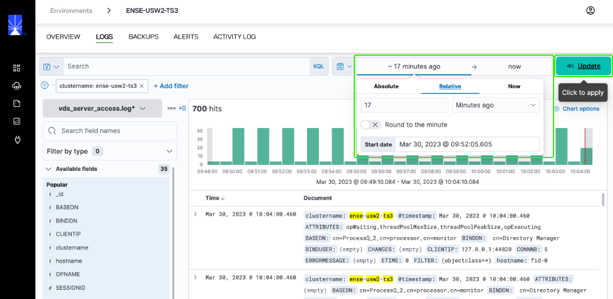
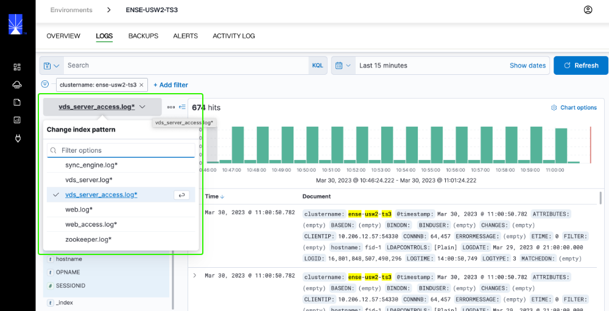

---
keywords:
title: Environment Logs
description: Learn how to access and review logs for a specific environment in Environment Operations Center. Log files let you monitor activities and troubleshoot errors in your environments. They outline the event description, a date and time stamp of when the event occurred, and the email of the user who triggered the event.
---
# Environment Logs

This guide outlines the steps to review logs for a specific environment. Log files let you monitor activities and troubleshoot errors in your environments. They outline the event description, a date and time stamp of when the event occurred, and the email of the user who triggered the event. The information contained in these logs is helpful if you require assistance from Radiant Logic Support to troubleshoot problems if they arise.

Environment Operations Center is connected to Elastic and displays the Elastic monitoring user interface directly within the Env Ops Center logging tab. This allows you to review environment logs directly in Env Ops Center without having to navigate away from the application.

[!note] For further details on specific log types and the data they provide, see the RadiantOne [logging and troubleshooting](../../../logging-and-troubleshooting-guide/01-overview.md) guide.

## Getting started

To navigate to the *Logs* screen for a specific environment, select **Logs** from the top navigation in the environment's detailed view.

From the logs tab you can filter and search the environment logs to review detailed information about environment activity.

## Filter and search logs

The search bar allows you to filter log results by field. Select the **Search** bar to expand a list of fields and select a field to filter the log files by.

Select an operator and enter a value to refine the query.

Once you have completed the search filter, select **Update** to display the filtered log files.

To save frequently used queries, select the **Save** icon next to the **Save** bar and select **Save current query**.

Logs can also be filtered by date and time. Select the **Calendar** icon to display the options to filter by quick select, commonly used, or recently used data ranges. There is also an option to set the refresh interval for log results.

Select the **Date and Time** bar to set the date and time to refresh log data. After setting the interval, select **Update** to apply the refresh interval.

## Change log type

To review a different log file, select the **Log File** dropdown and select the log file to review. Once you select the file typ, the page will load with the file details.

## Next steps

After reviewing this guide you should have an understanding of the steps required to review the log files of a specific environment. To learn more about backing up an environment, see the environment [backup and restore](../backup-and-restore/backup-restore-overview.md) documentation.
