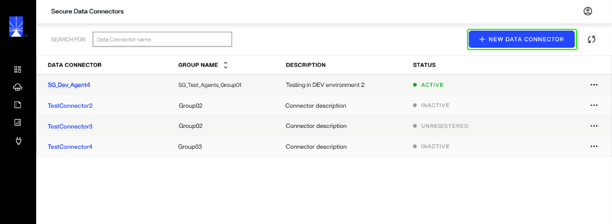
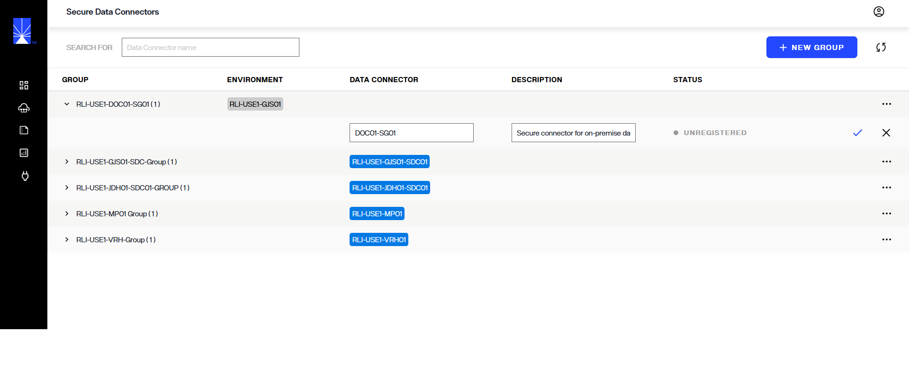
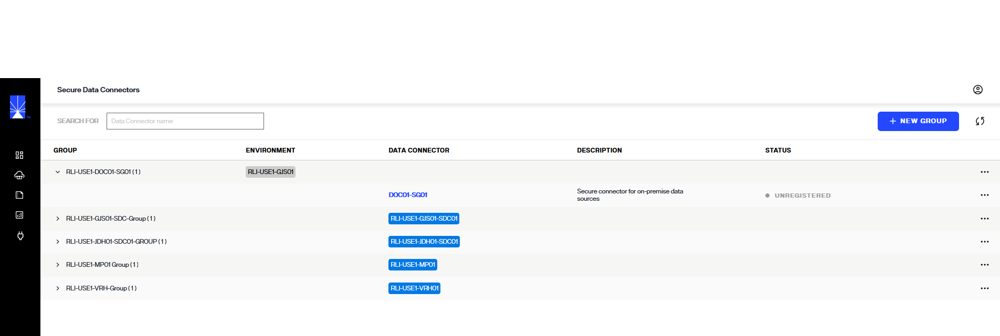

---
keywords:
title: Add a Data Connector
description: Add a data connector
---
# Add a Data Connector

The process to create a new secure data connector and establish a connection with a data source requires the following high-level steps:

- The data connector must be created in Environment Operations Center.
- The secure data connector client must be deployed on the local machine.
- The data source must be defined in the FID Control Panel. 

This guide outlines the steps to add a new secure data connector in Environment Operations Center. For details on deploying the secure data connector client, see the [deploy a secure data connector client](deploy-sdc-client.md) guide. For details on connecting to an on-premise backend from the control panel, see the [connect to an on-premise backend](...) guide.

## Getting started

To establish a connection between Env Ops Center and an on-premises network, a data connector must first be created in Env Ops Center.

To add a new data connector, select **Add New Connector** from the *Secure Data Connectors* home screen.

## Add data connector info

In the *New Data Connector* dialog, enter the data connector information in the provided name, group, and description fields.

[!note] Name and Group are required fields and must be entered to create the connector.

| Data Connector Info | Description |
| ------------------- | ----------- |
| Name | Provide a name that is relevant to the network being connected to. |
| Group | A minimum of two data connectors should be created per network environment to form a group. Groups provide failover and load balancing for the network. Either select a group from the **Group Name** dropdown list or select **New Group** to add a new group. | 
| Description | The description field is optional but is recommended to provide any details that are relevant about the network. This helps with maintaining data connectors. |

Once you have completed the required fields in the *Data Connector Info* section, select **Save** to add the new connector.

If the data connector is successfully created, it will appear in the list of available data connectors on the *Secure Data Connectors* home screen.

The *Status* of the new data connector will display as "Inactive". A connection needs to be established between a new data connector and the on-prem or cloud network for the connector to become "Active". For details on deploying the secure data connector client, see the [deploy a secure data connector client](deploy-sdc-client.md) guide.

## Next steps

You should now have an understanding of the steps to create a secure data connector in Environment Operations Center. For details on managing data connectors in Env Ops Center, see the [manage data connectors](manage-data-connectors.md) guide. To learn how to deploy the secure data connector client, see the [deploy a secure data connector client](deploy-sdc-client.md) guide.
