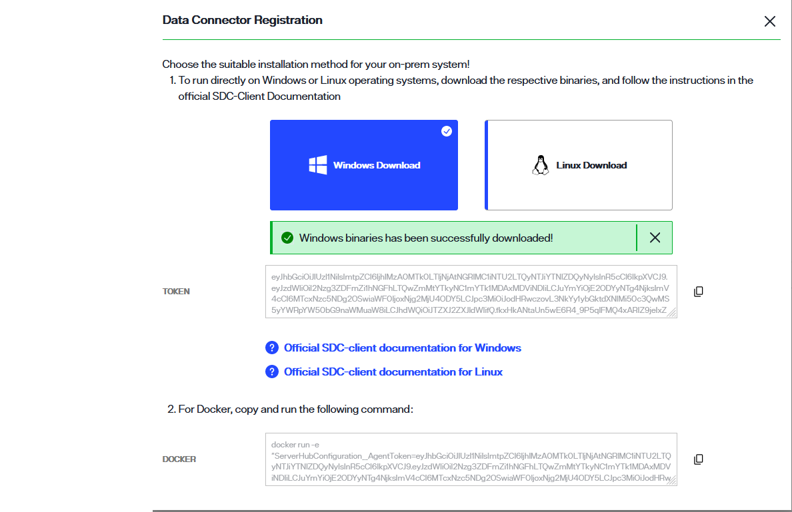

---
keywords:
title: Deploy the Secure Data Connector Client
description: Learn how to deploy the Secure Data Connector client in your on-premise or private cloud environment.
---
# Deploy the Secure Data Connector Client

Once a secure data connector has been created in Environment Operations Center, the client must be deployed on your local system before you can establish a connection. This guide outlines the system requirements and steps to deploy a data connector client on a Windows, Linux, or Docker system.

> [!note]
> You must create a secure data connector endpoint in Env Ops Center before deploying on the client side. For details on how to create a secure data connector in Env Ops Center, see the [add a data connector](add-data-connector.md) guide.

## System requirements

The following system specifications are required to deploy the secure data connector client. Please ensure your system meets these requirements before proceeding to the deployment steps below.

System requirements:

- ASP.NET core runtime must be installed on the machined or SDK (version 6 and above). The runtime is available on the [Microsoft .NET](https://dotnet.microsoft.com/en-us/download/dotnet/6.0) page.
- CPU: x-64 processor
- Processor: 1 GHz
- RAM 512 MB
- Minimum disc space (64-bit): 4.5 GB

## Getting started

Before deploying the secure data connector client, you must retrieve the registration token associated with the data connector in Env Ops Center. For Windows or Linux systems, you must also download the respective binary. 

To locate these dependencies in Env Ops Center, select the connector name to open the connector details. Alternatively, you can also select **View Details** from the **Options** (**...**) dropdown menu to open the connector details.

**image**

In the *Data Connector Info* section the connector status will display as "Unregistered" and there will be no available connections. 

Next to the status in the *Data Connector Info* section select **Register**.

**image**

For Windows or Linux systems, select the applicable card to download the binary.

A confirmation message will display once the binary has successfully downloaded.

Select the copy icon to copy the registration token located just below the Windows and Linux cards. You will use this while deploying the secure data connector client. The steps to deploy a secure data connector on a Windows or Linux system are outlined in the following sections.

For a Docker container, copy the registration token located in the *Docker* section of the *Data Connector Registration* dialog. You will use this while deploying the secure data connector client on the Docker container. The steps to deploy a secure data connector on a Docker container are outlined in the following sections.

## Deploy on Windows

To deploy the secure data connector client on a Windows system, first unzip the *sdc-windows-.zip* file into a directory on the client system. Next, locate the following files:

- *appsettings.Production.json*
- *RadiantLogic.OnPremisesAgentClient.Agent.exe*

![image description] (insert screenshot of file system)

Open the *appsettings.Production.json* file and locate the `"AgentToken"` field. Enter the token copied from the *Data Connector Registration* dialog in Env Ops Center into the `"AgentToken"` field.

![image description] (insert screenshot of the appsettings file containing the agent token field)

Launch the *RadiantLogic.OnPremisesAgentClient.Agent.exe* file. A notification will display in the command line that confirms a connection has been established between the agent and server.

Once the client is running, you can can setup a connection with the on-premise backend. For details on setting up a connection, see the [server backend](../../sys-admin-guide/server-backend.md) guide.

## Deploy on Linux

To deploy the secure data connector client on a Linux system, first unzip the *sdc-windows.zip* file into a directory on the client system. Next, locate the following files:

- *appsettings.Production.json*
- *RadiantLogic.OnPremisesAgentClient.Agent.exe*

![image description] (insert screenshot of file system)

Open the *appsettings.Production.json* file and locate the `"AgentToken"` field. Enter the token copied from the *Data Connector Registration* dialog in Env Ops Center into the `"AgentToken"` field.

![image description] (insert screenshot of the appsettings file containing the agent token field)

Open the command line and navigate to the directory that contains the unzipped *sdc-windows.zip* files. From the directory, run the following command to launch the secure data connector client:

`dotnet run RadiantLogic.OnPremisesAgentClient.Agent.dll`

Once the client is running, you can can setup a connection with the on-premise backend. For details on setting up a connection, see the [server backend](../../sys-admin-guide/server-backend.md) guide.

## Deploy on Docker

To deploy the secure data connector client on Docker, Docker must first be installed on the system. If you have not yet installed Docker, please visit the [Docker](https://docs.docker.com/get-docker) site and follow the instructions to download and install.

Open the command line and run the following command to start the client, replacing "`access_token`" with the token copied from Env Ops Center:

`docker run -e "ServerHubConfiguration_AgentToken=[access_token]" radiantone/sdc-client`

The `radiantone/sdc-client` is the latest image of the secure data connector client container located in the Radiant Logic Docker Hub repository.

![image description] (insert screenshot of docker command line)

Once the client is running, you can can setup a connection with the on-premise backend. For details on setting up a connection, see the [server backend](../../sys-admin-guide/server-backend.md) guide.

## Next steps

After reading this guide, you should now have an understanding of the steps required to deploy a secure data connector client on a Windows, Linux, or Docker system. To learn how to establish a connection with the on-premise backend, see the control panel [server backend](../../sys-admin-guide/server-backend.md) guide. For details on updating and monitoring the secure data connector client, see the [manage the secure data connector client](manage-sdc-client.md) guide.
