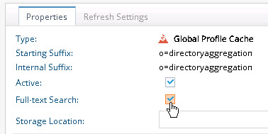
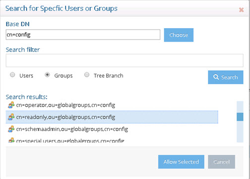
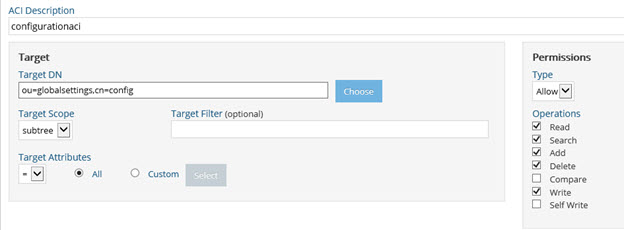

# Configuration

Before accessing the Global Identity Viewer, several preliminary tasks must be completed.

✓ Use the Global Identity Builder to create the reference list of identities. This step is
documented in the RadiantOne Global Identity Builder Guide.

✓ Configure real-time persistent cache refresh for the global profile view. This step is documented in the RadiantOne Global Identity Builder Guide.

✓ Enable full-text indexing for the global profile view. This step is documented in this chapter.

✓ Configure a persistent cache (with applicable refresh) and Full-text indexing for all underlying virtual views of identity sources, to facilitate advanced searching in the Global Identity Viewer. This step is documented in this chapter.

✓ Configure the needed access permissions and privileges to authorize use of the application. This step is documented in this chapter.

>[!warning]
>The Global Identity Viewer requires a subscription to the Insights, Reports and Adminstration module. If you would like to add this subscription, please contact your Radiant Logic account representative.

## Enable Full-Text Search

To enable full-text search capabilities against the global profile reference list:

1. Go to the Main Control Panel > Directory Namespace tab > Cache section and select the naming context corresponding to the name of your Global Identity Builder project.
2. Click the Full-text Search box.

    

    Figure 1: Full Text Search Option

3. Click OK to close the Note.
4. Click Save. Click Yes.
5. Click Re-build Index at the bottom.
6. Click Yes.
7. You can either select the running task and click View Log to track the progress, or you can click OK to close the Tasks Monitor window.
8. To enable full-text search capabilities against the virtual views that were auto-generated for each of the underlying sources, go to the Main Control Panel > Directory Namespace tab and click **Cache**.
9. Click Browse.
10. All underlying identity views are located below     dv=sourcecatalog,ou=directoryaggregation,dv=globalprofiles. An example with four identity sources is shown below.

    

    Select one of the virtual views representing an identity source (e.g. based on the samples shown above is dv=ids_adpartnerdomain_directoryaggregation).

    >[!warning]
    >Configure the persistent cache at the level of each individual backend. Do not configure the persistent cache at the dv=sourcecatalog or the dv=globalprofiles levels.

11. Click Create Persistent Cache.
12. Click OK.
13. On the Refresh Settings tab, choose the persistent cache refresh type. For details on persistent cache options and configuration, see the RadiantOne Deployment and Tuning Guide.
14. Click Save.
15. On the Refresh Settings tab, click Initialize.
16. After initialization, select the Properties tab.
17. Click the Full-text Search box to enable it.
18. Click OK to close the note.
19. Click Save. Click Yes.
20. On the Properties tab, click Re-build Index at the bottom.
21. Click Yes.
22. You can either select the running task and click View Log to track the progress, or you can click OK to close the Tasks Monitor window.
23. Repeat steps 8-21 to cache virtual views for all identity sources.

>[!warning]
>If you make any changes to the identity sources (e.g. mappings, correlation rules...etc.) in the Glo bal Identity Builder project the identity source views are recreated. Therefore, you must delete and reconfigure the persistent cache on these views.

## Define Access Permissions

Three default groups are designed to be used with the Global Identity Viewer. They are Global ID Viewer Design, Global ID Viewer Write, and Read Only. Any member associated with these roles can log into the Insights, Reports and Administration Console and access the Global Identity Viewer. There are three privileges assigned to these roles to dictate what the user is authorized to do within the Global Identity Viewer.

| vdPrivilege Name | View entries & attributes | Perform searches | Edit, delete templates | Create, edit, delete queries | Export results | Modify attr values | configure/ schedule reports | Default groups/ roles that have this privilege
|------|------|------|------|------|-----|-----|-----|-----| 
globalidviewer-read | ✓ | ✓ |  |  |  |  |  | Read Only   cn=readonly,ou=globalgroups,cn=config
globalidviewer-designer | ✓ | ✓ | ✓ | ✓ | ✓ | ✓ | ✓ | Global ID Viewer Design   cn=Global ID Viewer Design,ou=globalgroups,cn=config
globalidviewer-write | ✓ | ✓ |  |  | ✓ | ✓ |  | Global ID Viewer Write   cn=Global ID Viewer Write,ou=globalgroups,cn=config

To add your user to a RadiantOne group:

1. Log into the Main Control Panel as the super user and click on the Directory Browser tab.
2. Navigate below ou=globalgroups,cn=config node to locate all of the default groups.
3. Select the group (e.g. cn=Global ID Viewer Design) you want to add your user to and click Manage Group. From here you can remove users from groups and search for new users (located anywhere in the virtual namespace) to add to groups.

4. (Optional) Repeat step 3 to add users to other groups (e.g. cn=Global ID Viewer Write, or cn=readonly) used by the Global Identity Builder.

    In addition to being assigned one of the roles mentioned above, proper read, search, and in some cases write permissions are also required. These permissions should be configured for the root naming context defined in the Global Identity Builder project and dv=globalprofiles. This section describes how to add permissions.

    To define access permissions:

    >[!warning]
    >Access rights can be defined by any user who is a member of the ACI Administrators group or the Directory Administrators group. For details on all administrative groups available for RadiantOne, please see Delegated Administration of RadiantOne in the RadiantOne System Administration Guide.

5. From the Main Control Panel > Settings Tab > Security section > Access Control sub-section, select the Enable ACI checkbox on the right side in the Authorization section and click Save.
6. In the Access Control section, click **Add**. The Edit ACI pane is displayed.

    >[!note]
    >The Target Scope pull-down menu value defaults to subtree, and the Target Attributes value defaults to All.

7. Enter an ACI description (e.g. globalprofileaci).
8. Click the Choose button to navigate to the target DN.
9. Select the root naming context corresponding to what you defined in the Global Identity Builder and click OK. An example is shown below.

    

    Figure 2: Example of a Naming Context Configured in the Global Identity Builder and Location for Defining Access Controls

10. In the Permissions section, select Allow from the drop-down menu and select the Read and Search operations.
11. In the Apply To section, click Specific Users.
12. Enter cn=config for the Base DN.
13. Select the groups option and click Search.

    

    Figure 3: Defining Access Controls

14. Select the groups that require the ability to perform searches on users and groups from the Global Identity Viewer and click Allow Selected. This should be the group that contains the user you added in step 3 earlier in this section.

    >[!warning]
    >Any groups that should be able to update attributes in the identity sources (that are associated with [Modify Templates](03-global-identity-viewer.md#modify-templates)) should also have “write” permissions.

15. Select the default “anyone” and click Delete.
16. Click Save.
17. Repeat steps 6-16 for dv=globalprofiles target (naming the aci something like identitysourcesaci).

    >[!warning]
    >If you have multiple Global Identity Builder projects and want to grant access on a per-project basis, define access permissions on the sub-branch under dv=globalprofiles that is associated with the project (ou=<Global_Identity_Builder_ProjectName>) instead of the dv=globalprofiles level.

    Permissions must also be granted to allow the user to save, edit, and delete queries, and save custom templates.

18. From the Main Control Panel > Settings Tab > Security section, select Access Control.
19. In the Access Control section, click **Add**. The Edit ACI pane is displayed.

    >[!note]
    >The Target Scope pull-down menu value defaults to subtree, and the TargetAttributes value defaults to All.

20. Enter an ACI description (e.g. configurationaci).
21. Click the Choose button to navigate to the Target DN.
22. Expand cn=config and select ou=globalsettings. Click OK.
23. In the Permissions section, select Allow from the drop-down menu.
24. Select the Read, Search, Add, Delete, and Write operations.

    >[!warning]
    >Users assigned to the Read Only role only need Search permissions. Whereas users assigned to the Global ID Viewer Design or Global ID Viewer Write roles need Search, Add, Delete, and Write permissions.

    

    Figure 4: Sample ACI for the Global Identity Viewer

25. In the Apply To section, click Specific Users.
26. Enter cn=config for the Base DN.
27. Select the groups option and click Search.
28. Select the group (e.g. Global ID Viewer Design or Global ID Viewer Write) that [contains the user(s)](#define-access-permissions) and click Allow Selected.
29. Select the default “anyone” and click **Delete**.
30. Click Save.
