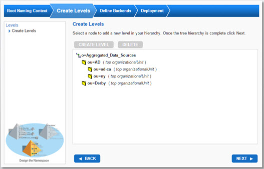
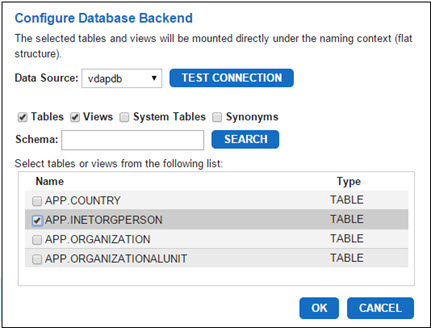

# Chapter 2: Directory Tree Wizard

The Directory Tree Wizard creates a virtual view which can aggregate multiple types of backends (combination of directories, database, web services, and so on) under a naming context. The wizard guides you through creating the root naming context, creating levels of hierarchy beneath the root naming context, and mounting LDAP and database backends to leaf nodes.

Data sources that you connect to in the Directory Tree Wizard must be configured prior to reaching the Define Backends page of the wizard. This can be done before launching the wizard from the Main Control Panel -> Settings tab -> Server Backend section as described in the steps below. For more information on configuring data sources, refer to the System Administration Guide. 

The detailed steps are as follows.

1.	Log in to the Main Control Panel.

2.	Start the RadiantOne service. 
3.	From the Main Control Panel > Settings Tab, expand below the Server Backend node and click one of the data source options. Click the Add button to add a new data source.

>**IMPORTANT NOTE – When creating an LDAP data source, do not use special characters in the Base DN value.**

4.	After the data source is created, from the Main Control Panel click the Wizards tab.

5.	Click the Directory Tree Wizard.
6.	On the wizard’s welcome page, click Next.
7.	Enter a root naming context (the suffix that LDAP clients use to access this branch in the virtual directory) and click Next.

At this point, you can create a virtual hierarchy that is as deep as you want.

8.	Select the root naming context and click Create Level. 
9.	Select a Level Type. Provide a name for the sub-level and click OK. An example hierarchy is shown in the figure below. 

>**Note – This step is optional. However, if you choose to continue without adding sub-levels, backends and their data source connections under the naming context created here can be configured on the Directory Namespace tab only after the Directory Tree Wizard has finished.**

 
Figure 2.1: Sample Virtual View

10.	After the hierarchy is designed, click Next. 

11.	Select a leaf node and select either Mount LDAP Backend or Mount Database Backend. 
12.	Click the Data Source drop-down menu and select the data source that represents the backend you want to mount at this location in the hierarchy. 

 
Figure 2.2: Example of Mounting a Database Backend

13.	Click Next. 

14.	Click the Create button. Wait for the message “The tree has been created successfully” to be displayed. Click OK to close this dialog box.

15.	Click Finish to close the wizard.

The new virtual view created with the wizard is displayed below Root Naming Contexts. To edit any of the configuration details, go to the Directory Namespace tab, select the node, and change the parameters on the tabs on the right.
 