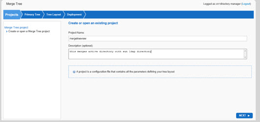
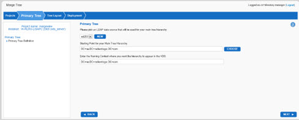
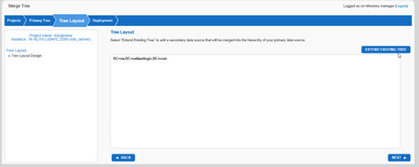
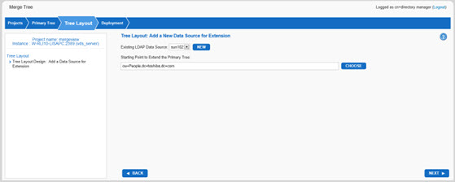
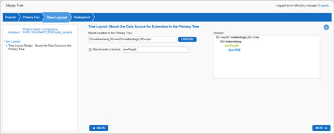

# Chapter 5: Merge Tree Wizard

The Merge Tree Wizard is used for merging multiple data sources into a single naming context in the RadiantOne namespace, while maintaining the underlying directory hierarchy. The Merge Tree Wizard is ideal for situations where applications are expecting to find information in an explicit hierarchy which already exists in a backend LDAP directory and there is a need to extend a part of this hierarchy with additional information from other LDAP data sources. 

The detailed steps are as follows:

1.	Log into the Main Control Panel.

2.	Click the Wizards tab.

3.	Click the Merge Tree button.

4.	Click Next on the welcome page.

5.	Enter a project name. This creates a configuration file that contains the parameters defining the groups you want to migrate. Enter a description (optional) and click Next.

 
Figure 5.1: Sample Merge Tree Project

6.	Select a primary data source from the drop-down menu. If you do not see the requested data source listed you can configure a new data source. Enter a starting point in the primary tree that will be mounted into the RadiantOne namespace. 

7.	Enter the location where this branch should be mounted in the RadiantOne namespace. By default, this has the same naming context of the Primary Base DN. You can either keep this naming (if it doesn’t already exist in the RadiantOne namespace), or enter the DN where the branch (hierarchy from the primary tree) should be mounted.

 
Figure 5.2: Primary Tree Definition

8.	Click Next.

9.	Click “Extend Existing Tree” to add a secondary data source that will be merged into the hierarchy of your primary data source. 

 
Figure 5.3: Extend Existing Tree

10.	Select an existing LDAP data source from the drop-down menu. If you do not see the requested data source listed in the drop-down menu, click “New” and follow the wizard steps to create a new data source. 

>**IMPORTANT NOTE – When creating an LDAP data source, do not use special characters in the Base DN value.**

11.	Enter the starting point that you would like to extend the primary hierarchy with.

 
Figure 5.4: Data Source for Tree Extension

12.	Click Next.

13.	If you would like to merge the tree extension below an existing container in the primary tree, click “Choose” to display the available sub-nodes. If you would like to mount the branch from the secondary source below a new container, enter this name in the space provided after the “mount under a branch” and check the option. As you make changes to the mount location, you will be able to see the tree hierarchy of the view you are creating in the preview screen.
 

Figure 5.5: Mounting the Tree Extension

14.	You can add as many extension data sources as you would like to build your tree by clicking Next and then Extend Existing Tree again. Follow the same steps mentioned above to mount another extended branch into the main hierarchy.

15.	If you are done adding extensions, click Next.

16.	The merge tree view is mounted into the RadiantOne namespace and can be viewed from the Directory Browser tab in the Main Control Panel. Click Finish to close the wizard.

## Authenticating Users Against a Merged View

The structure of the merged view dictates which backend(s) authentication of a user is validated against. The data source associated with the main tree is searched first. If the user is found in this backend, the credentials checking is only performed against this backend and the success or failure is returned to the client. Only if the user is not found in the main backend, the data source associated with the merged branch is searched. If the user is found in the merged branch, the credentials checking is performed against this backend. This logic continues until the user is found or until all backends have been searched and the user is not found.

## Modifying Entries Against a Merged View

The structure of the merged view dictates the order of the backend(s) that modifications are sent to. The data source associated with the main tree is the first backend that receives the modification. If the entry is not located in that backend (error code 32 returned), the modification is sent to the next backend in the view definition. This continues until the entry is found and modified (or modification failure) or the list of backends is exhausted.
