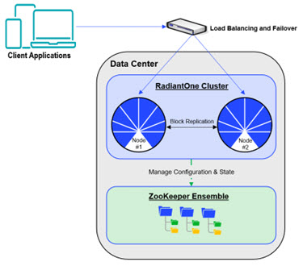
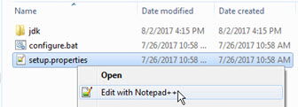
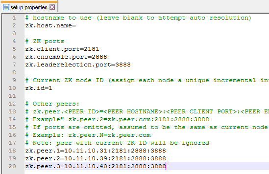
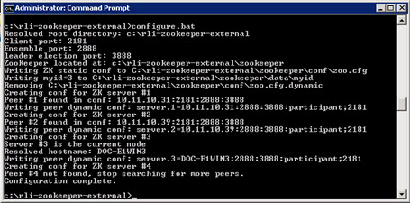
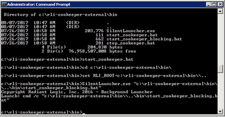
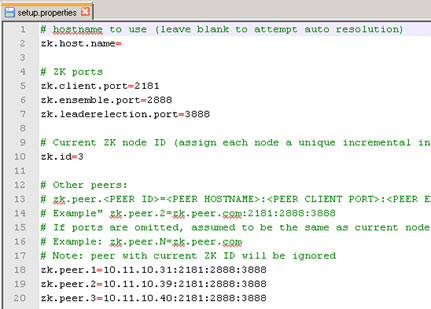
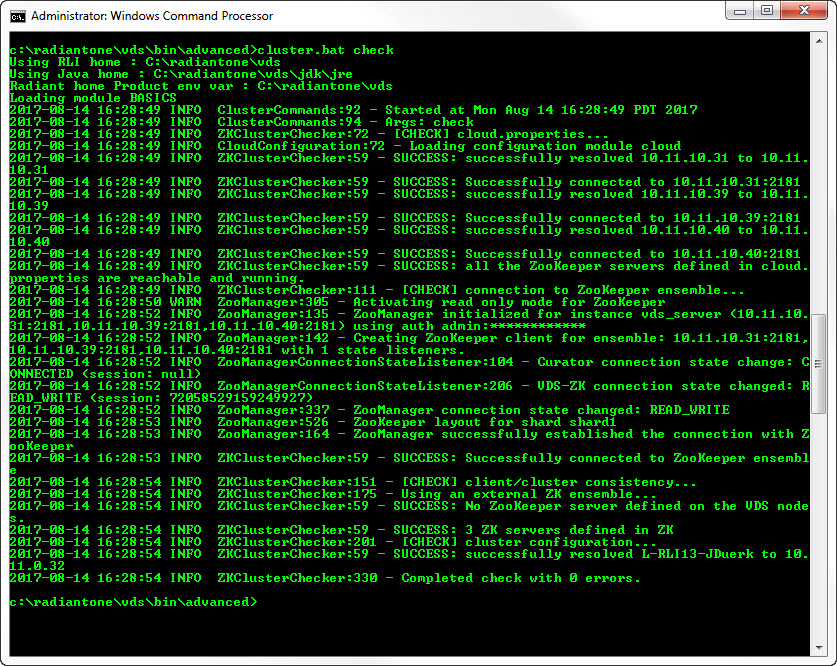
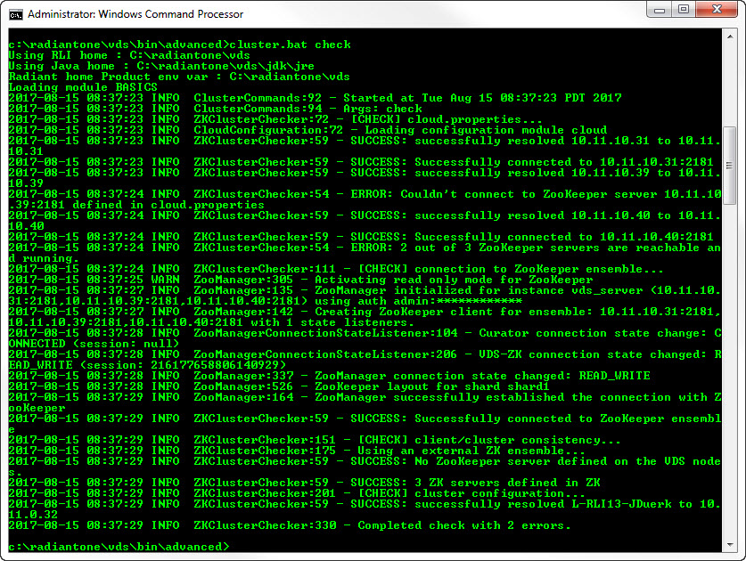
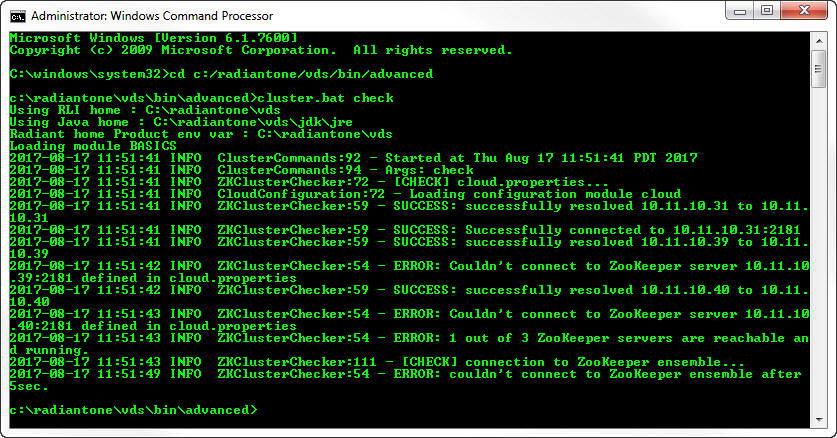

# Introduction

Apache ZooKeeper is a centralized service for maintaining configuration information across a RadiantOne cluster. Although RadiantOne comes bundled with ZooKeeper to simplify installation in Dev/QA environments, it is discouraged to use this architecture in production. Shutting down a redundant RadiantOne server will also shut down ZooKeeper on this server. Because a ZooKeeper ensemble must have a quorum of more than half its servers running at any given time, this can be a problem for cluster integrity and stability. The solution is to deploy ZooKeeper in a separate, external ensemble.

Other advantages of having a ZooKeeper ensemble separate from the RadiantOne nodes include:

- As a general best practice, you should only have one main service per server. This allows machines resources to be devoted to a single service and not have to compete for resources with other services.
- You can choose the number of ZooKeeper nodes to deploy to meet your HA requirements (e.g. 3, which allows for the failure of 1 server, or 5 which allows for the failure of 2 servers) independently from the number of RadiantOne nodes you need to serve client requests.
- You can choose the number of RadiantOne nodes to meet your needs. Only one node needs to be up for the service to work. A RadiantOne cluster of 2 nodes might be sufficient whereas if ZooKeeper was on the same server as RadiantOne you would be required to have 3 nodes to accommodate the requirements of the ZooKeeper ensemble for HA.
- This de-coupled (single service per server) architecture is better for running in container technologies like Docker, simplifying deployment.
- Easier to troubleshoot problems and there is one less point of failure per machine.

For details on installing RadiantOne in a Dev/QA environment see [Installation](02-installation).

For details on installing RadiantOne in a production environment, start with the steps in this guide to setup the external ZooKeeper ensemble. Then, refer to [Installation](02-installation) on how to point to an external ZooKeeper ensemble.

The installers are available via an ftp site. Contact support@radiantlogic.com for access information.

## Configuring External ZooKeeper Ensemble

For HA a minimum of three Zookeeper nodes is required.

Figure 1: RadiantOne Cluster with External Zookeeper Ensemble

## Configuring the First ZooKeeper Server

To configure the first ZooKeeper server:

1. On the first node in the Zookeeper ensemble, extract the compressed Zookeeper installer.

   >[!note]
    >The screen shot below is a general reference and the file name indicated is not the latest zip file name. For Windows deployments, use the rli-zookeeper-external-`<version>`-windows_64.zip file. For Linux deployments, use the rli-zookeeper-external-`<version>`-linux_64.tar.gz file.

   

   Figure 2: Extracting the Compressed Zookeeper File

1. Open the extracted folder.
1. Open the folder rli-zookeeper-external.
1. Open the file setup.properties in a text editor. In this example, the file is opened using Notepad++.

    

    Figure 3: Opening setup.properties

1. To attempt auto-resolution of the hostname, leave the zk.host-name value empty. In this example, this value is empty.
1. To configure the ports used by Zookeeper, edit the values under # ZK ports. In this example, the default port values (2181, 2888, and 3888) remain unchanged.
1. Under the “# Current ZK node ID (assign each node a unique incremental integer: 1,2,3,...)” line, append the zk.id line. As this is the first node in the cluster, enter a 1 so the line reads as follows.

   `zk.id=1`

   >[!warning]
   >This value must be a unique incremental value for all nodes in the cluster. The first node’s zk.id value should be 1, the second node’s    zk.id value should be 2, and so on.

1. Enter values for the zk.peer parameters. The syntax for this parameter is as follows.

   `zk.peer.1=hostname:<zk.client.port>:<zk.ensemble.port>:<zk.leaderelection.port>`
     `zk.peer.2= hostname:<zk.client.port>:<zk.ensemble.port>:<zk.leaderelection.port>`
     `zk.peer.3= hostname:<zk.client.port>:<zk.ensemble.port>:<zk.leaderelection.port>`

   In this example, these values are as follows:
   `zk.peer.1=10.11.10.31:2181:2888:3888`
     `zk.peer.2=10.11.10.39:2181:2888:3888`
     `zk.peer.3=10.11.10.40:2181:2888:3888`

1. Save setup.properties. In this example, the file is configured as follows for the first node in the cluster:

    

    Figure 4: The setup.properties File On the First Zookeeper Node

1. In a Command Processor window, navigate to C:\rli-zookeeper-external.
1. Run configure.bat. The configuration detects the additional nodes.

    

    Figure 5: Configuring Zookeeper

1. In the command processor, navigate to C:\rli-zookeeper-external\bin.
1. Run start_zookeeper.bat. Text similar to the following displays.

    

    Figure 6: Starting ZooKeeper

>[!warning] Any change to the setup.properties file requires re-configuring (configure.bat) and then restarting (start_zookeeper.bat) ZooKeeper.

### Configuring Additional ZooKeeper Nodes

Once the first Zookeeper node is configured, you are ready to configure additional nodes.

1. On the second node in the cluster, perform the instructions in [Configuring the First Zookeeper Server](#configuring-the-first-zookeeper-server). The configured setup.properties file on Zookeeper node #2 should resemble the following image.
 
    >[!warning]
    >Note that the zk.id value for this node is set to 2.

    

    Figure 7: The setup.properties File on the Second Zookeeper Node

2. On the third node in the cluster, perform the instructions in [Configuring the First Zookeeper Server](#configuring-the-first-zookeeper-server). The configured setup.properties file on Zookeeper node #3 should resemble the following image.

    >[!warning]
    > Note that the zk.id value for this node is set to 3.

Figure  8: The setup.properties File on the Third Zookeeper Node

>[!warning] Any change to the setup.properties file requires re-configuring (configure.bat) and then restarting (start_zookeeper.bat) Zookeeper.

## Installing RadiantOne

Once all Zookeeper nodes have been configured and started, install RadiantOne. Details about the RadiantOne installation process can be found in [Installation](02-installation).

If you use a load balancer, enter the hostname of the load balancer in the ZooKeeper Hostname/IP field. If you do not use a load balancer, enter the hostname and port number of one of the machines in the Zookeeper ensemble in the ZooKeeper Hostname/IP field. In this example, a load balancer is not used, so the Hostname value is r1-server, and the port number would be 2181.

Figure 9: The ZK Connection String Value in the RadiantOne Installer

### Configuring SSL between FID and ZooKeeper

Configuring SSL between FID and ZooKeeper can be configured after RadiantOne is installed. The steps are described in the [RadiantOne Hardening Guide](/documentation/hardening-guide/00-preface).

## Testing a ZooKeeper Cluster

Once the Zookeeper ensemble and RadiantOne FID nodes are installed, you can test access to the ZooKeeper cluster.

To test a Zookeeper cluster:

1. On a machine that is running RadiantOne FID, open a Command Processor.
2. At the command line, navigate to <RLI_HOME>\bin\advanced. With a default RadiantOne FID installation, this location would be as follows (on Windows).

   `c:\radiantone\vds\bin\advanced`

3. Run the following command.

   `cluster.bat check`

If Zookeeper is functional on all nodes, “SUCCESS” messages similar to the following are displayed.

Figure 10: A Cluster Check with All Nodes Online

In the following image, one Zookeeper node has gone offline. In this example, RadiantOne nodes are unable to connect to the Zookeeper node at 10.11.10.39.

Figure 11: A Cluster Check with One Node Offline

In the following image, two Zookeeper nodes have gone offline. If the ZooKeeper ensemble only had three nodes to begin with, the loss of two nodes puts the service in a non-functional state since the quorum has been lost. The RadiantOne nodes are impacted at this point and will enter into a read-only mode where they cannot accept configuration changes nor client write operations.

>[!note]
>As an alternative to the default read-only mode, ZooKeeper can be configured for SHUTDOWN mode when the quorum is lost. In this case, the RadiantOne service on all cluster nodes shuts down. If this behavior is preferable, set "onZkWriteLossVdsServerBehavior" : "SHUTDOWN", for the /radiantone/v1/cluster/config/vds_server.conf node on the Main Control Panel > ZooKeeper tab. For more information, see the [RadiantOne Deployment and Tuning Guide](/documentation/deployment-and-tuning-guide/00-preface)e.

Figure 12: A Cluster Check with Two Nodes Offline

### Configuring ZooKeeper to Startup as a Service

Use the native operating system utilities (Task Scheduler or Linux Daemons) to configure the
ZooKeeper service on each node in the ensemble so that it starts up automatically after reboot.
The script to start ZooKeeper is <ZooKeeper_HOME>\bin\start_zookeeper.bat/.sh.

Scripts to install ZooKeeper as a service can be found by navigating to the RadiantOne version on the site referenced at the link above (e.g. /Installers/7.4/7.4.7) and then going to the ScriptsToInstallZKService folder.

https://support.radiantlogic.com/hc/en-us/articles/4484716474132-RadiantOne-Installers-and-Updaters

For further assistance, contact support@radiantlogic.com.
