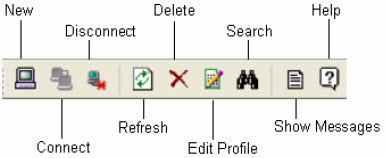
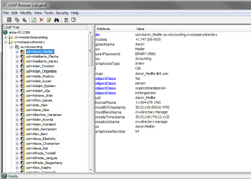

# RadiantOne LDAP Browser Guide

## Overview

The LDAP Browser is a Java-based LDAP client used for viewing and managing the content of any LDAP directory.

To connect to the RadiantOne LDAP service, please see create a profile [Create a Profile](02-using-the-ldap-browser#Create-a-Profile-for-Radiantone) for RadiantOne.

To connect to any LDAP server, please see the section on [creating profiles](02-using-the-ldap-browser#Create-a-Profile).

This guide presents the LDAP Browser concepts and procedures as follows:

▪ [LDAP Browser Concepts](#LDAP-Browser-Concepts)

▪ [LDAP Browser Interface](#ldap-browser-interface)

▪ [Using the LDAP Browser](#Using-the-LDAP-Browser)

### LDAP Browser Concepts

This section describes some terms that are important to know for using the LDAP Browser.

▪ [Profile](#Profile)

▪ [LDIF](#LDIF)

#### Profile

A profile stores the necessary information required to connect to an LDAP-enabled directory. This information includes server name, port, username and password (if required), and BaseDN. The profile information is stored in a .prof file and can found in the directory of $RLI_HOME\<instance_name>\ldif\profiles. For more information, please see [Manage Directory Profiles](02-using-the-ldap-browser#Manage-Directory-Profiles)

#### LDIF

An LDIF file can be generated from the directory trees. After testing the tree from the LDAP Browser, an LDIF file can be generated for populating an existing LDAP directory. For more information, please see [Creating an LDIF File](02-using-the-ldap-browser#Create-an-LDIF-file-for-populating-a-directory).

### LDAP Browser Interface

The LDAP Browser commands can be accessed in any of the following ways:

- Pull-down Menus
  The menus are available from the menu bar at the top of the LDAP Browser interface.
After you click the menu name to display a list of commands, click the command for the desired action.

- Popup Menus
  In the LDAP Browser, right-click on an entry to display the popup menu (See Figure 4.1)

    

    Figure 4.1: LDAP Browser Shortcut Menu

- The Toolbar
  The toolbar contains the LDAP Browser buttons required to use the interface (See Figure 4.2).

Figure 4.2: LDAP Browser Toolbar

When you open a .prof file, the LDAP Browser displays the directory tree according to the Base DN entered in the configuration. As you select a node in the tree, information about the entry appears on the right side. See Figure 4.3.

Figure 4.3: LDAP Browser Interface
