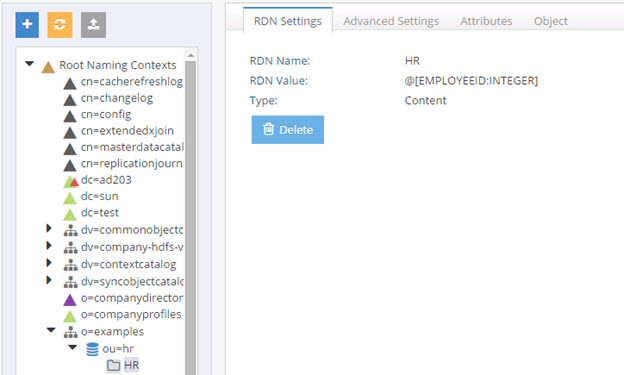
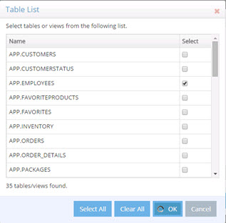
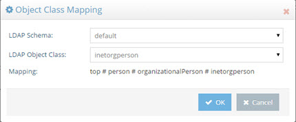
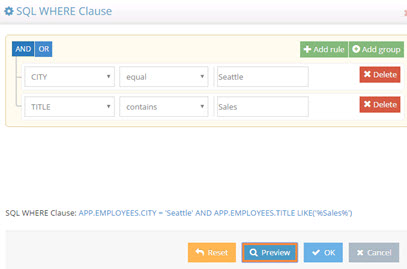
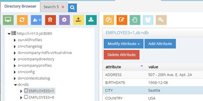
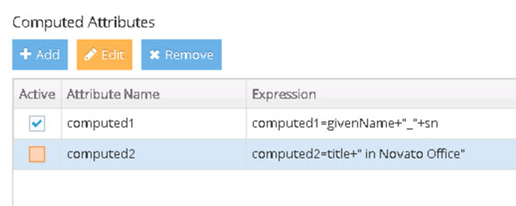

# Chapter 4: Virtual Views of Database (JDBC/ODBC-accessible) Backends

Virtual views can be configured for database backends and are associated with a specific root naming context. A root naming context is the very top node of a virtual directory view and RadiantOne can respond to many different root naming contexts. This section describes how to create and manage root naming contexts for databases. 

After the virtual view of the database backend has been configured, a series of tabs are available for managing the configuration. From the Main Control Panel > Directory Namespace Tab, select the node representing the virtual view to the database backend. On the right side, you can access the Properties tab for viewing the connection information.


 
Figure 4.1: Sample Database Backend Connection Properties

All other aspects are managed per object. Therefore, you must select the specific database object (represented by a blue or white folder icon) to expose the needed tabs (RDN Settings, Advanced Settings, Attributes and Object).
 


Figure 4.2: Sample Database Backend

-	RDN Settings – Used for configuring the [RDN name](#rdn-name) that will comprise the user DN for entries virtualized from this database backend.

-	Advanced Settings – Used for managing [interception scripts](#interception-scripts), [optimizations](#optimizations), [filtering](#sql-filter), [handling case sensitivity of the data](#case-sensitivity-for-searches), and [objectclass mapping](#object-class-mapping).

-	Attributes - This tab is used for managing attributes from the database object. This includes [attribute mapping](#attribute-mapping) and adding attributes.

-	Object - This tab is for managing [joins](#joins) and other tasks associated with joining such as handling overlapping attributes, [custom bind order](#bind-order) and defining [computed attributes](#computed-attributes).

## Configuration

If you configure the database backend directly at the Root Naming Context, it is the only backend that can be defined for this specific naming context. If you want to comprise the tree from many different backends, choose the Virtual Tree option for the type of naming context instead of Database Backend.

>**Note – if you would like to build your virtual view using the Directory Tree Wizard, refer to the RadiantOne Identity Service Wizards Guide.**

1.	First, data sources for each backend must be defined. From the Main Control Panel > Settings tab, expand below the Server Backend node and go to the DB Data Sources section. Click **Add** to define database data sources.

2.	On the Main Control Panel -> Directory Namespace Tab click .

3.	Enter the new naming context and select the Database Backend option. Click **Next**.

4.	Select the data source (created in step 1) that you want to mount in this location of the hierarchy and click **OK**.

5.	Select the objects you are interested in and click **OK**.


 
Figure 4.3: Sample Objects Available for Creating a Flat Virtual View from a Database

6.	Click **OK** in the New Database Proxy confirmation window.

7.	Click **Save** and then **Yes** to apply the changes to the server.

8.	Click **OK** to close the confirmation.

A new naming context matching the mapped base DN parameter is created in the RadiantOne namespace. When clients access this naming context, the contents from the database objects selected are returned.

If you need to modify the database backend configuration, select the appropriate node on the Directory Namespace tab and modify the settings on the tabs on the right side. Click Save when finished.

For details on the available parameters for [database backends](#database-backend-parameters-and-settings), please see the section below.

## Database Backend Parameters and Settings

The parameters applicable for a database backend are as follows (only some of these parameters are available when you go through the wizard. After you exit the Wizard, click on the Database Backend node below Root Naming Contexts. All these parameters are available on the tabs on the right side):

### Database Type
You set the data source type when you create the data source. This type list contains default values. If the value is green it means the driver file(s) is properly loaded in RadiantOne. If the value is pink, it means the basic driver name and syntax are provided, but the proper driver files are not loaded in RadiantOne. You must copy the needed driver files into <RLI_HOME>\lib\jdbc. 

A database type is associated with a driver and a URL. When you select a specific data source type, the Driver and URL syntax are automatically populated.

### Driver

The driver class name is set when you create the data source. The driver name parameter is automatically populated when you select the Data Source Type. You can manually update the syntax in the data source configuration if needed.

### URL

The JDBC URL is set when you create the data source. The URL syntax is automatically populated when you select the Data Source Type. You must fill in the appropriate connection values (everything indicated with `<value>`).

### User

The database user name is set when you create the data source and is the database user that RadiantOne uses to create a connection to the server and perform all relevant operations (create, read, update, and delete).

### Password 

The user password is set when you create the data source. This is the password for the user configured in the user parameter.

### Active

Check the Active option to activate the node. Uncheck the Active option to deactivate the node. Only active nodes are accessible in RadiantOne by clients.

### Naming Context

The value here is determined from the hierarchy built, up to the location where the mapping to the backend database takes place. This is the DN that clients access to retrieve the data from RadiantOne. 

### Object Class Mapping

For database backend objects, RadiantOne provides a default LDAP object class name (based on the name of the database object). This is the object class that clients can base their query filter on to request data from a particular database object. 

If you want to map the database objects to a new/different object class:

1.	From the Main Control Panel > Directory Namespace Tab, select the database object node below Root Naming Contexts. 
2.	On the right side, select the Advanced Settings tab. 
3.	Click on the Change button next to Object Class Mapping. 
4.	Select the schema containing the object class you want to map to from the LDAP Schema drop down list. 
5.	Select the object class to map to from the LDAP Object Class drop down list.
If the object class inherits from multiple classes, the classes are displayed with a # as the separator. 


 
Figure 4.4: Mapping Object Classes

6.	Click **Save** and then **Yes** to apply the changes to the server.

### Case Sensitivity for Searches

There are three options available for handling case sensitive databases. These options are related to how RadiantOne generates the query to send to the database. These options are available from the Main Control Panel -> Directory Namespace tab, select the database object node below Root Naming Contexts. On the right-hand side, select the Advanced Settings tab. The options are As Is, Ignore Case and Translate Values to Uppercase. Each is described in details below.

**As Is**

If your database is not case sensitive, then you should choose the As Is option. With this option, RadiantOne forwards the search filter to the backend in the exact case it was received in the request from the client. This is the default option.

If your database is case sensitive and you choose this option, the case received in the filter from the client search request must match the case used in the database or else the entry is not found.

For example, if a database attribute named FIRSTNAME had a value of Nancy, and RadiantOne received a search request with a filter of (firstname=nancy), the entry is not returned. The client must use a filter of (firstname=Nancy) for the entry to be properly returned from the database.

**Ignore Case**

If your database is case sensitive and you are not sure how the values are stored (mixed case, all upper, all lower…etc.), then you should choose the Ignore Case option. With this option, RadiantOne generates the SQL query so that both the filter that was received in the client request and the values from the backend are converted into uppercase before the search filter can be validated. For example, if a client sent a request with a filter of (firstname=Nancy), RadiantOne would generate the following where clause based on the filter received in the client request.

WHERE (UPPER(APP.EMPLOYEES.FIRSTNAME)=UPPER('Nancy'))

The case used in the filter from the client is irrelevant and everything is converted into uppercase.

This option offers the least performance, so it should only be used when absolutely required. If the database is case sensitive and the values are stored in uppercase, you should use the Translate Values to Uppercase option (see #3 below) as it is more efficient.

**Translate Values to Uppercase**

If your database is case sensitive and you know the values are stored in uppercase, you should choose the Translate Values to Uppercase option. With this option, RadiantOne translates the search filter value into uppercase before sending it to the backend database. This option is more efficient than the Ignore Case option mentioned above.

### SQL Filter

If you want to condition the virtual view of your database to only return a set of entries that match a certain criterion, you can enter a SQL Filter on the Advanced Settings tab. An example of a filter would be ENAME=’s%’, which would only return entries that have an ENAME value that starts with “s” (the % is a wild card character).

>**NOTE - You must enter a valid SQL filter and use the actual database attribute names (as opposed to using any virtual names you have configured through mapping). The SQL syntax you use in your filter must be compatible with the database brand/version you are accessing on the backend.**

To get assistance on defining the SQL filter:
1.	Click **Assist**.

2.	From the drop-down list, select the source attribute you want to filter on.

3.	Choose an operator (e.g. equals, begins with, ends with…etc.) from the drop-down list in the middle property.

4.	In the last property, enter the value that defines the condition.

5.	(Optional) To add more conditions to the filter, click **Add Rule**.

6.	(Optional) To remove conditions from the filter, click **Delete** next to the condition.

7.	Click **OK**.

8.	Click **Save**.

An example filter is shown below where only entries that have CITY = Seattle and a TITLE that contains “Sales” are returned in the virtual view.


 
Figure 4.5: Adding SQL Filter (Where Clause)


 
Figure 4.6: Example of Filtered Database View

### Preventing Duplicate Rows (Distinct)

If you need to ensure you get unique records from the database table (to avoid duplicate rows in the result set), check the Distinct checkbox option on the Advanced Settings tab. This modifies the query request RadiantOne issues to the backend database to prevent duplicate rows from being returned.

### Attribute Mapping

To map database attribute names to LDAP attribute names:

1.	From the Main Control Panel > Directory Namespace tab, select the database object node below Root Naming Contexts. 

2.	On the right side, select the Attributes Tab. Here you will see a list of attributes available for this database object. 

3.	Select the attribute in the list and click **Edit**. 

4.	Enter a value for the Virtual Name parameter. The virtual name will be the one returned by RadiantOne to the client.

5.	If the attribute you want to map does not appear in the list on the Attributes Tab (but you know it is an attribute of the database object), click on the Add button and add the attribute along with a virtual name.

6.	Click **Save** and **Yes** to apply the changes to the server.
 


Figure 4.7: Attribute Mapping

### Hidden Attributes

By default, all attributes available for the database objects are present in the virtual entries.

To hide an attribute so that it is not returned in the virtual entries:

1.	From the Main Control Panel > Directory Namespace Tab, select the database object node below Root Naming Contexts.

2.	On the right side, click the **Object** tab.

3.	To hide an attribute, select it in the table and click **Edit Attribute**.

4.	Check the “Hidden in Result” option and click OK. The attributes with check marks in the Hidden column are not visible in the virtual entries.

5.	Click Save and then Yes to apply the changes to the server.

To see only the attributes that are visible in the virtual entry, check the “Visible Only” checkbox. All attributes marked as hidden will not show in the list.

### Computed Attributes

For specific details, please see Computed Attributes in the Concepts section of the RadiantOne System Administration Guide. This section describes how to configure computed attributes for a Database backend.

To create computed attributes:

1.	From the Main Control Panel > Directory Namespace Tab, select the database object node below Root Naming Contexts. 

2.	On the right side, select the Object Tab. 

3.	Click on the Edit button next to Define Computed Attributes. 

4.	Click Add.

5.	Enter the Computed Attribute name in the Name parameter.

6.	Configure the needed expression to comprise the computed attribute. This is based on Java and if you are already familiar with the syntax, you can enter it directly for the value.

If you would like to build the attribute based on a constant and need assistance, click on the constant button and enter the value. 

If you would like the computed attribute to be based on an existing attribute, click on the Attribute button for assistance (a list of all attributes available in the virtual object displays). 

If you would like to use a function to build your computed attribute, click on the **Function** button for a list to display.

7.	Click **Validate** to check the syntax of your expression. 

8.	Once your expression compiles properly (no errors in the Compilation Results window), click **OK**. 

The computed attribute appears in the list of attributes for the virtual object (will be noted with an orange square in the Origin column) and the value is populated based on your configured expression when RadiantOne returns virtual entries.

If you would like to see a list of only computed attributes for the virtual object, select the “Computed” option in the Display drop-down list. See screen shot below as an example.


 
Figure 4.8: Display Computed Attributes Only

For more details, please see Computed Attributes in the Concepts section of the RadiantOne System Administration Guide.

#### Deactivate Computed Attributes
If you have defined multiple computed attributes, it can be helpful to deactivate some for testing or if you (temporarily) don’t need them anymore. 

To deactivate a computed attribute:

1.	From the Main Control Panel > Directory Namespace Tab, select the node representing the LDAP backend below Root Naming Contexts. 

2.	On the right side, select the Objects Tab. 

3.	In your Primary Objects list, select the one that contains the computed attribute(s) that you need to deactivate.

4.	Click **Edit** next to Define Computed Attributes. 

5.	Uncheck the “Active” checkbox next to the computed attributes that you want to deactivate.


 
Figure 4.9: Computed Attributes Example with One Deactivated

6.	Click **OK**.

7.	Click **Save**.

### Bind Order

If you have configured joins between the selected database object and other sources, RadiantOne can send the bind request (credential checking) to many backends.

To configure the bind order:

1.	From the Main Control Panel > Directory Namespace Tab, select the database object node below Root Naming Contexts. 

2.	On the right side, select the Object Tab and click  **Change** next to Define Bind Strategy at the bottom. A list of all sources (the primary along with any secondary sources you have joined with) displays. 

3.	Enable the source as a possible participant in the bind operation.

4.	Use the up and down arrow to determine the order RadiantOne should attempt the credential checking. RadiantOne attempts to verify the credentials against the first enabled source in the list. If it fails, then the next is tried and so forth. If all enabled sources have been tried without success, RadiantOne returns a bind failed error to the client.

For more information on bind order and joining, please see the sections titled Bind Order and Joins in the Concepts section of the RadiantOne System Administration Guide.

### Interception Scripts

For specific details, please see Interception Scripts in the Concepts section of the RadiantOne System Administration Guide. This section describes how to enable interception scripts for a virtual view of a database backend.

1.	From the Main Control Panel -> Directory Namespace Tab, select the database object node below Root Naming Contexts. 

2.	On the right side, select the Advanced Settings Tab.

3.	Locate the Interception section and enable the operations you want to customize by checking the box next to it. The Java script associated with this Database object is displayed in the Source Location parameter. This is this script that you will customize and it is located in <RLI_HOME>\vds_server\custom\src\com\rli\scripts\intercept.

4.	Click **Save** and then **Yes** to apply the changes to the server.

5.	Click **OK** to apply the changes to the server.

6.	Lastly, follow the steps defined in the Interception Scripts section of Concepts of the RadiantOne System Administration Guide.

### Joins

Objects from any sources in the virtual namespace can be joined. With joins, you can extend the database entries with attributes coming from another data source. This section assists you in finding the location to configure the join.

1.	From the Main Control Panel > Directory Namespace Tab, select the database object node below Root Naming Contexts.

2.	On the right side, select the Object Tab. Remember, you must be on the node that represents the database table in the Root Naming Contexts section for the Object tab to be available.

3.	Locate the Join Profiles section and click New.

To deactivate a join, uncheck the join’s Active box in the Join Profiles section on the Objects tab and click Save. To reactivate the join, check the join’s Active box and click Save.

For complete details and steps, please see Joins in the Concepts section of the RadiantOne System Administration Guide.

### Handling Multi-Valued Attributes from a Database

If a database table you are virtualizing contains an attribute that stores a list of values, RadiantOne can return this attribute as multi-valued in the virtual entries. The database attribute must contain values separated by a space then the pound sign (#), then a space before the next value. See the sample database table below as an example:
** Database Table:**

Name | Mail	| Title
-|-|-
Harold Carter| hcarter@rli.com # harold@yahoo.com | HR Mgr # HR Associate

1.	Stop the RadiantOne service.

2.	Edit the /radiantone/v1/cluster/config/vds_server.conf node either from the Zookeeper tab in the Main Control Panel or from ZooInspector and locate the “multiValuedAttrs” parameter. The value of this parameter should be the database attribute name (or mapped/virtual name if one is being used). For example, using the same database table shown above, the parameter would be
“multiValuedAttrs” : “Title,Mail”

As shown above, if there is more than one attribute, separate them with a comma.

This parameter allows for special processing of a database attribute that contains a multi-value. RadiantOne returns the database record with multi-valued attributes for Mail and Title (as indicated by the “multiValuedAttrs” parameter). Below is the result of how RadiantOne returns the attributes.

cn=Harold Carter
mail = hcarter@rli.com
mail = harold@yahoo.com
title = HR Mgr
title = HR Associate

If the “multiValuedAttrs” parameter is not set in the vds_server.conf node in ZooKeeper, then RadiantOne would return the following:

cn=Harold Carter
mail = hcarter@rli.com # harold@yahoo.com
title = HR mgr # HR Associate

### RDN Name
For virtual entries from a database backend, the default RDN name is the name of the database object. This parameter is editable on the RDN Settings tab. Click EDIT to select the attributes that should comprise the RDN value.

### Optimizations
For certain configurations/use cases, there are two parameters that may be enabled to improve processing/performance. They are located on the Main Control Panel > Directory Namespace Tab. Navigate below the Root Naming Context section and select the node representing the virtual view to your backend. On the right side, select the Advanced Settings tab. Each optimization is described below.

**Removing UPPER**

Since some databases are case sensitive, RadiantOne transforms primary key attribute values to upper case when generating the where clause. This is only applicable when the database key is a character data type. “UPPER” is generated automatically for the following databases: Oracle, SQL MX, Sybase, Interbase, and DB2. If you do not want UPPER to be used (because your database is NOT case sensitive), you can use the Base Search and Update parameters on the Advanced Settings tab section to remove it. 

The Base Search parameter allows you to remove UPPER (that is generated by default) for base searches. If your database is not case sensitive, then the UPPER can be removed. If your database is case sensitive, then you must make sure that the attribute that is indexed (and is used in the base parameter) uses the UPPER case. Otherwise, performance of the virtual view (during a base search) is unpredictable.

><span style="color:red">**IMPORTANT NOTE – using the UPPER can slow down performance because the indexes in the database may not be used. IF your database has an index on an attribute and it stores the value in upper case, then you have the option of removing the UPPER generated on the left side of the parameter (it is the UPPER on the left that is most costly in terms of performance).**

Below is an example of the Base Search filter that is generated for a database. If the database is case sensitive and the CN attribute is indexed (and the index stores the value in upper case), then the UPPER generated on the left side of the “=” can be removed and performance is improved (also remove the leading and ending parentheses).

The following example:

```
(UPPER(SCOTT.PEOPLE.CN)=UPPER(@@[cn : VARCHAR2(60)]))
```

Would become:

```
(SCOTT.PEOPLE.CN=UPPER(@@[cn : VARCHAR2(60)]))
```

If you are not able to remove the UPPER then you should consider using cache at the level of RadiantOne in order to improve performance. RadiantOne queries the database the first time (the UPPER is used), the results are cached and future queries receive the information from cache.

The Update parameter allows you to remove UPPER (that is generated by default) for updates to the database. The UPPER is generated when the primary key of the database object is a character data type. The UPPER is used to generate the where clause based on the primary key to locate the entry to update. If your database is not case sensitive, then you can remove the UPPER that is generated in the update parameter and the performance of the query is improved.

**Request Binary/BLOB Attributes Only When Necessary**

Requesting BLOB attributes can significantly decrease performance. When this option is enabled, RadiantOne requests binary/BLOB attributes from the backend only if they are specifically requested by the client. 

Use caution when enabling this parameter if an interception script is defined (which may need such attributes even if they are not requested by the client).

><span style="color:red">**IMPORTANT NOTE - Do not enable this option if a memory entry cache is used (as the whole virtual entry is needed, including the BLOBs).**

**Process Joins and Computed Attributes Only When Necessary**

The default behavior of RadiantOne is to process associated joins and build computed attributes whenever a virtual object is reached from a query regardless of whether the attributes requested come from a secondary source or computation.

If you enable this option, RadiantOne does not perform joins or computations if a client requests or searches for attributes from a primary object only. If a client requests or searches for attributes from secondary objects or computed attributes, then RadiantOne processes the join(s) and computations accordingly. 

Use caution when enabling this option if you have interception scripts defined on these objects, or access controls based on filters are being used (both of which may require other attributes returned from secondary sources or computations regardless of whether or not the client requested or searched for them). 

●	IMPORTANT NOTE - Do not enable this option if a memory entry cache is used (as the whole virtual entry is needed for the cache). 
