# Chapter 5: RadiantOne Universal Directory

The RadiantOne platform offers the Universal Directory as a scalable storage that can be used to store any entries. After the root naming context is created, the local store can be populated from an LDIF file from the Main Control Panel > Directory Namespace tab or manually from the Main Control Panel > Directory Browser Tab.

Once a Universal Directory naming context is created, a properties tab is available for managing the configuration. To access the properties tab, select the node representing the Universal Directory storage below the Root Naming Contexts section on the Main Control Panel > Directory Namespace Tab.

Properties – This tab lists the settings:<!-- [storage location](#storage-location),--> [schema checking](#schema-checking), [normalizing attribute names](#normalize-attribute-names), [indexed attributes](#indexed-attributes), [non-indexed](#non-indexed-attributes) attributes, [sorted attributes](#sorted-attributes), [encrypted attributes](#encrypted-attributes-for-data-at-rest), [inter-cluster replication](#inter-cluster-replication), and support for [full text search](#support-for-full-text-search). There are also buttons for saving, [initializing](#initializing-radiantone-universal-directory-stores), [exporting], [re-building the index](#rebuilding-indexes), [backing up](#backing-up-a-radiantone-universal-directory-store), [restoring](#restoring-a-radiantone-universal-directory-store), and [deleting the local storage](#deleting-a-radiantone-universal-directory-store) (must be de-activated to delete).

>[!warning] 
>Although persistent cache leverages the Universal Directory as a storage, the functionality and configuration can vary slightly. For steps on configuring persistent cache and details on applicable properties, see the RadiantOne Deployment and Tuning Guide as this chapter is related to Universal Directory stores only.

## Configuration

To create RadiantOne Universal Directory store:

1.	On the Main Control Panel > Directory Namespace Tab click the  button.

2.	Enter the new naming context and select the RadiantOne Universal Directory (HDAP) Store option. Click **Next**.

3.	Click **OK**.

4.	Click **OK** to exit the confirmation.

The new naming context appears in the list of root naming contexts. Populate the local store by importing an LDIF file or manually adding entries on the Directory Browser Tab. 

## Universal Directory Storage Parameters and Settings

The parameters and settings appear on the Properties tab for the selected Universal Directory store.

### Naming Context
The external suffix used by clients to access this branch in the RadiantOne namespace. 

<!--

### Storage Location
The default location for data files is <RLI_HOME>\vds_server\data. To tune the local disk load, you can specify a different location on the file system. To define a storage location, follow the steps below.

1.	Deactivate the Universal Directory store by unchecking the Active checkbox and click Save.

2.	Click Yes to apply the change to the server.

3.	Enter the full path in the Storage Location parameter.

4.	Click Save and then Yes to apply the change to the server.

5.	Check Active.

6.	Click Save and then Yes to apply the change to the server.

>[!warning] 
>Any data in the default location is lost if the storage location is changed. If you have data in the existing location that you want to keep, export it to an LDIF file and after the storage location is changed, import this LDIF file.

If RadiantOne is deployed in a cluster, the value of the storage location parameter is also assigned to all other nodes. The drive location indicated in the value must exist on the file system of each node. The nodes cannot leverage a single shared drive.

-->

### Schema Checking

Check the Enable Schema Checking option if you want Schema Checking enabled.

Enabling schema checking means whenever entries or attributes are added or modified for this naming context, RadiantOne Universal Directory checks them to ensure that:

-	Object classes and attributes in the entry are defined in the directory schema 

-	Attributes required for an object class are contained in the entry 

-	Only attributes allowed by the object class are contained in the entry 

Schema checking occurs when populating the directory from the Main Control Panel > Directory Browser Tab, or when using an LDIF file. Schema checking does not enforce the validity of values against their syntax.

### Add Superior Objectclasses

This option is to dictate whether, when creating an entry or adding an 'objectClass' value to an entry, all superclasses of the named classes will be implicitly added as well if not already present. By default, this option is not enabled. This means that when an entry is created, or an objectclass value is added to an existing entry, only the object classes explicitly listed in the request are included in the final objectclass attribute value. If this option in enabled, RadiantOne automatically adds associated superclasses (based on the LDAP schema definition) to the final objectclass attribute value if they are not already present. 

### Normalize Attribute Names

This option is for determining the case that is used for attribute names of an entry. If this option is enabled, all attribute names entered during an insert of an entry conform to the same case as defined in the RadiantOne LDAP schema. The attribute name is stored in the same case as defined in the schema. If the attribute is not defined in the RadiantOne LDAP schema then the attribute name is stored as all lower case. 

If this option is not enabled, then the attributes are stored in the entry with the same case as used in the insert request.

This option is to improve the performance of initializing the local store when possible. If the attribute names are not normalized, the import of user entries is faster.

### Indexed Attributes

This property lists the attributes that should be indexed (separated by a comma). Attributes in this list support client search filters that use presence, equality, approximate, substring, matching rule, and browsing indexes. By default, all attributes are indexed (except for binary attributes and a few “internal” attributes defined in the Non Indexed Attributes property). If the Indexed Attributes setting is empty, this means all attributes are indexed. If you do not want all attributes indexed, define a comma separated list of attributes to index in this setting. If you indicate a list of attributes and later add attributes to index, you must remember to re-build the index. To do so, select the naming context below Root Naming Contexts on the Directory Namespace tab and on the Properties tab on the right side, click **Re-build Index**. 

>[!note] 
>Although the underlying Lucene engine enforces a size limit of 32K characters for indexed attributes, we generally advise not indexing attributes containing more than 4K characters. To ignore these attributes, add them to the Non-indexed Attributes list and Re-build the Index (click Re-build Index).

>**Using OR conditions in filters containing non-indexed attributes is strongly discouraged since it requires a full scan and all entries fetched from disk.**

### Support for Full Text Search

RadiantOne Universal Directory can support full text searches. This offers additional flexibility for clients as they can search data based on text (character) data. These types of searches are no longer linked to specific attributes as the characters requested could be found in any attribute value. An entry is returned by RadiantOne if any attribute in the entry contains the character string(s) requested by the client.

Clients issue full text searches similar to the way they issue LDAP searches. The only difference is the filter contains (fulltext=`<value>`) where `<value>` would be the text they are interested in. As an example, if a client was interested in the text John Doe as an exact phrase, the search filter sent to RadiantOne would be (fulltext= “John Doe”) where the phrase is encapsulated in double quotes. If the phrase in the filter is not encapsulated in double quotes it means the client wants any entries that have at least one attribute that contains the character string John and one attribute that contains the character string Doe.

The part of the filter that contains the piece related to the full text search can also be combined with other “standard” LDAP operators. As an example, a filter could be something like (&(uid=sjones)(fulltext=”John Doe”)). This would return entries that contain a uid attribute with the value sjones AND any other attribute that contains the exact character string John Doe.

Below are two examples of LDAP filters leveraging the NEAR operator in full text searches: 

Example Filter 1: (fulltext~="A B") 

RadiantOne returns all the entries with A before B and A near B: 

The examples below show different possible values for an attribute and whether they would match the fulltext filter: 

"A Z B C D" (matches the filter) 

"A Z C D B" (doesn't match the filter, A not near enough to B) 

"B Z A C D" (doesn't match the filter, A is after B) 

Example Filter 2: (fulltext~=A B) 

RadiantOne returns all the entries containing an attribute value with A near B. 

The examples below show different possible values for an attribute and whether they would match the fulltext filter: 

"A Z B C D" (matches the filter) 

"A Z C D B" (doesn't match the filter, A not near enough to B) 

"B Z A C D" (matches the filter) 

When using the NEAR operator, the indicated texts must be in the same attribute value. 

When you search for A NEAR B, RadiantOne looks at all the entries with an attribute value containing A and B where B and A have a maximum of 2 words in between.

If you want to support full text searches, check the Full-Text Search option on the Properties tab for the selected RadiantOne Universal Directory store and click Save. If you add the support for full text searches, remember to re-build the index. To do so, select the naming context below Root Naming Contexts on the Directory Namespace tab and on the right side, click **Re-build Index**.

### Non Indexed Attributes

If the Indexed Attributes list is empty, all attributes (except binary ones and the description attribute) are indexed by default. Also, the following “internal” ones are not indexed either: “pwdLastLogonTime”, "creatorsName", "createTimestamp", "modifiersName", "modifyTimestamp", "cacheCreatorsName", "cacheCreateTimestamp", "cacheModifiersName", "cacheModifyTimestamp", "uuid", "vdsSyncState", "vdsSyncHist", "ds-sync-generation-id", "ds-sync-state", "ds-sync-hist", "vdsSyncCursor", "entryUUID", "userpassword”. Any additional attributes that you do not want indexed should be added to the Non Indexed Attributes list on the Properties tab for the selected RadiantOne Universal Directory store. This parameter is an alternative to listing all the attributes you want to index in the Indexed Attributes parameter.

If you change the non indexed attributes, you must re-build the index. You can do this from the Properties tab by clicking **Re-build Index**.

>[!warning] 
>If possible, add attributes that must be modified frequently to the non-indexed attribute list to improve update performance of RadiantOne Universal Directory. Attributes that don’t need to be used in searches are good candidates for the non-indexed attribute list. Limit the number of configured non-indexed attributes to further improve update performance.

### Active

Check the Active option if you want to activate this naming context. Uncheck the Active option to deactivate the node. Only active nodes are accessible in RadiantOne and returned when querying the rootDSE.

### Sorted Attributes

Defined on the Properties Tab for the selected RadiantOne Universal Directory store, this is a comma-separated list of attributes to be used in association with Virtual List Views (VLV) or sort control configured for RadiantOne. These sorted indexes are managed internally in the store and kept optimized for sorting. They are required if you need to sort the search result or to execute a VLV query on the RadiantOne Universal Directory store.

If you need to support VLV, the VLV/Sort control must be enabled in RadiantOne. For details on this control, please see the RadiantOne System Administration Guide.

If you change the sorted attributes, re-build the index. You can do this from the Properties tab by clicking **Re-build Index**.

### Optimize Linked Attribute

Linked attributes are attributes that allow relationships between objects. A typical example would be isMemberOf/uniqueMember for user/groups objects. A group has members (uniqueMember attribute) which is the forward link relationship. Those members have an isMemberOf attribute which is the back link (to the group entry) relationship. Other examples of linked attributes are:

manager/directReports
<br>altRecipient/altRecipientBL
<br>dLMemRejectPerms/dLMemRejectPermsBL
<br>dLMemSubmitPerms/dLMemSubmitPermsBL
<br>msExchArchiveDatabaseLink/msExchArchiveDatabaseLinkBL
<br>msExchDelegateListLink/msExchDelegateListBL
<br>publicDelegates/publicDelegatesBL
<br>owner/ownerBL

The most common back link/forward link relationship is between group and user objects. A list of groups a user is a member of can be automatically calculated by RadiantOne and returned in the membership attribute of the user entry. The default attribute name in the user entry for the group membership is isMemberOf. However, you can configure any attribute name (e.g. memberOf) you want. This is configured on the Main Control Panel, click Settings > Interception > Special Attributes Handling, Linked Attribute section.

>[!note] 
>When the Optimize Linked Attribute setting is enabled, the backlink attribute is always returned to clients even when not requested unless Hide Operational Attributes is enabled in RadiantOne (in which case isMemberOf is only returned when a client explicitly requests it). For details on the Hide Operational Attributes setting, please see the RadiantOne System Administration Guide.

If the back link attribute location and forward link attribute location in the Linked Attributes setting is a RadiantOne Universal Directory store, the computation of the references can be optimized in order to return client requests for the back link attribute(s) at high speed. To enable this optimization, follow the steps below.

It is assumed you have configured the Linked Attribute Special Attributes Handling. If you have not, please do so prior to continuing with the steps below.

1.	Select the Optimize Linked Attribute option on the Properties tab for the selected RadiantOne Universal Directory store on the Main Control Panel -> Directory Namespace tab.

2.	Click **Save**.

3.	Click **Re-build Index**.

>[!warning] 
>If your users and groups are in RadiantOne Universal Directory stores, and you enable the Optimize Linked Attribute setting, and must support nested groups, only one Target Base DN location and Source Base DN location per RadiantOne Universal Directory store is supported. For example, in the Linked Attribute Special Attribute Handling, having a Target Base DN location configured for ou=people1,dc=myhdap and ou=people2,dc=myhdap (both in the same dc=myhdap store) is not supported. In this case, you should configure a single location as dc=myhdap as a shared parent for both containers.

#### Enable Changelog

When Optimize Linked Attributes is enabled, the Enable Changelog option is available. Check this option if you want the RadiantOne service to publish changes to the back link attribute into the cn=changelog. By default, the RadiantOne service doesn’t publish changes to operational back link attributes like isMemberOf into the cn=changelog. 

This option should only be enabled if downstream applications are leveraging the changelog to detect changes in the RadiantOne service and need access to entries that have had their back link attribute (e.g. memberOf, isMemberOf) updated by RadiantOne. If this option is not enabled, and the back link attribute is the only change on an entry, it is not published into cn=changelog.

The most common linked objects are groups and users. Use caution when enabling this option because modifications that add or update dynamic (memberURL attribute) or static group members can result in changing memberOf/isMemberOf for many users, causing many time-consuming writes into the changelog. Also, all RadiantOne changelog connectors (e.g. Global Sync connectors and/or persistent cache refresh connectors), and downstream applications leveraging the changelog for capturing changes, will have to process many potentially irrelevant changes. Enabling this option forces the RadiantOne service to update the linked entries (e.g. groups and users) asynchronously, allowing the client that issued the group modification request to get a response immediately after the group membership is updated without waiting for the backlink attribute in all related objects to be updated. This can avoid a modification timeout getting returned to the client that issued the modify request, but can result in transactional integrity because all related objects haven’t necessarily been updated when the modify response is returned. For example, if a client application queries a user entry to get isMemberOf during this period (could be as much as a few seconds), there is a risk that they receive outdated information because the backlink attribute hasn’t been updated yet. Also, the asynchronous processing results in higher CPU usage on the RadiantOne node while it is processing the modifications on objects containing the forward link and back link attributes, which could trigger monitoring alerts if configured thresholds are reached. 

#### Async Indexing

When Optimize Linked Attributes is enabled, the Aysnc Indexing option is available to be used in conjunction with the Enable Changelog option, or on its own. 

Enabling this option forces the RadiantOne service to update the linked entries (most commonly, groups and users) asynchronously, allowing the client that issued the group modification request to get a response immediately after the group membership (object containing the forward link attribute) is updated without waiting for the back link attribute in all related objects to be updated. This can avoid a modification timeout getting returned to the client that issued the modify request, but can result in transactional integrity because all related objects haven’t necessarily been updated when the modify response is returned. For example, if a client application queries a user entry to get isMemberOf during this period (could be as much as a few seconds), there is a risk that they receive outdated information because the back link attribute hasn’t been updated yet. Also, the asynchronous processing results in higher CPU usage on the RadiantOne node while it is processing the modifications on objects containing the forward link and back link attributes, which could trigger monitoring alerts if configured thresholds are reached. 

If async indexing is not used, all objects containing either a forward link or back link attribute are updated before the modify response is returned to the client. If the modification request results in many objects getting updated, this can be time-consuming and the client may receive a timeout error.

>[!note] 
>For persistent cached branches, you should only consider enabling this option if client applications issue modification requests to the RadiantOne service for the cached branch. If the data is only modified directly on the backend, and this is the event that triggers the persistent cache refresh, async indexing is irrelevant and not used.

### Encrypted Attributes for Data at Rest

Attribute encryption protects sensitive data while it is stored in RadiantOne Universal Directory. You can specify that certain attributes of an entry are stored in an encrypted format. This prevents data from being readable while stored, in any temporary replication stores/attributes (cn=changelog, cn=replicationjournal, cn=localjournal), in backup files, and exported in [LDIF files](#importing-changes-from-an-ldif-file) (must use the LDIFZ file extension). Attribute values are encrypted before they are stored in RadiantOne Universal Directory, and decrypted before being returned to the client, as long as the client is authorized to read the attribute (based on ACLs defined in RadiantOne), is connected to RadiantOne via SSL, and is not a member of the special blacklisted group (e.g. cn=ClearAttributesOnly,cn=globalgroups,cn=config). For more information about the blacklisted group, see the RadiantOne System Administration Guide.

>[!warning] 
>Define a security encryption key from the Main Control Panel -> Settings Tab -> Security section -> Attribute Encryption prior to configuring encrypted attributes. For steps on defining key generation, changing the encryption security key, or using an HSM like Amazon Web Services KMS as the master security key storage, see the RadiantOne System Administration Guide.

Defined on the Properties Tab for the selected RadiantOne Universal Directory store, this is a comma-separated list of attributes to store encrypted. Attributes listed in the Encrypted Attributes property are added to the Non-indexed attribute list by default. This means these attributes are not searchable by default. Indexing encrypted attributes is generally not advised as the index itself is less secure than the attribute stored in RadiantOne Universal Directory, because the index is not salted. However, if you must be able to search on the encrypted attribute value, it must be indexed. Only “exact match/equality” index is supported for encrypted attributes. To make an encrypted attribute searchable, remove the attribute from the list of nonindexed attributes, save the configuration and then click **Re-build Index**.

>[!warning] 
>To prevent the sensitive attribute values from being logged in clear in RadiantOne logs, make sure you add them to the Attributes Not Displayed in Logs property on the Main Control Panel > Settings tab > Server Front End > Attributes Handling. Each attribute name should be separated with a single space. Any attribute indicated here has a value of ***** printed in the RadiantOne logs instead of the value in clear.

#### Updating Encrypted Attributes

In order to update encrypted attributes, the client must connect to RadiantOne via SSL, be authorized (via ACLs) to read and update the attribute, and not be a member of the special blacklisted group (e.g. cn=ClearAttributesOnly,cn=Global Groups,cn=config). For more information about the blacklisted group, see the RadiantOne System Administration Guide. When editing entries from the Main Control Panel > Directory Browser tab > selected RadiantOne Universal Directory store, encrypted attributes appear as encrypted because this operation is not connected to RadiantOne via SSL. If you are connected to the Control Panel via SSL, then the Directory Browser tab connects to the RadiantOne service via SSL and the attributes defined as encrypted are shown in clear as long as the user you’ve connected to the Main Control Panel is authorized to read those attributes. In this case, the connected user can also update the encrypted attribute if permissions allow for it. For details on connecting to the Control Panel via SSL, see the RadiantOne System Administration Guide.

#### Removing Attribute Encryption

If you need to remove attribute encryption, follow the steps below.

1.	Go to the Main Control Panel > Directory Namespace tab.

2.	Select the naming context representing the RadiantOne Universal Directory store.

3.	On the right, remove all values from the encrypted attributes list.

4.	Click **Save**.

5.	Click **Re-build Index**.

### Inter-Cluster Replication

This option should be enabled if you want to support replication between this RadiantOne Universal Directory store and stores in different clusters. If you have a classic RadiantOne architecture deployed, this would be used to support replication between stores across the active/active or active/passive RadiantOne servers.

If inter-cluster replication is enabled, a replication journal is used to store changes that happen on the configured naming context. The replication journal is associated with the default LDAP data source defined as replicationjournal and root naming context named cn=replicationjournal. The RadiantOne leader nodes in other clusters pick up changes from the replication journal to update their local image. In classic architectures, each RadiantOne server acts as a leader node whether it is active or passive.

For details on inter-cluster replication deployment options, please see the RadiantOne Deployment and Tuning Guide.

### Operations Redirection

In certain deployment scenarios, RadiantOne Universal Directory stores should not process all types of operations. By default, RadiantOne directs all operations to the local store. However, in certain circumstances (e.g. deployments across multiple sites/data centers) you may want to direct write and/or bind operations to another RadiantOne server. For details on redirections, please see the RadiantOne System Administration Guide.

### Initializing RadiantOne Universal Directory Stores

Initialization of RadiantOne Universal Directory stores on follower/follower-only nodes is done automatically when they join the cluster.

Although new configurations for RadiantOne Universal Directory stores are supported on any node in the cluster, these stores can only be initialized on the leader node. If you attempt to initialize on a non-leader node, an error message indicating that you must perform this operation on a leader node is displayed. To determine what node is currently the leader, go to the Main Control Panel > Dashboard tab. Check the details associated with each node and look for the yellow triangle which signifies the RadiantOne leader. Perform the initialization operation on this node and the data is automatically replicated out to all follower/follower-only nodes in the cluster.

RadiantOne Universal Directory stores can be initialized with LDIF files. The Main Control Panel supports a simplified version of the LDIF file format. For example, it does not support 'changetypes'. 

To import an LDIF file:

1.	On the Main Control Panel of the leader node, go to the Directory Namespace tab.

2.	Select the RadiantOne Universal Directory store node below Root Naming Contexts and on the right side, click **Initialize**. 

3.	Browse to the LDIF file (or LDIFZ which is a zipped and encrypted file) and click OK. 

>[!warning] 
>If using an LDIFZ file, the security key used on the RadiantOne node where the file was exported must be the same security key value used on the RadiantOne node that you are trying to import the file into. For steps on defining key generation or changing the encryption security key, see the RadiantOne System Administration Guide.

4.	The initialization process is performed as a task. The Tasks Monitor window displays. Click **OK** to exit the window. To view the task details, go to the Tasks tab in the Server Control Panel of the leader node (click the Config button next to the node on the Dashboard tab in the Main Control Panel).

If you have a large data set and generated multiple LDIF files for the purpose of initializing the local store (each containing a subset of what you want to store), name the files with a suffix of “_2”, “_3”…etc. For example, let’s say the initial LDIF file (containing the first subset of data you want to import) is named init.ldif. After this file has been imported, the process tries to find init_2.ldif, then init_3.ldif…etc. Make sure all files are located in the same place so the initialization process can find them.

>[!warning] 
>Deactivate any inter-cluster replication on the RadiantOne Universal Directory store prior to re-initializing them. To do so, navigate to the naming context associated with the RadiantOne Universal Directory store on the Main Control Panel -> Directory Namespace tab, below the Root Naming Contexts section. On the right side, uncheck “Inter-cluster Replication”, then click Save. Click Yes to apply the changes to the server.

### EntryDN

For every entry inserted into RadiantOne Universal Directory, an entryDN operational attribute is generated. This attribute contains a normalized form of the entry’s DN. This attribute is indexed by default and can be used in search filters. An example of a user entry inserted into a RadiantOne Universal Directory store from the Main Control Panel -> Directory Browser tab is shown below. The entryDN attribute that was auto-generated is highlighted.

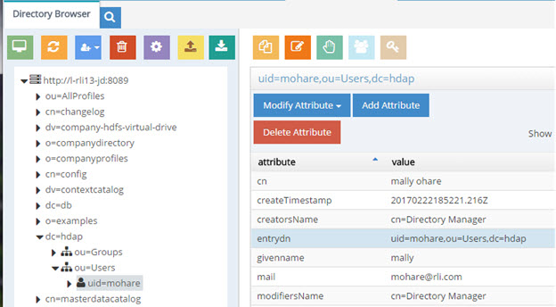
 
Figure 5.1: EntryDN Attribute for User Entry

Extensible match filters are supported on entryDN. An example of a search request for the user entry shown above that leverages the entrydn attribute is shown below. The filter used in this example is: (ou:dn:=Users) and is equivalent to requesting entries that have ou=Users somewhere in their entryDN.

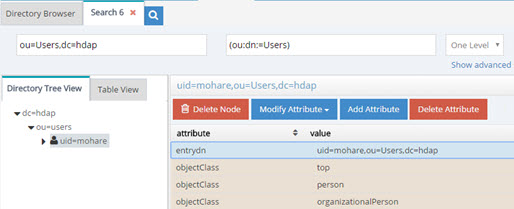
 
Figure 5.2: Example Search Request Basing the Filter on entryDN

An example of a more complex filter on entryDN is shown below and is equivalent to requesting entries associated with the objectclass named “person” that have ou=Accounting or ou=Management somewhere in their entryDN: <br>(&(objectclass=person)(|(ou:dn:=accounting)(ou:dn:=Management)))

### Universally Unique Identifier (UUID)

The Universally Unique Identifier (UUID) attribute is a reserved, internal attribute that is assigned to each entry and can guarantee uniqueness across space and time.

When adding entries into RadiantOne Universal Directory (LDAP ADD operations) from an LDIF file, if there are UUID attributes they are ignored by RadiantOne during import. RadiantOne generates a unique value for each entry based on the specifications in RFC 4122. 

When initializing with an LDIF file (LDIF INIT), if the entry has a UUID attribute, RadiantOne keeps it. If the entry does not have a UUID attribute, RadiantOne generates a unique value for each entry based on the specifications in RFC 4122.

UUID is an operational attribute meaning that if a client wants this attribute, they must explicitly ask for it in the search request sent to RadiantOne. 

When exporting a RadiantOne Universal Directory store to an LDIF file, you have the option to export the UUID attribute or not. The UUID attribute should be exported into LDIF if you plan on using this export to initialize another RadiantOne Universal Directory store, a replica for inter-cluster replication. Otherwise, the UUID attribute generally should not be exported. To export a RadiantOne Universal Directory store and include the UUID attributes, check the Export for Replication option in the export window shown when you click the Export button on the Main Control Panel > Directory Namespace tab, selected RadiantOne Universal Directory store > Properties tab. If you only need to replicate a sub-branch instead of the whole RadiantOne Universal Directory store, you can use the Export option  on the Main Control Panel > Directory Browser tab when you have the sub-branch selected. 


 
Figure 5.3: Export for Replication Option

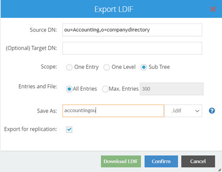
 
Figure 5.4: Export Store from a Sub-branch on the Directory Browser Tab – Export for Replication Option

### Number of Supported Clauses in Search Filters

By default, the RadiantOne Universal Directory supports a maximum of 1024 clauses in search filters. To increase the maximum number of clauses supported, edit the maxClausesLimit property setting in /radiantone/v1/cluster/config/vds_server.conf from the Main Control Panel -> ZooKeeper tab (requires [Expert Mode](01-introduction#expert-mode)). The RadiantOne service does not need to be restarted after modifying this value.

### Exporting RadiantOne Universal Directory Stores

Stores can be exported into an LDIF file from the Main Control Panel, Directory Namespace tab. 

>[!warning] 
>If exporting to an LDIFZ file, a security key must be configured for RadiantOne. Any target stores where you want to import this LDIFZ file must use the same LDIFZ security key value. For steps on defining key generation or changing the encryption security key, see the RadiantOne System Administration Guide.

1.	From the Main Control Panel, Directory Namespace tab, select the branch in the virtual namespace where you want to export entries.

2.	On the right side, click Export. 

3.	Enter a file name and select an extension type (.ldif or .ldifz). If you want the exported file to be zipped and encrypted, select the .ldifz option from the drop-down list. In order to support exporting to an encrypted file, a security key must be configured for RadiantOne. Any target RadiantOne Universal Directory stores where you want to import this LDIFZ file must use the same LDIFZ security key value. For steps on defining key generation or changing the encryption security key, see the RadiantOne System Administration Guide.

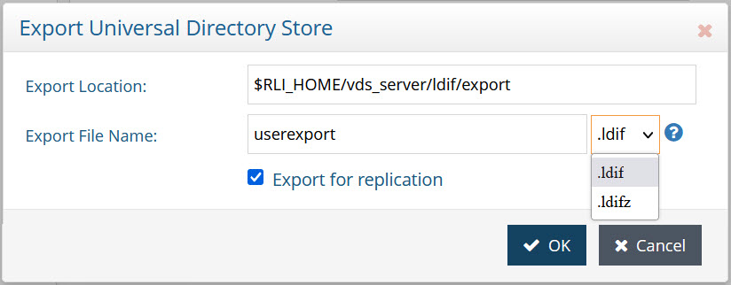
 
Figure 5.5: LDIF Export Configuration

4. If this exported file is going to be used to initialize another RadiantOne Universal Directory store for replication, check the option to Export for Replication. Otherwise, leave this option unchecked. All entries in the RadiantOne Universal Directory store are exported with this option. 

5.	Click Download.

### Rebuilding Indexes

If the Indexed Attributes or Sorted Attributes properties are changed, click on the Re-build Index button on the Properties Tab for the selected RadiantOne Universal Directory store. If RadiantOne is deployed in a cluster, the reindexing should be done on the leader node.

Rebuilding an index should not happen very frequently. It is a time-consuming process, and should be performed during a scheduled maintenance window. During the rebuild of the index, the RadiantOne Universal Directory store is not accessible. When the indexing is complete, the store is active again and the follower/follower-only nodes (if any) get the data from the leader node to update their local copy.

### Backing up a RadiantOne Universal Directory Store

To backup a RadiantOne Universal Directory store, click the Back Up button on the Properties Tab. 

### Restoring a RadiantOne Universal Directory Store

To restore a RadiantOne Universal Directory store from a previous backed up image, click on the Restore button on the Properties Tab for the selected store. Select a date associated with the backup point you would like to restore in the default directory, or browse to the custom backup location containing the files to restore the image from. You must select the .zip file containing the image to restore. The RadiantOne Universal Directory store is deactivated and is inaccessible by clients during the restore operation.

### Interception Scripts

Only a global interception script is supported for RadiantOne Universal Directory stores. For details on global interception, see the RadiantOne System Administration Guide.

### Deleting a RadiantOne Universal Directory Store

To delete a RadiantOne Universal Directory, first de-activate it (uncheck the Active checkbox) and click Save. Then, click the Delete button on the Properties Tab for the selected store.

### Inter Cluster Replication

Inter Cluster replication in RadiantOne leverages a publish-and-subscribe architecture. The leader nodes within each cluster play the role of a master in the multi-master replication. Each leader node publishes their changes in the common replication journal. Each leader node is also responsible for periodically checking the journal for changes that they need to apply locally. The default checking interval is 7 seconds. Should conflicting change events occur, a combination of timestamps and sequence numbers associated with the conflicting events are used to resolve the conflict.

>[!note] 
>On startup, a RadiantOne node first applies any missed change events from the replication journal. After these changes have been applied it is able to serve as an active node in the cluster.

A data source named replicationjournal is included in the RadiantOne install and plays the role of the journal. This data source points to the default cn=replicationjournal naming context installed with RadiantOne and should not be deleted or deactivated. You can decide to have the journal running on one of the clusters that is participating in replication, or run a separate cluster whose only role is to house the central journal. Having the journal housed in a Universal Directory (HDAP) store deployed in a cluster ensures high availability of this repository. The replicationjournal data source should indicate a primary server/node in the cluster and the failover servers should point to the other cluster nodes.

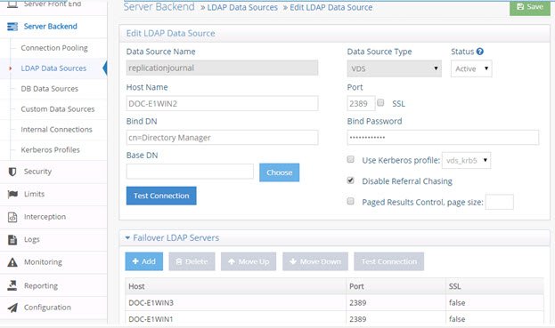
 
Figure 5.12: The Journal Leveraged for Inter Cluster Replication

To configure inter-cluster replication, follow the steps below.

1.	The replicationjournal data source for all clusters must be configured to point to the same journal. For example, if there are three clusters (1, 2, and 3) and cluster 1 is where the journal is located, the replicationjournal data source in clusters 2 and 3 must point to the cn=replicationjournal naming context in Cluster 1. All nodes running in Cluster 1 should be defined in the data source: one of them as the primary server and the others as failover.


 
Figure 5.13: Configuration of Multi-Master Replication

>[!note] 
>All clusters that participate in the inter cluster replication topology must have unique cluster names to be uniquely identified.

2.	To modify the replicationjournal data source in clusters 2 and 3, launch the Main Control Panel associated with the leader node of that cluster and login as the RadiantOne Directory manager. From the Settings Tab-> Server Backend section -> LDAP Data Sources sub-section, click on the replicationjournal data source and click **Edit**. Modify the hostname and port to point to the replicationjournal running in cluster 1. The base DN should be cn=replicationjournal. All nodes running in the cluster housing the journal should be defined in the data source: one of them as the primary server and the others as failover.

>[!warning] 
>Make sure the port used in the replicationjournal settings can be accessed from all clusters and that firewall rules do not prevent the cluster from reading and writing into the central journal.

3.	The same naming context and RadiantOne Universal Directory store to be replicated must be configured in each cluster. To create a new Universal Directory store, go to the leader node’s Main Control Panel > Directory Namespace tab and click . Remember, configuration changes in a cluster are shared across all cluster nodes. Therefore, you only need to configure the Universal Directory store on one node.

4.	Enter the new naming context (e.g. dc=replication) and select the Universal Directory (HDAP) Store option. 

5.	Click Next.

6.	Click OK.

7.	Repeat these steps on the leader node within each cluster.

8.	Before enabling replication, all replicas must have the same initial image: either an empty store or an initialized store. 

9.	To initialize a store, go to the leader node of a given cluster. To determine the leader node of a cluster, go to the Main Control Panel -> Dashboard tab and check the details associated with each node. On the Main Control Panel for the leader node, go to the Directory Namespace tab. Select the naming context representing the Universal Directory store. 

10.	In the properties tab on the right, click on the initialize button at the bottom of the screen and choose a location for the LDIF to initialize your store with. 

11.	Click OK and the initialization is launched as a Task which can be viewed from the Server Control Panel associated with the leader node > Tasks tab. Once the task completes, the store is initialized. As the initialization is performed on the leader node, all follower/follower-only nodes are also initialized automatically.

12.	(Optional) If you want to [exclude certain attributes from replication](#changing-excluded-attributes), enter a comma-separated list of attributes in “Replication Excluded Attributes” property. Then, you can click “Export” to generate an LDIF file (make sure you have “Export for Replication” enabled), that excludes these attributes. This LDIF file can be used to initialize replicas in other clusters. 

13.	After the Universal Directory stores are initialized in each cluster, inter-cluster replication must be enabled. Remember, configuration changes in a cluster are shared across all cluster nodes. Therefore, you only need to enable the replication on one node.

14.	To enable inter-cluster replication for a specific Universal Directory store, go to the Main Control Panel > Directory Namespace Tab on the leader node and select the Universal Directory store below the Root Naming Contexts section. 

15.	On the Properties tab on the right, check the box for Inter-cluster Replication as shown in the screen below.

16.	Click **Save**.
 
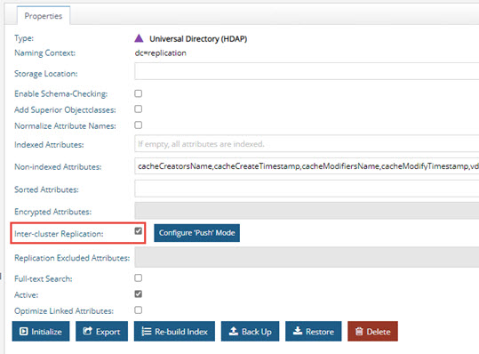

Figure 5.14: Enabling Universal Directory Store for Inter-Cluster Replication

### Fractional Replication

With fractional replication, you can indicate that certain attributes should be excluded from replication. This allows you to control which data is distributed and reduce the replication bandwidth by excluding attributes like photo, jpegPhoto and audio.

Fractional replication can be enabled per Universal Directory naming context by indicating a comma-separated list of attributes to exclude from replication in the Replication Excluded Attributes list. This property is available on the Properties tab of a selected store naming context. Click the Edit button next to the property to configure the comma-separated list of attributes. You must configure this excluded attribute list (same list of attributes) in every cluster participating in inter-cluster replication. Therefore, you should plan and configure the excluded attributes list prior to starting inter-cluster replication. If you need to make changes to the excluded attributes list, see [Changing Excluded Attributes](#changing-excluded-attributes).


 
Figure 5.15: Replication Excluded Attributes

When you export the store on the main cluster, make sure the “Export for Replication” checkbox is enabled. This ensures the excluded attributes are not included in the exported LDIF file and will not be included when the replicas are initialized.

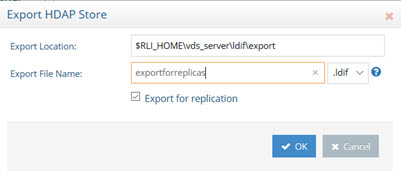
 
Figure 5.16: Export for Replication

###### Changing Excluded Attributes

Adding and removing attributes from the Replication Excluded Attributes list takes effect immediately after saving the configuration change. To keep all clusters consistent, you should temporarily suspend replication if you need to make changes to the Replication Excluded Attributes list. The steps are outlined below.

1.	Log into the Main Control Panel.

2.	Navigate to the ZooKeeper tab (requires [Expert Mode](01-introduction#expert-mode)).

3.	Navigate to /radiantone/<zk_version>/<clustername>/config/namings/<namingcontext_being_replicated>.
4.	Click **Edit Mode**.

5.	Set the replicationInSuspendMode property to true (as shown below).

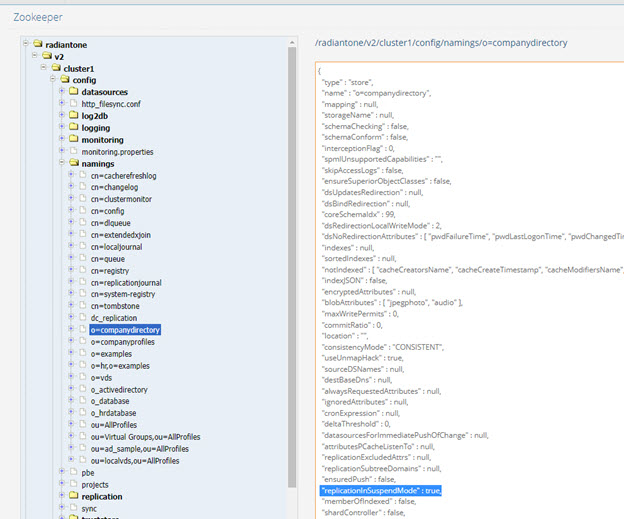
 
Figure 5.17: Location of Configuration to Suspend Inter-cluster Replication

6.	Click **Save**.

7.	Repeat steps 1-6 for each cluster involved in inter-cluster replication.

8.	Navigate to the Main Control Panel > Directory Namespace tab.

9.	Select the Universal Directory store naming context below Root Naming Contexts.

10.	On the Properties tab, for the selected store, click Edit next to Replication Excluded Attributes.

11.	Enter a comma-separated list of attributes to exclude from replication and click Save Changes.

12.	Click **Save**.

13.	Repeat steps 8-12 in each cluster playing a role in inter-cluster replication.

14.	Navigate to the Main Control Panel -> ZooKeeper tab.

15.	Navigate to /radiantone/<zk_version>/<clustername>/config/namings/<namingcontext_being_replicated>.

16.	Click **Edit Mode**.

17.	Set the replicationInSuspendMode property to false (to restart inter-cluster replication).

18.	Repeat step 17 in each cluster playing a role in inter-cluster replication.

### Subtree Replication

With subtree replication, you can indicate which containers/sub-branches should be replicated. To export the sub-branches to initialize replicas, use the Main Control Panel > Directory Browser tab. Select the container/sub-branch that should be replicated and use  to export. Check the option to Export for Replication to ensure the UUID attribute is included in the export. Copy this exported LDIF file to the replica server and use it to initialize the Universal Directory store.


Figure 5.18: Export to LDIF for a Specific Sub-branch (e.g. ou=Accounting)

The replication sub-trees must be defined in a comma-separated list in the “replicationSubtreeDomains” property located in ZooKeeper at: /radiantone/<version>/<cluster_name>/config/namings/<root_naming_context>

An example of configuring two sub-trees for replication would be:

“replicationSubtreeDomains” : [“ou=Accounting,o=companydirectory”, “ou=Sales,o=companydirectory”],

## Managing Universal Directory Entries

On the Main Control Panel > Directory Browser tab of the leader node, you can see the entire directory structure instantiated with the directory entries. There could be nodes for Universal Directory stores, virtual directory trees, the change log (if enabled stores all changes made to local storage or virtual entries), and other default configuration below cn=config. If you do not see your new naming context after clicking on the Directory Browser tab, click the  button at the top.

### Creating New Entries

>[!warning] 
>The user you are logged into the Control Panel as must have rights to create users.

To create new entries, select the parent location in the tree above where you want the entry created and click . Select New Entry, New inetOrgPerson, New Active Directory User New OrganizationalUnit, or New Group. The sections below describe these default options including the object classes that are used. If you want to create entries using different types of object classes than the ones mentioned here, then choose the New Entry option and select the desired object class from the drop-down list. Only object classes available in the RadiantOne LDAP schema are shown here. If the desired object class is not shown, extend the RadiantOne LDAP schema first and then come back to this screen to add your entry. See the RadiantOne System Administration Guide for steps on extending the RadiantOne LDAP schema.

>[!warning] 
>Creating/Modifying entries on the Directory Browser tab is not just for local Universal Directory stores. If a backend other than a local store is mounted under the naming context where you are creating/modifying entries, the backend source is modified accordingly. For example, if you are modifying a branch that represents an LDAP backend and you create a new user entry, that operation is sent to the backend (assuming the credentials stored in the connection string/data source to the backend has the appropriate rights to create users).

#### New Entry

To create entries based on an object class other than group, organizationalUnit, inetOrgPerson, or user, choose the New Entry option. When you select the “New Entry” option, you are shown a drop-down list with all object classes available in the RadiantOne LDAP schema. Select the object class that the entry should belong to. After the object class is selected, enter the RDN in the space provided, and then enter values for the attributes below (all required attributes must have values – required attributes are noted with a “yes” in the “Required?” column). Type the value after clicking in the Value column. 
 
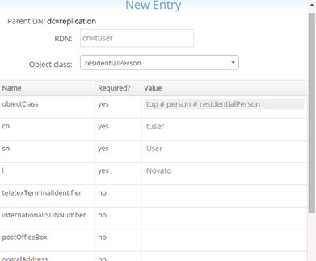

Figure 5.19: Creating a New Entry

#### New Group

When creating a new group, you are able to select from the following list of object classes: group, groupOfNames, groupOfUniqueNames, groupOfUrls. More than one object class may be selected. 

>[!note] 
>If you want the group to be a dynamic group, you must choose the groupOfUrls object class.

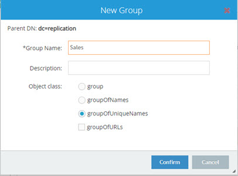
 
Figure 5.20: Creating a New Group Entry

#### New OrganizationalUnit

If you choose to create a new organizationalUnit, the entry is associated with the organizationalUnit object class. 

#### New Active Directory User

This is only relevant if the underlying source is Active Directory. This is a special template for Active Directory due to the specific attributes that are required to be set during the creation of an account. When creating a new Active Directory user, an SSL connection is required if a password is entered for the account. If you do not want to set a password during the account creation, check the Account is Disabled option.

#### New inetOrgPerson

If you choose to create a new user, the entry is associated with the inetOrgperson object class. 

#### New Dynamic Object – Entry that has an Expiration

RadiantOne Universal Directory supports temporary entries using the dynamicObject auxiliary object class as specified in [RFC 2589](https://www.rfc-editor.org/rfc/rfc2589). These entries are associated with a time to live attribute and once expired, the entry is automatically removed from the directory. The attribute that determines the expiration is named entryTTL and has a value in seconds. The minimum entryTTL value supported is 900 seconds. If there is no value specified for entryTTL when the entry is created, a default of 86400 (24 hours) is used.

Dynamic objects have the following conditions:

-	A static object cannot be turned into a dynamic object (you cannot simply add the dynamicObject object class to an existing entry), and vice versa. The object must be marked as dynamic when it is created.

-	Dynamic objects can be created under static objects but cannot be created under dynamic objects.

-	Dynamic objects that are containers cannot have static child objects.

There is no GUI way to create Dynamic Objects so it is common to use an LDAP command line utility. Below is an example of an LDIF file that contains a dynamic entry to create followed by an ldapmodify command to create the entry:

```
dn: uid=tempuser2,o=companydirectory
changetype: add
objectclass: user
objectclass: dynamicObject
uid: tempuser2
entryTtl: 1000
```

C:\SunResourceKit>ldapmodify -h fidserver -p 2389 -D "cn=directory manager" -w password -f addtempuser2.ldif

The temporary entry can be seen from the Main Control Panel in the example below. This entry will exist for 1000 seconds and then be deleted automatically.

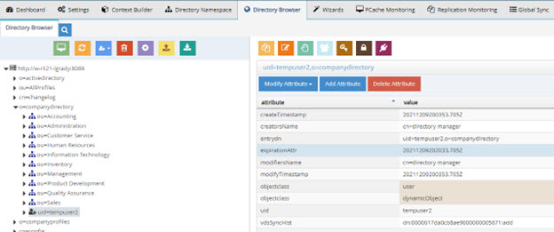
 
Figure 5.21: Dynamic Object/Entry Example

To update the time-to-live for an entry, you can use the “refresh” extended operation as outlined in RFC 2589. The refresh operation is sent by a client to RadiantOne, to indicate that the dynamic directory entry is still accurate and valuable. The client sends a periodic refresh request and if the server receives the request within the timeout period, the lifetime of the dynamic entry can be extended. Below is an example of using the LDAP extended operation command line utility to change the entryTTL to 900 seconds.

```
ldapexop -v -h "fidserver" -p 2389 -D"cn=Directory Manager" -w password refresh "uid=tempuser2,o=companydirectory" 900

ldap_initialize( ldap://fidserver:2389 )
newttl=900
Result: Success (0)
```

### Managing Group Entries

Groups stored in a Universal Directory store may contain members from any branch in the RadiantOne namespace (not just limited to the local store where the group is defined). The easiest way to manage group membership is from the Main Control Panel -> Directory Browser tab. Select the desired group and click .

#### Adding Members

Members can be either “explicit” or “dynamic”. Each option is described in this section.

##### Explicit Members

To add explicit members, follow the steps below.

1.	Select a group and click the Manage Group option on the Directory Browser tab.

2.	If the group is a dynamic group (contains the groupOfUrls object class), the Manage Group window displays an Edit Dynamic Members option and an Edit Explicit Members option. Click the Edit Explicit Members option. If the group is not a dynamic group, the member list displays.

3.	In the Members window, click the Add Members button. The Find Users and Groups window opens.

4.	Select either Groups or Users from the Find drop-down menu and then click  to select a starting point in the RadiantOne namespace to look for groups/users.

5.	To limit the search criteria, enter a value in the Keywords field before clicking Find Now. If “Users” was selected from the Find menu in the previous step, the value must match a uid, sn, sAMAccountName, or cn value. If “Groups” was selected in the previous step, the value must match the cn value.

The objectclass for the user must be inetOrgPerson, user, person, or organizationalPerson (for the search to return them as a user entry). For groups, the objectclass must be group, groupOfNames or groupOfUniqueNames.

6.	Select the user or group you want to add and click . To select all users returned from the search result, click .

7.	Click Confirm. New members to be added are highlighted in a different color than current members. An example of adding three members is shown below.

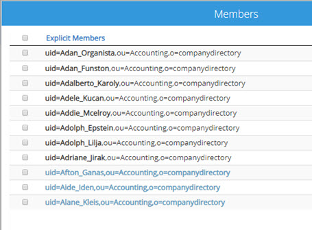

Figure 5.22: Example of adding three members
 
8.	Click Close to exit the Members screen. 

##### Dynamic Members

Dynamic group members are different than explicit group members because instead of specifying a user DN in the group membership attributes (either the member or uniqueMember attributes), you need to specify the LDAP URL containing the filter to find the group members in an attribute named memberURL. The syntax for the memberURL value is as follows:

```
<base_dn>?[attrs]?[sub|one|base]?<filter>
```

-	base_dn is the location in the RadiantOne namespace to start searching from to find the user entries you want to be a member of the group.

-	attrs is optional and here you can provide certain attributes to return about the user entries.

-	the next value is for the scope of the search. This can be either sub (for sub tree search scope), one (for one level search scope), or base (for base level search scope).

-	the final parameter is the filter that should be used to return all members for the group. 

For example, if all users that have departmentNumber=0332 should be members of a group named Sales, the group entry should have the following attributes:

-	objectclass = groupOfURLs (in addition to any other objectclasses for the group --- like group or groupOfUniqueNames…etc. If you only want dynamic members, then groupOfURLs is the only objectclass required). 

-	memberURL = ou=People,ou=Sun,o=vds??one?(departmentNumber=0332)

To add dynamic members with the assistance of a wizard, follow the steps below.

1.	Select a dynamic group and click the Manage Group option on the Directory Browser tab. The Manage Group window opens.

2.	Click **Edit Dynamic Members**. 

>[!note] 
>The Edit Dynamic Members option displays only if the group contains the groupOfUrls object class.

3.	Click **Add Member(s)**.

4.	Enter a base DN (starting point in the RadiantOne namespace) or click  to navigate to the location of the users. 

5.	Select the scope of search needed to find the users. 

6.	Finally, enter the filter that qualifies the users or groups as members of the specific group. 

7.	Click **Confirm**. 

8.	Click **Close** to exit the Dynamic Members screen. 

9.	Once the memberURL is defined, you can enter optional return attributes separated by a comma instead of the default which is to return all attributes. If the user or group entries are large, you may want to only return the attribute that contains the user DN for example (dn, distinguishedName…etc.). To do so, select the memberURL attribute and choose Modify Attribute > Edit. 

10.	In the LDAP URL, replace. 1.1 with a comma separated list of attributes to return and click OK.


 
Figure 5.23: memberURL Criteria for Dynamic Group

### Manually Adding Dynamic Members

An alternative to using a wizard to manage dynamic group members is to manually add the groupOfUrls objectclass and memberURL to the group entry. Follow the steps below.

1.	Navigate to the group in the Main Control Panel > Directory Browser Tab.

2.	Select the group entry and on the right side, select the objectclass attribute.

3.	Choose Modify Attribute > Add Value.

4.	Enter groupOfURLs for the new object class and click Confirm.

5.	To add members, with the group selected in the tree, click **Add Attribute** on the right side.

6.	In the attribute drop-down list, select memberURL. 

7.	Enter the memberURL using the syntax mentioned above. Click Confirm and the group entry is updated accordingly.

>[!note] 
>Groups stored in RadiantOne Universal Directory can contain both explicit members and dynamic members. If RadiantOne is the enforcement point for authorization it first checks to see if the user is an explicit member of the group(s). Then, dynamic group membership is evaluated.

The notion of dynamic group membership is discussed in the Concepts section of the RadiantOne System Administration Guide. It is worth mentioning again, that if the client application is the enforcement point for authorization, then the logic to perform the extra search to the directory to find the group members (based on the memberUrl value of the group entry) must be implemented in the client application code. If the application does not support LDAP dynamic groups, then RadiantOne can be configured to dynamically build the group membership on-the-fly and make all groups managed by RadiantOne appear to have static (explicit) group members. For complete details on this behavior, please see the Groups Builder Wizard in the RadiantOne Identity Service Wizards Guide.

For more information on LDAP dynamic groups as opposed to RadiantOne auto-generated groups, please see Groups in Chapter 2 of the RadiantOne System Administration Guide.

#### Removing Members

To remove explicit group members, from the Main Control Panel > Directory Browser Tab, select the group entry and click . If the group is a dynamic group that has both static and dynamic members, there is an option to edit “explicit” members and one to edit “dynamic” members. If there are no dynamic members, the list of unique members is displayed. Click Remove Member(s), select the member(s) and click Confirm Remove Member(s). If there are dynamic members, click the Edit Dynamic Members option first to reach the screen to remove members. If the group has many members, you can type a value in the filter box on the top right to reduce the entries shown.

To remove dynamic members, select the group entry and click . Click **Edit Dynamic Members**. Click **Remove Member(s)**, select the LDAP URL representing the members to remove and click **Confirm Remove Member(s)**. Click **Close**. 

>[!note] 
>Only groups that are of objectclass type groupOfUrls can have dynamic members. If the group you are managing does not have this object class, then the Dynamic Members option is not shown.

#### Modifying Group Attributes

All group attributes that allow modifications can be changed from the Main Control Panel -> Directory Browser tab. 

1.	Select the group entry in the tree and then on the right side, click the attribute you want to update.

2.	Click **Modify Attribute** > **Edit**. 

3.	Enter the new value.

4.	Click **Confirm**.

To add a value to a multi-valued attribute, select the attribute and choose Modify Attribute > Add Value. 

To delete a value from a multi-valued attribute, select the attribute and value you want to remove and choose Modify Attribute > Delete Value and click **Confirm**.

#### Searching Using Range Retrieval

Searching for multi-valued attributes (generally members) in a group may result in the retrieval of many returned values. To define the range of returned attribute values, use the Range option. This feature can be used with any object class (e.g. group, groupOfUniqueNames) and any attribute (e.g. member, uniqueMember). Both RadiantOne Universal Directory stores and RadiantOne FID persistent cache support range searches. 

An example of how to perform a Range Retrieval search in RadiantOne is described below:

1.	With the RadiantOne service started, click the Main Control Panel > Directory Browser tab. 

2.	Click the  icon. 

3.	Enter a DN in the Search DN field. 

4.	Specify an object class. 

5.	Select a scope. Searches with a lower limit other than 0 must have a scope of “base”. 

6.	Click “Show Advanced Search”. 

7.	In the Return Attributes field, enter your range in the following syntax. 

`<member> or <uniquemember>;range=<lowerlimit>-<upperlimit>`

>[!note] 
>For more information on lower and upper limits, see the [Range Limits](#range-limits) section. Refer to the [Examples](#base-search-with-the-dereferencing-flag-set-to-search) section for example searches.

8.	Click **Search**. 

##### Range Limits

Range retrieval involves requesting either a limited or unlimited number of attribute values in your search. In the RadiantOne Main Control Panel’s Directory Browser search function, the range is specified in the Return Attributes field. This section describes the lower and upper range limits. 

**Lower Range Limit**

The range’s lower limit must be expressed as a numerical value and must not exceed the number of members in the group. If the lower limit is greater than 0, the search scope must be “Base”. If the lower limit is greater than 0, and the search scope is “One Level” or “Subtree”, an error occurs. 

**Upper Range Limit**

The upper limit can be expressed by a numerical value, or, to express a limitless upper limit, use the asterisk [*]. If the upper limit is expressed as a numerical value, it must exceed the lower limit. RadiantOne has no server size limit on range retrieval searches. Be aware that searches with large ranges might affect client performance. 

**Range Syntax**

The following table describes syntax for a few example range searches. 

Syntax 	| Description
-|-
range=0-* | Retrieves all attribute values. 
range=1-10	| Retrieves the second through eleventh values. 
range=0-5000 | Retrieves the first through 5001st values. 

**Examples**

Below are some example range searches. 

**Full-range Search**

In the following example, a search is performed on all group member attributes. 

>[!warning] 
>Searches with large ranges may impact client performance.

The Return Attributes value for this example is as follows.

```
member;range=0-*
```


Figure 5.23: Full-range Search Example

**Mid-range Search**

This search retrieves the second through eleventh values. The following search parameters are used in this example.

```
Scope: Base
Return attributes: member;range=1-10
```

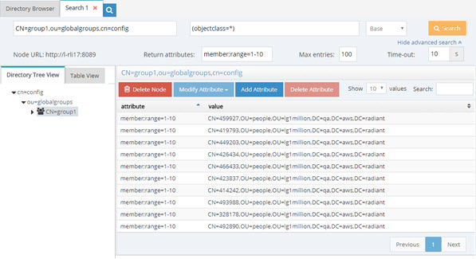

Figure 5.24: Mid-range Search Example

**Large-range Search**

The following search retrieves the first through 5001st values. The Return Attributes value for this example is the following. 

```
member;range=0-5000
```


Figure 5.25: Large-range Search Example

#### Nested Groups

RadiantOne Universal Directory supports nested groups, where groups can be members of other groups. To enable support for nested groups, navigate to the Main Control Panel > Settings tab > Security > Access Controls. Check the option to “Enable Nested Groups”.
 
##### Searching for Group Members using LDAP_MATCHING_RULE_IN_CHAIN

The following example is used to describe the ability to search group membership for a user that is a member of a nested group.

User Ada Rule (identified with a DN of uid=Ada_Rule,ou=Administration,o=companydirectory) is a member of a group named WebUsers. The WebUsers group is a member of a group named Intern. The Intern group is a member of a group named AllUsers. Ada is implicitly a member of WebUsers, Intern and AllUsers. To query RadiantOne for a list of all groups Ada is a member of, the following filter leveraging the LDAP_MATCHING_RULE_IN_CHAIN OID can be used:

```
(uniquemember:1.2.840.113556.1.4.1941:=uid=Ada_Rule,ou=Administration,o=companydirectory)
```

An example query using the RadiantOne LDAP Browser is shown below.


 
Figure 5.26: Sample Search Request Leveraging LDAP_MATCHING_RULE_IN_CHAIN

If a Linked Attribute configuration has been configured for isMemberOf on the naming context, and “Optimize Linked Attribute” is enabled on the Universal Directory store, a filter requesting the ismemberOf attribute using the LDAP_MATCHING_RULE_IN_CHAIN OID is also supported. An example is shown below.


Figure 5.27: Linked Attribute Settings

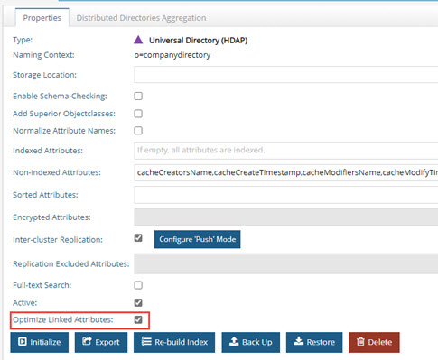

Figure 5.28: Optimize Linked Attribute Setting
An example query using the RadiantOne LDAP Browser is shown below.


Figure 5.29: Sample Search Request Leveraging LDAP_MATCHING_RULE_IN_CHAIN

### Managing User Entries

User entries can be managed from the Main Control Panel > Directory Browser tab or any client that issues standard LDAP or SCIM requests The RadiantOne Restful Web Service (ADAP) interface can also be used to manage accounts.

#### Disabling User Accounts

Disabled accounts are inactive. The user is not able to authenticate (bind) to the directory anymore. To disable an account, add an attribute named nsAccountLock with a value of true to the user entry. To enable the account, set nsAccountLock to false.

1.	Administrators can disable an account from the Main Control Panel > Directory Browser tab. Navigate to the Universal Directory store and select the user entry. On the right side, click **Add Attribute**.

2.	Type in nsAccountLock and press Enter on your keyboard.


Figure 5.30: Adding nsAccountLock to a User Entry

3.	Enter a value of true and click Confirm. 

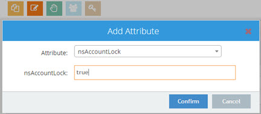
 
Figure 5.31: Disabling a User Account

The account is now disabled. If this user tries to authenticate to the directory, the server responds with: [LDAP: error code 53 - Account inactivated. Contact system administrator to activate this account].

A disabled account in RadiantOne Universal Directory appears in the Main Control Panel > Directory Browser tab with a red X next to the entry. 

#### Enabling User Accounts

If an account is disabled because the nsAccountLock attribute is set to true, simply set the value to false to enable the account.

If an account is locked by the RadiantOne server, due to a password policy violation (e.g. too many invalid login attempts), it can become unlocked by resetting the user’s password. Any user (other than the locked-out user) that has the proper permissions (ACI’s) can reset the user’s password. If the lockout policy has a duration period, the account is automatically unlocked after the duration has passed.

#### Modifying Attributes

Attributes can be updated, added or deleted.

>[!warning] 
>The user you are logged into the Main Control Panel as must have rights to modify users.

##### Updating Attributes

To update attributes, select the user in the tree and on the right side, select the attribute you want to change. Click the Modify Attribute > Edit option and provide the new value. To add a value to a multi-valued attribute, select the attribute and choose Modify Attribute > Add Value. To delete a value from a multi-valued attribute, select the attribute value you want to remove and choose Modify Attribute > Delete Value.

##### Adding Attributes

To add attributes, select the user in the tree and on the right side, click **Add Attribute**. Enter an attribute name or select the attribute from the drop-down list and provide a value. Click **Confirm**.

##### Deleting Attributes

To delete attributes, select the user in the tree and on the right side, select the attribute you want to remove then click **Delete Attribute**.

##### Editing Photo Attributes
If an attribute is of binary type, select the attribute and choose Modify Attribute > Edit. This brings up the binary editor. Browse to the new file and click **Confirm**.

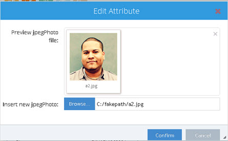
 
Figure 5.32: Binary Attribute Editor

##### Resetting Passwords

RadiantOne Universal Directory uses the userPassword attribute to store passwords.

To reset a user’s password, select the user entry in the tree and on the right, select the userPassword attribute. Click **Modify Attribute** > **Edit**. Change the value and click **OK**.

#### Moving Entries

To move a user entry from one container to another within the same root naming context representing the same backend data source, select the entry and click the Move Entry () button. Browse to the location where you want the entry moved to and click **OK**. Click **OK** to confirm the move.

>[!warning] 
>Entries can only be moved to/from containers below the same naming context representing the same backend data source.


Figure 5.33: Move Entry

#### Setting Access Permissions

For information on setting access permissions, please see the RadiantOne System Administration Guide.

### Deleting Entries

From the Main Control Panel > Directory Namespace tab, select the entry in the tree and click . Click Confirm to accept the deletion. If the entry being deleted is a container with child entries, you are prompted a second time to confirm the deletion of the sub-tree.

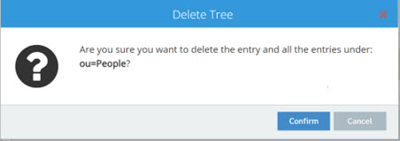

Figure 5.34: Delete Tree Confirmation

### Alias Entries

RadiantOne Universal Directory supports alias entries as defined in RFC 22521. Alias entries point to/reference another entry in the directory. The attribute containing the location of the target entry (DN) is aliasedObjectName and the object class associated with these entries is alias. When a client requests an alias entry, they can indicate if they want the alias dereferenced or not. The indicators are outlined in the table below.

>[!warning] 
>Dereferencing alias entries is only supported on base-level searches. One-level and subtree searches are not supported at this time.

Flag | RadiantOne Behavior
-|-
derefAliases=0 <br> (equivalent to using -a never in an ldapsearch command) | Never dereferences aliases. <br>This is the default behavior.
derefAliases=1 <br> (equivalent to using -a search in an ldapsearch command) | Dereferences aliases in subordinates of the base object in a search but not in locating the base object of the search.
derefAliases=2 <br> (equivalent to using -a find in an ldapsearch command) | Dereferences the base object in a search, but does not dereference alias entries that are under the base.
derefAliases=3 <br>(equivalent to using -a always in an ldapsearch command)	| Dereferences aliases both in searching and in locating the base object of the search.

The following two entries, described in LDIF format, are used to explain how alias entries work.

```
dn: uid=Adan_Caudy,ou=Management,o=companydirectory
uid: Adan_Caudy
sn: Caudy
objectclass: inetOrgPerson

dn: uid=President,o=companydirectory
objectclass: alias
objectclass: extensibleobject
uid: President
aliasedobjectname: uid=Adan_Caudy,ou=Management,o=companydirectory
```

Based on the two entries above, the uid=President entry is an alias for the uid=Adan_Caudy user. The example searches below describe how RadiantOne handles searches on the alias entry.

###### Base Search with the Dereferencing Flag set to find

ldapsearch -p 2389 -h r1fidserver -D "cn=directory manager" -w password -b "uid=president,o=companydirectory" -a find -s base "objectclass=*"

In this example, RadiantOne automatically dereferences the alias entry and returns the entry it points to. In this example, the search dereferences “uid=president,o=companydirectory”, which is an alias entry, and returns uid=Adan_Caudy,ou=Mangement,o=companydirectory as shown below.

```
version: 1
dn: uid=Adan_Caudy,ou=Management,o=companydirectory
employeeType: Intern
homePhone: +1 008 952 2404
givenName: Adan
entrydn: uid=Adan_Caudy,ou=Management,o=companydirectory
mobile: +1 730 681 9001
modifyTimestamp: 20170823171430.973Z
objectClass: top
objectClass: person
objectClass: organizationalperson
objectClass: inetorgperson
userPassword: {SSHA}yeF7G1Z1sVuCkgQguNMmdkArvIHYLN7Y3MG4tg==
createTimestamp: 20170823171430.973Z
ou: Management
uid: Adan_Caudy
mail: Adan_Caudy@rli.com
cn: Adan Caudy
modifiersName: cn=directory manager
creatorsName: cn=directory manager
employeeNumber: 6937
l: Eureka
sn: Caudy
```

###### Base Search with the Dereferencing Flag set to search

ldapsearch -p 2389 -h r1fidserver -D "cn=directory manager" -w password -b "uid=president,o=companydirectory" -a search -s base "objectclass=*"

In this example, RadiantOne returns the entry without dereferencing it. The uid=President,o=companydirectory entry is returned.

```
version: 1
dn: uid=President,o=companydirectory
entrydn: uid=President,o=companydirectory
objectClass: top
objectClass: alias
objectClass: extensibleObject
uid: President
modifyTimestamp: 20180511202649.932Z
modifiersName: cn=directory manager
creatorsName: cn=directory manager
createTimestamp: 20180511202539.737Z
aliasedObjectName: uid=Adan_Caudy,ou=Management,o=companydirectory
```

###### Base Search with the Dereferencing Flag set to _always_

ldapsearch -p 2389 -h r1fidserver -D "cn=directory manager" -w password -b "uid=president,o=companydirectory" -a always -s base "objectclass=*"

In this example, RadiantOne automatically dereferences the alias entry and returns the entry it points to. In this example, the search dereferences “uid=president,o=companydirectory”, which is an alias entry, and returns uid=Adan_Caudy,ou=Mangement,o=companydirectory as shown below.

```
version: 1
dn: uid=Adan_Caudy,ou=Management,o=companydirectory
employeeType: Intern
homePhone: +1 008 952 2404
givenName: Adan
entrydn: uid=Adan_Caudy,ou=Management,o=companydirectory
mobile: +1 730 681 9001
modifyTimestamp: 20170823171430.973Z
objectClass: top
objectClass: person
objectClass: organizationalperson
objectClass: inetorgperson
userPassword: {SSHA}yeF7G1Z1sVuCkgQguNMmdkArvIHYLN7Y3MG4tg==
createTimestamp: 20170823171430.973Z
ou: Management
uid: Adan_Caudy
mail: Adan_Caudy@rli.com
cn: Adan Caudy
modifiersName: cn=directory manager
creatorsName: cn=directory manager
employeeNumber: 6937
l: Eureka
sn: Caudy
```

### Searching for Number of Subordinates

To search for the number of subordinates an entry contains, use the numSubordinates attribute in your filter. This indicates how many immediate subordinates an entry has. Entries returned when using a search filter of (numSubordinates=0) are leaf entries because they currently have no subordinates/child nodes. You can also leverage “greater than” or “less than” in your filter. A filter of (numSubordinate>=5) would return only entries that have 5 or more subordinates.

Numsubordinates is an operational attribute and is only returned in searches when it is specifically requested. An example search is shown below.


 
Figure 5.35: Sample Search Requesting numSubordinates Attribute

## Detecting Changes in RadiantOne Universal Directory

Changes to entries can be detected based on changelog (listening for change on the cn=changelog naming context) or using the Persistent Search Control. For details on these change detection mechanisms, please see the RadiantOne System Administration Guide. 
