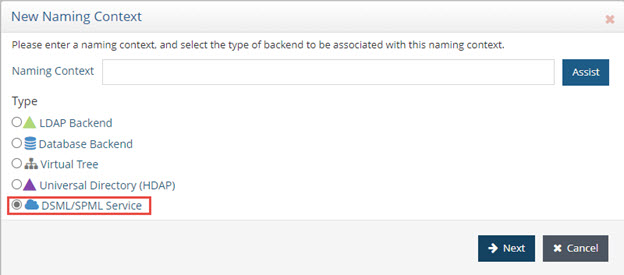
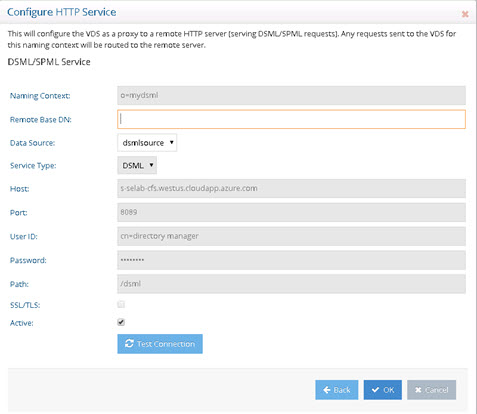
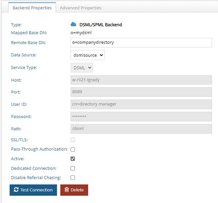
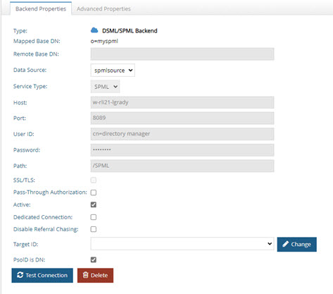

# Virtual Views for DSML or SPML Backends
Virtual views of DSML and SPML backends are supported with RadiantOne. 

## Configuration

To configure virtual views pointing to a backend SPML or DSML service, follow the steps below.

1.	From the Main Control Panel > Settings tab > Server Backend > Custom Data Sources, add a DSML/SPML data source. For details on creating data sources, see the [RadiantOne System Administration Guide](/sys-admin-guide/01-introduction).

2.	From the Main Control Panel > Directory Namespace Tab, click .

3.	Enter a name for the naming context, select the DSML/SPML Service option and click Next.

    

    Figure 1: Defining Naming Context for a Web Service

4.	Select the DSML/SPML data source from the drop-down list and click OK.

RadiantOne queries the DSML/SPML service when clients request information from this particular branch/naming context.

## Web Service Backend Parameters and Settings

The properties to connect to the DSML/SPML backend are defined in the custom data source.

 
Figure 7.2: DSML/SPML Service

Once the naming context is defined, the DSML/SPML service properties can be managed from the Main Control Panel > Directory Namespace tab. Select the naming context and the Backend Properties tab is shown on the right.

 
Figure 7.3: DSML Backend Properties

### Naming Context

External suffix used by clients to access the branch in RadiantOne mapped to the web service.

### Remote Base DN

Internal suffix used by RadiantOne, this can be the same as the naming context (which is the default value). For SPML services, this is not required.

### Data Source

The RadiantOne data source representing the connection details for the DSML/SPML service.

### Service Type

SPML or DSML. Defined at the level of the custom data source.

### Host

Web server name or IP address. Defined at the level of the custom data source.

### Port

Web server port. Defined at the level of the custom data source.

### User ID

User name to connect to the DSML or SPML service (and perform any operation you want RadiantOne to be able to perform (create, read, update, delete). Defined at the level of the custom data source.

### Password

Password for the user account. Defined at the level of the custom data source.

### Path

Path that points to the DSML or SPML Service installed on the web/application server. Defined at the level of the custom data source.

### SSL/TLS

Check whether to enable SSL/TLS access to the backend (see SSL/TLS for details on configuring RadiantOne as an SSL client in the [RadiantOne System Administration Guide](/sys-admin-guide/01-introduction)). Defined at the level of the custom data source.

### Pass Thru Authorization

This parameter dictates how authorization is handled when RadiantOne accesses the backend. If Pass Thru Authorization is enabled, RadiantOne impersonates the user that authenticated to RadiantOne. If Pass Thru Authorization is not enabled, RadiantOne accesses the backend with the credentials stored in the User ID and Password parameters.

For complete details on this functionality, please see the [Pass Thru Authorization parameter](03-virtual-view-of-ldap-backends#pass-thru-authorization) for a backend LDAP (as it functions the same way).

### Active

Check Active option to activate the node. Uncheck the Active option to deactivate the node. Only active nodes are accessible by clients.

### Dedicated Connection

By default, RadiantOne uses connection pooling for accessing backend servers. Therefore, when clients access RadiantOne, it can re-use any open connections in the pool to connect to the backend. If you want the connection from the client to RadiantOne to determine the lifecycle of the connection to the backend server, you can enable the dedicated connection option. If the dedicated connection option is enabled, RadiantOne does not use the connection pool and the connection to the backend is closed when the client disconnects from RadiantOne. The connections are more predictable because when the client disconnects, the connection to the backend is closed. Whereas if dedicated connections were not used, and a client disconnects from RadiantOne, the connection to the backend server can remain in the connection pool (until the configured timeout parameter is reached, which then removes the connection from the pool).

Dedicated connections are best used in cases where there are only a few clients accessing RadiantOne but generate a lot of traffic.

### Disable Referral Chasing

By default, RadiantOne attempts to chase referrals that have been configured in the underlying LDAP server. If you do not want it to chase referrals when searching the underlying LDAP server, then you should enable this option. Remember to click save to apply the changes to the server.

Chasing referrals can affect the overall performance of RadiantOne because if the referral server is not responding (or responding slowly) RadiantOne could take a long time to respond to the client. For example, in the case of RadiantOne querying an underlying Active Directory (with a base DN starting at the root of Active Directory) you may get entries like the following returned:

`ldaps://ForestDnsZones.na.radiantlogic.com:636…
ldaps://DomainDnsZones.na.radiantlogic.com:636…`

RadiantOne attempts to “chase” these referrals which can result in an extreme degradation in response times. Therefore, it is recommended that you disable referral checking if you need to proxy to Active Directory starting at the root of the Active Directory tree.

### Target ID (SPML)

A target is a logical endpoint for provisioning which is controlled by the Provisioning Service Provider (PSP). When virtualizing an SPML backend, RadiantOne is a client to the SPML service. Therefore, you must specify which target(s) RadiantOne should access. The drop-down list next to the Target ID (SPML) settings is populated from the available targets from the backend SPML service. Select the target that should be associated with the configured virtual view.

### PsoID is DN (SPML)

When RadiantOne virtualizes an SPML backend, the attribute that indicates the unique identifier may be a DN (if the provisioning target is an LDAP directory for example). If this is the case, be sure to check the PsoID is a DN option for the virtual view. 

If the unique identifier in the SPML service is not a DN, then uncheck this option. Click Save and then Yes to apply the changes to the server after making the change.

 
Figure 4: SPML Backend Properties

### Interception Scripts

For specific details, please see Interception Scripts in the Concepts section of the [RadiantOne System Administration Guide](/sys-admin-guide/01-introduction). This section describes how to enable interception scripts for a DSML or SPML service backend.

1.	Navigate to the DSML or SPML Service backend node below Root Naming Contexts on the Main Control Panel > Directory Namespace Tab. 

2.	On the right side, select the Advanced Properties tab.

3.	Enable the operations you want to customize by checking the box next to it. The Java script associated with this DSML or SPML service backend is displayed in the Source Location parameter. This is this script that you will customize.

4.	Click Save and then Yes to apply the changes to the server.

5.	Lastly, follow the steps defined in the Interception Scripts section of Concepts in the [RadiantOne System Administration Guide](/sys-admin-guide/01-introduction) to customize the logic and rebuild the needed jar file.
 
