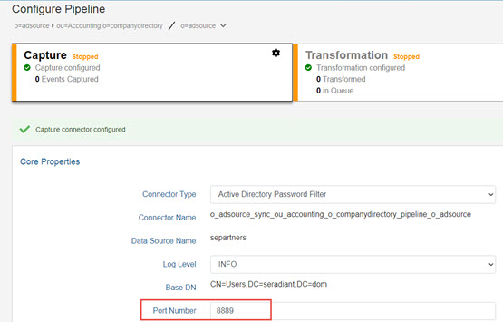
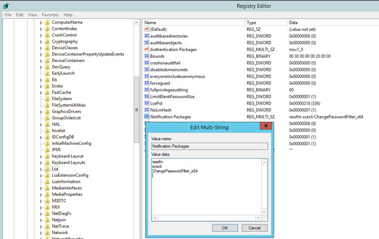
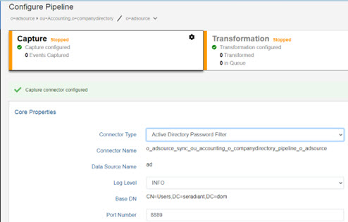

# RadiantOne Password Filter Guide

## Overview

Synchronizing passwords can be challenging because of the many different encryption schemes used by data sources. One data source may use an encryption scheme that is not understood by another data source. Therefore, the only way to synchronize passwords between the two sources would be to capture the password in clear text before the data source encrypts it. RadiantOne offers a password filter component that captures a password in clear text when it is created or reset and publishes the password to other data sources that need this information. The password filter component is available for Active Directory.

## Configuring Password Synchronization Topology

### Configuring the Synchronization Topology

The first step in configuring password synchronization is to capture the schema and connection information from the Active Directory (where the password filter will be listening for changes) and all data stores that will receive the password changes. For help on capturing schemas, please see the RadiantOne Context Builder Guide.

>[!warning]
>If the destination/target receiving the password changes is an Active Directory, the target connector must connect to this Active Directory via SSL. For details on how to connect to a data source via SSL, please see the RadiantOne System Administration Guide.

Next, configure the synchronization source and target using the Main Control Panel > Directory Namespace tab and then the needed topology using the Global Sync tab. The topology should be for password synchronization only because the capture/source connector type must be set as type AD Password Filter and this connector type can only be used for synchronizing password changes. In other words, even if you already have a topology that contains your Active Directory source object where you are already detecting changes from (inserts, updates, deletes), you should create a new topology that is solely for password synchronization.

The topology should consist of the user object from the Active Directory schema (as the source) and all other objects that should receive the password change (as targets). Each target requires a separate topology. For example, if Active Directory passwords need to be synchronized to Target Directory 1 and Target Directory 2, one topology will process the password sync from Active Directory to Target Directory 1 and one topology will process the password sync from Active Directory to Target Directory 2. The flow of change should come from the user object (representing the source where the password filter will be listening for changes) and be directed toward the other target object in the topology. In the transformation script, you must set the password attribute from the source user object to the correct destination attribute. The source and target attribute mapping should be userPassword. For help on configuring a topology, please see the RadiantOne Global Sync Guide.

>[!note]
>You will need the name of the synchronization object for the password filter configuration. For the password filter configuration, the synchronization
object is the DN in the RadiantOne namespace that is the parent container for the source Active Directory users. In the example shown below, the sync object is o=adsource.

### Setting the Capture Connector Type

The Active Directory source object should be set for the password filter. Select the topology and
click Configure. Select the capture component and the configuration displays. Select Active
Directory Password Filter from the Connector Type drop-down menu.

Figure 1: AD Password Filter Connector Type

### Configuring the Connector Properties

Configure the Port Number property.

>[!warning]
>Other connector properties like log level, polling interval, etc. can also be defined, but typically the default values are sufficient. For details on all connector properties, please see the RadiantOne Connector Properties Guide.

#### Port Number

The port that the connector should receive the password change on is configured at the level of the connector. Enter the port number and click Save. This should match the port you configure for the password filter.

Figure 2: Port Number for the Connector

#### LDAP Filter

To further condition the entries that are published, you can indicate the desired criteria in the LDAP Filter property. This is a post filter, used to qualify which entries are published by the connector. You must enter a valid LDAP filter in the property.

This property can be used to avoid publishing unwanted information.

If a captured entry matches the criteria indicated in the LDAP filter property, it is published by the connector. If it doesn’t, the entry is not published. Information about the skipped entries is in the connector log (with log level set to DEBUG).

#### Excluded Branches

To further condition the entries that are published, you can indicate a branch to exclude. In the Excluded Branches property, enter one or more suffixes associated with entries that should not be published in the message by the connector. To list many suffixes, separate the values with `<space>##<space>`. For example, ou=dept1,ou=com ## ou=dept2,ou=com. If the changed entry DN contains a suffix that matches the excluded branches value, or is a change in the exact entry that is listed (e.g. ou=dep1,ou=com), this entry is not published by the connector. Otherwise, the entry is included. This can avoid publishing unwanted information.

>[!note]
>If both included and excluded branches are used, an entry must satisfy the conditions defined in both settings to be included in the message. The included branches condition(s) is checked first.**

#### Included Branches

To further condition the entries that are published, you can indicate a branch to exclude. In the Excluded Branches property, enter one or more suffixes associated with entries that should not be published in the message by the connector. To list many suffixes, separate the values with <space>##<space>. For example, ou=dept1,ou=com ## ou=dept2,ou=com. If the changed entry DN contains a suffix that matches the excluded branches value, or is a change in the exact entry that is listed (e.g. ou=dep1,ou=com), this entry is not published by the connector. Otherwise, the entry is included. This can avoid publishing unwanted information.

>[!note]
>If both included and excluded branches are used, an entry must satisfy the conditions defined in both settings to be included in the message. The included branches condition(s) is checked first.

## Password Filter Component

### Installation

For the location of the password filter installer, please contact support@radiantlogic.com.

The Password Filter component for 32-bit Windows operating systems can be installed on the following Windows Server versions: 2003, 2008 R2, or 2012 R2 that are running Active Directory. The Password Filter component for 64-bit Windows operating systems can be installed on the following Windows Server versions: 2012 R2, 2016, or 2019.

>[!warning]
>Microsoft Visual C++ Runtime and .NET Framework v4 must be installed prior to running the password filter installer.

To install the Password Filter, execute ‘ChangePasswordFilterSetup32bits.exe’ for a 32-bit
Windows operating System and ‘ChangePasswordFilterSetup64bits.exe’ for a 64-bit operating
system.

>[!note]
>You must restart Windows after the Password Filter has been installed.

After the password filter component is installed, and you restart the Windows machine, a file named "ChangePasswordFilter_x64.dll" is stored in the Windows\System32\ folder. If you run the “Regedit.exe” tool ("Regedt32.exe" on 32 - bit systems) and go to "HKEY_LOCAL_MACHINE\SYSTEM\CurrentControlSet\Control\Lsa" the "Notification Packages" will specify "ChangePasswordFilter_x64" in the list for 64-bit installer and “pwdchg” for the 32-bit installer.

Figure 3: Notification Packages

A Windows Service is also installed and retrieves the password changes from the filter. The
name of the Windows Service is: Radiant Logic, Inc. Change Password Filter Service. This
service must be started for the password changes to be published to the connector.

Figure 4: Password Service

### Configuration

The following attributes need to be configured with the values for the hostname, port, syncobject, and userattribute. Run the “regedit.exe” tool ("Regedt32.exe" on 32-bit operating systems) and go to:

"HKEY_LOCAL_MACHINE\SYSTEM\CurrentControlSet\Control\Lsa\RadiantOne"

“**hostname**” of REG_SZ type - the value should be the name or IP address of the machine where RadiantOne has been installed.

“**port**” of REG_DWORD type - the value should be the port number the connector listens on, on the machine where RadiantOne has been installed. This should be the same as the port number that is configured in the connector properties.

“**syncobject**” of REG_SZ type - the DN in the RadiantOne namespace to locate the source Active Directory object.

“**userattribute**” of REG_SZ type –the name of the attribute used to locate the entry – for Active Directory, this should be “sAMAccountName”.

“**logs**” of REG_SZ type – To enable additional logging for the password filter component, set the value to true. The logs are located in a folder named RadiantOne_PWDCHANGES located in C:\Windows\System32. By default, this additional logging is disabled (false).

>[!note]
>The hostname, port, syncobject, userattribute, and logs can be modified later in the registry if needed. Windows does not need to be restarted if you modify these parameters. However, on 32- bit systems only, the ‘Radiant Logic, Inc. Change Password Filter Service’ in the Windows services should be restarted.

Figure 5: Hostname, Port, Syncobject, and Userattribute Parameters for Password Filter

Below is a reference to the corresponding capture connector configured in RadiantOne.

### How the Password Filter Works

When a password is created or reset in Active Directory, the password filter intercepts the password before it gets encrypted. The filter then publishes the information to a log file where it remains until the password service retrieves it. The log file is read by the password service (Radiant Logic, Inc. Change Password Filter Service). The password service uses the hostname, port, syncobject and userattribute parameters that were configured for the password filter to send the password changes to the connector (which is listening on a dedicated port to receive the changes). The connector then publishes the information to the targets/destinations that have been configured to subscribe to password changes (as defined in the synchronization topology). If the password service cannot reach the connector (i.e. it is not running) to publish the password change, it continues to try indefinitely.

See diagram below for a high-level architecture.

Figure 6: Password Synchronization Architecture

### Troubleshooting

On the machine where the password filter is installed, there is a folder named RadiantOne_PWDCHANGES located in C:\Windows\System32. This folder contains all log files related to the password changes and the password filter service (Radiant Logic, Inc. Change Password Filter Service).

The main file is Passworddata.rlisend: If the password service is not running or unable to successfully publish changes to the connector, details about the password changes are stored in this file. The changes remain in this file until the service can successfully publish them to the connector. If the changes are successfully published to the connector, this log file is automatically removed.

On 32-bit systems, there are also log files named: ‘logxxxxxx_xxxxx.....’ which contain connection errors if the password service is unable to connect to the Active Directory Password Filter connector. (32 bits)

On 64-bit systems, there is a log file named LogService which contains connection errors if the password service is unable to connect to the Active Directory Password Filter connector.

### Uninstalling the Password Filter

There are two methods to uninstall the password filter:

Method 1: Navigate to C:\Program Files
(x86)\RadiantOne_Password_Filter\RadiantOne_Password_Filter\uninstaller directory and execute the uninstaller.exe. Restart the machine.

Method 2: From the Windows Control Panel, go to Programs and Features > Uninstall or change a program. In the list of the available programs, locate Change Password Filter 64bits (or Change Password Filter 32bits depending on your operating system). Right click on it and select uninstall. Restart the machine.

## Starting the Synchronization Process

The RadiantOne Global Sync pipeline must be running for passwords to be synchronized. Please see the RadiantOne Deployment and Tuning Guide for detailed steps on starting the pipeline.
