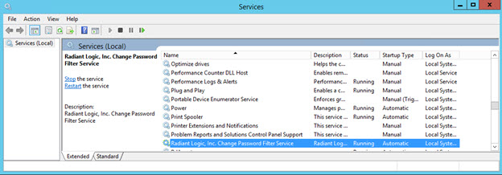

# Password Filter Component

## Installation

For the location of the password filter installer, please contact support@radiantlogic.com.

The Password Filter component for 32-bit Windows operating systems can be installed on the following Windows Server versions: 2003, 2008 R2, or 2012 R2 that are running Active Directory. The Password Filter component for 64-bit Windows operating systems can be installed on the following Windows Server versions: 2012 R2, 2016, 2019, or 2022.

>[!warning]
>Microsoft Visual C++ Runtime and .NET Framework v4 must be installed prior to running the password filter installer.

To install the Password Filter, execute ‘ChangePasswordFilterSetup32bits.exe’ for a 32-bit
Windows operating System and ‘ChangePasswordFilterSetup64bits.exe’ for a 64-bit operating
system.

>[!note]
>You must restart Windows after the Password Filter has been installed.

After the password filter component is installed, and you restart the Windows machine, a file named "ChangePasswordFilter_x64.dll" is stored in the Windows\System32\ folder. If you run the “Regedit.exe” tool ("Regedt32.exe" on 32 - bit systems) and go to "HKEY_LOCAL_MACHINE\SYSTEM\CurrentControlSet\Control\Lsa" the "Notification Packages" will specify "ChangePasswordFilter_x64" in the list for 64-bit installer and “pwdchg” for the 32-bit installer.

Figure 1: Notification Packages

A Windows Service is also installed and retrieves the password changes from the filter. The
name of the Windows Service is: Radiant Logic, Inc. Change Password Filter Service. This
service must be started for the password changes to be published to the connector.

Figure 2: Password Service

## Configuration

The following attributes need to be configured with the values for the hostname, port, syncobject, and userattribute. Run the “regedit.exe” tool ("Regedt32.exe" on 32-bit operating systems) and go to:

"HKEY_LOCAL_MACHINE\SYSTEM\CurrentControlSet\Control\Lsa\RadiantOne"

“**hostname**” of REG_SZ type - the value should be the name or IP address of the machine where RadiantOne has been installed.

“**port**” of REG_DWORD type - the value should be the port number the connector listens on, on the machine where RadiantOne has been installed. This should be the same as the port number that is configured in the connector properties.

“**syncobject**” of REG_SZ type - the DN in the RadiantOne namespace to locate the source Active Directory object.

“**userattribute**” of REG_SZ type –the name of the attribute used to locate the entry – for Active Directory, this should be “sAMAccountName”.

“**logs**” of REG_SZ type – To enable additional logging for the password filter component, set the value to true. The logs are located in a folder named RadiantOne_PWDCHANGES located in C:\Windows\System32. By default, this additional logging is disabled (false).

>[!note]
>The hostname, port, syncobject, userattribute, and logs can be modified later in the registry if needed. Windows does not need to be restarted if you modify these parameters. However, on 32- bit systems only, the ‘Radiant Logic, Inc. Change Password Filter Service’ in the Windows services should be restarted.

Figure 3: Hostname, Port, Syncobject, and Userattribute Parameters for Password Filter

Below is a reference to the corresponding capture connector configured in RadiantOne.

## How the Password Filter Works

When a password is created or reset in Active Directory, the password filter intercepts the password before it gets encrypted. The filter then publishes the information to a log file where it remains until the password service retrieves it. The log file is read by the password service (Radiant Logic, Inc. Change Password Filter Service). The password service uses the hostname, port, syncobject and userattribute parameters that were configured for the password filter to send the password changes to the connector (which is listening on a dedicated port to receive the changes). The connector then publishes the information to the targets/destinations that have been configured to subscribe to password changes (as defined in the synchronization topology). If the password service cannot reach the connector (i.e. it is not running) to publish the password change, it continues to try indefinitely.

See diagram below for a high-level architecture.

Figure 4: Password Synchronization Architecture

## Troubleshooting

On the machine where the password filter is installed, there is a folder named RadiantOne_PWDCHANGES located in C:\Windows\System32. This folder contains all log files related to the password changes and the password filter service (Radiant Logic, Inc. Change Password Filter Service).

The main file is Passworddata.rlisend: If the password service is not running or unable to successfully publish changes to the connector, details about the password changes are stored in this file. The changes remain in this file until the service can successfully publish them to the connector. If the changes are successfully published to the connector, this log file is automatically removed.

On 32-bit systems, there are also log files named: ‘logxxxxxx_xxxxx.....’ which contain connection errors if the password service is unable to connect to the Active Directory Password Filter connector. (32 bits)

On 64-bit systems, there is a log file named LogService which contains connection errors if the password service is unable to connect to the Active Directory Password Filter connector.

## Uninstalling the Password Filter

There are two methods to uninstall the password filter:

Method 1: Navigate to C:\Program Files
(x86)\RadiantOne_Password_Filter\RadiantOne_Password_Filter\uninstaller directory and execute the uninstaller.exe. Restart the machine.

Method 2: From the Windows Control Panel, go to Programs and Features > Uninstall or change a program. In the list of the available programs, locate Change Password Filter 64bits (or Change Password Filter 32bits depending on your operating system). Right click on it and select uninstall. Restart the machine.
