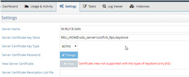
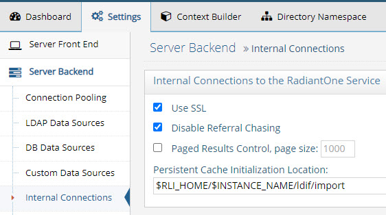
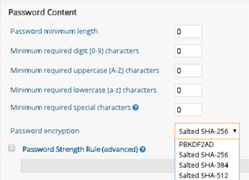
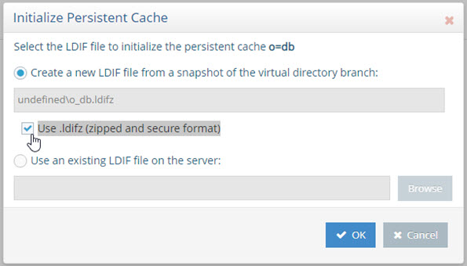
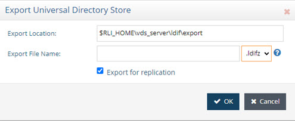
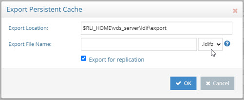

# Chapter 2: Deploying RadiantOne in FIPS Mode

In FIPS mode, RadiantOne performs all cryptographic operations using the Radiant Logic Cryptographic Module for Java. This includes key generation and key derivation, message digests and message authentication codes, random number generation, symmetric and asymmetric encryption, signature generation and verification, etc. RadiantOne supports FIPS mode on Windows Server 2016, RHEL, and CentOS.

After installing RadiantOne, it is recommended that you harden the server for security threats. See the RadiantOne Hardening Guide for advice. After the server is hardened, you can enable FIPS mode.

During the RadiantOne installation, a self-signed server certificate of type JKS is installed in <RLI_HOME>/vds_server/conf/rli.keystore. When you enable FIPS mode, the keystore containing the self-signed certificate is converted to type BCFKS and a new keystore is created. Therefore, when you (later) replace the default self-signed certificate, ensure it is updated properly in the corresponding FIPS certificate keystore.

If RadiantOne is deployed in a cluster, follow these steps to enable FIPS mode on each node. To ensure all nodes are at the same level of security at the same time, all RadiantOne processes except ZooKeeper should be stopped to enable FIPS mode. ZooKeeper must remain running. 

>[!warning]
>Since enabling FIPS mode requires cluster downtime, only perform the change during a maintenance window.

>[!warning]
>If you have deployed RadiantOne in Kubernetes, modify the file <RLI_HOME>/jdk/jre/lib/security/java.security and replace this line: <br> securerandom.source=file:/dev/random <br> With this line: <br> securerandom.source=file:/dev/urandom

To enable FIPS mode on each node, use the following command:

```
C:\radiantone\vds\bin>vdsconfig.bat fips-mode-enable
><span style="color:red">
```

Restart Jetty and the RadiantOne service. If deployed in a cluster, restart these services on each node.

When RadiantOne is enabled for FIPS mode, the keystore type is automatically converted to BCFKS. This can be seen in the Server Control Panel -> Settings tab: Server Certificate Key Store and Server Certificate Key Type should indicate the path to the keystore and BCFKS respectively.


 
## Converting a Server Certificate to BCFKS

When RadiantOne is enabled for FIPS mode, the keystore type is automatically converted to BCFKS. Therefore, the example provided in this section is solely informational.

For a given keystore of type JKS or PKCS12, you can convert it into the RadiantOne FIPS mode format by using the command line keytool -importkeystore.

Below is an example that converts JKS type of keystore into BCFKS type:

```
C:\radiantone\vds\vds_server\conf>"C:\radiantone\vds7.3\jdk\bin\keytool" -importkeystore 
-srckeystore rli.keystore -srcstoretype JKS -srcstorepass radiantlogic -destkeystore rli_fips.keystore -deststoretype BCFKS -deststorepass radiantlogic -provider com.safelogic.cryptocomply.jcajce.provider.CryptoComplyFipsProvider -providerpath C:\radiantone\vds7.3\lib\ccj-3.0.1.jar"
```

Output of the command:

```
Importing keystore rli.keystore to rli_fips.keystore...
Entry for alias rli successfully imported.
Import command completed:  1 entries successfully imported, 0 entries failed or cancelled
```

## Allowed SSL/TLS Protocols

The configurations to check and update if needed are the SSL/TLS protocols allowed, the vdsha LDAP data source is configured to use the SSL port, and all internal connections are configured to use SSL.

1.	When FIPS mode is enabled, RadiantOne only supports the following SSL/TLS protocols: TLS v1, TLS v1.1, TLS v1.2, and TLS v1.3. The supported protocols can be seen from Main Control Panel > Settings tab > Security > SSL. Click the Change button next to Enabled SSL Protocols.


 
2.	One of the elements of hardening the RadiantOne service, is to set the vdsha LDAP data source to use SSL. From the Main Control Panel -> Settings tab -> Server backend -> LDAP Data Sources. Select the vdsha data source and click Edit. Enable the SSL checkbox on the right and set the SSL port. Click Save.
 


3.	One of the elements of hardening the RadiantOne service is to ensure that all Internal Connections are configured to use SSL. From the Main Control Panel -> Settings tab -> Server Backend -> Internal Connections, ensure the Use SSL option is enabled. Click Save.



 
## Allowed Cipher Suites

The cipher suites allowed in FIPS mode can be seen from Main Control Panel > Settings tab > Security > SSL. Click the Change button next to Supported Cipher Suites.

```
TLS_DHE_DSS_WITH_AES_128_CBC_SHA
TLS_DHE_DSS_WITH_AES_128_CBC_SHA256
TLS_DHE_DSS_WITH_AES_128_GCM_SHA256
TLS_DHE_DSS_WITH_AES_256_CBC_SHA
TLS_DHE_DSS_WITH_AES_256_CBC_SHA256
TLS_DHE_DSS_WITH_AES_256_GCM_SHA384
TLS_DHE_RSA_WITH_AES_128_CBC_SHA
TLS_DHE_RSA_WITH_AES_128_CBC_SHA256
TLS_DHE_RSA_WITH_AES_128_GCM_SHA256
TLS_DHE_RSA_WITH_AES_256_CBC_SHA
TLS_DHE_RSA_WITH_AES_256_CBC_SHA256
TLS_DHE_RSA_WITH_AES_256_GCM_SHA384
TLS_ECDH_ECDSA_WITH_AES_128_CBC_SHA
TLS_ECDH_ECDSA_WITH_AES_128_CBC_SHA256
TLS_ECDH_ECDSA_WITH_AES_128_GCM_SHA256
TLS_ECDH_ECDSA_WITH_AES_256_CBC_SHA
TLS_ECDH_ECDSA_WITH_AES_256_CBC_SHA384
TLS_ECDH_ECDSA_WITH_AES_256_GCM_SHA384
TLS_ECDH_RSA_WITH_AES_128_CBC_SHA
TLS_ECDH_RSA_WITH_AES_128_CBC_SHA256
TLS_ECDH_RSA_WITH_AES_128_GCM_SHA256
TLS_ECDH_RSA_WITH_AES_256_CBC_SHA
TLS_ECDH_RSA_WITH_AES_256_CBC_SHA384
TLS_ECDH_RSA_WITH_AES_256_GCM_SHA384
TLS_ECDHE_ECDSA_WITH_AES_128_CBC_SHA
TLS_ECDHE_ECDSA_WITH_AES_128_CBC_SHA256
TLS_ECDHE_ECDSA_WITH_AES_128_GCM_SHA256
TLS_ECDHE_ECDSA_WITH_AES_256_CBC_SHA
TLS_ECDHE_ECDSA_WITH_AES_256_CBC_SHA384
TLS_ECDHE_RSA_WITH_AES_128_CBC_SHA
TLS_ECDHE_RSA_WITH_AES_128_CBC_SHA256
TLS_ECDHE_ECDSA_WITH_AES_256_GCM_SHA384
TLS_ECDHE_RSA_WITH_AES_256_CBC_SHA
TLS_ECDHE_RSA_WITH_AES_256_CBC_SHA384
TLS_ECDHE_RSA_WITH_AES_256_GCM_SHA384
TLS_RSA_WITH_AES_128_CBC_SHA
TLS_RSA_WITH_AES_128_CBC_SHA256
TLS_RSA_WITH_AES_128_GCM_SHA256
TLS_RSA_WITH_AES_256_CBC_SHA
TLS_RSA_WITH_AES_256_CBC_SHA256
TLS_RSA_WITH_AES_256_GCM_SHA384
```

## Allowed Password Hash/Encryption

When RadiantOne is in FIPS mode, the password hash/encryption options allowed for password policies are reduced to: PBKDF2AD, Salted SHA-256, Salted SHA-384 and Salted SHA-512

Password policies can be seen from the Main Control Panel -> Settings tab > Security > Password Policies.


 
If existing entries contain passwords that use a non-compliant FIPS hash, or if user entries are imported entries into a RadiantOne Universal Directory (HDAP) store via an LDIF file and contain hashed passwords using a non-compliant FIPS hash, these passwords remain stored with the existing hash until they are updated. Once FIPS mode is enabled, updated passwords are stored in the selected FIPS-compliant hash. Authentication of users is not impacted. 

## Allowed Universal Directory (HDAP) Attribute Encryption and LDIF File Encryption Ciphers

When RadiantOne is in FIPS mode, the cipher available for attribute encryption and/or LDIF file encryption is limited to AES256. The supported ciphers can be seen from Main Control Panel -> Settings tab -> Security -> Attribute Encryption.
 


You must define an attribute encryption key and LDIFZ encryption key to properly secure data-at-rest.

### RadiantOne Universal Directory (HDAP) Attribute Encryption

Attribute encryption protects sensitive data while it is stored in RadiantOne. Attribute encryption allows you to specify that certain attributes of an entry are stored in an encrypted format. This prevents data from being readable while stored in Universal Directory (HDAP) stores, persistent cache, backup files, and exported LDIF files.

There are two items to configure. One is the criteria for the key generation used to encrypt/decrypt the attributes. Two is the list of attributes you want to encrypt.

**Key Generation**

To define the criteria used to generate an encryption key:
1.	Navigate to Main Control Panel > Settings Tab > Security section > Attribute Encryption sub-section.

2.	On the right, click on Define Key Generation.

3.	Select the desired cipher from the drop-down list. 

4.	Enter a security key. This value is used to auto-generate an encryption key. If you plan on deploying multiple clusters that will participate in inter cluster replication for encrypted attributes, take note of the value you enter here as you must use it when configuring the security key in the other clusters.

An encryption key is auto-generated based on the cipher and security key value provided. This key is used across nodes in a cluster to encrypt/decrypt the attributes configured for encryption. If inter-cluster replication is deployed, all clusters must be configured with the same cipher and security key.

**Attributes to Encrypt**

No attributes are encrypted by default. To configure a list of attributes to encrypt:

1.	Navigate to the RadiantOne Universal Directory (HDAP) store (or configured persistent cache branch) on the Main Control Panel > Directory Namespace tab.

2.	Enter a comma-separated list of attribute names in the Encrypted Attributes property.

3.	Click Save.

4.	Click the Re-build Index button (if your configuration is a Universal Directory store) or the Initialize button to reinitialize the cache (if your configuration is a Persistent Cache).

Attributes listed in the Encrypted Attributes property are added to the Non-indexed attribute list by default. This means these attributes are not searchable by default. Indexing encrypted attributes is generally not advised as the index itself is less secure than the attribute stored in Universal Directory store/persistent cache. However, if you must be able to search on the encrypted attribute value, it must be indexed. Only “exact match/equality” index is supported for encrypted attributes. To make an encrypted attribute searchable, remove the attribute from the list of nonindexed attributes and then click the Re-build Index button or the Initialize button (to reinitialize) if the branch is a persistent cache.

For more information about accessing encrypted attributes and changing the encryption key, see the RadiantOne System Administration Guide.

### LDIF File Encryption

Use the LDIFZ format when exporting RadiantOne Universal Directory stores (HDAP) stores to produce a zipped and encrypted LDIF file. This prevents data from being readable while stored in exported LDIF files.

**Key Generation**

To define the criteria used to generate an encryption key:

1.	Navigate to Main Control Panel > Settings Tab > Security section > Attribute Encryption sub-section.

2.	On the right, for LDIFZ Encryption Key, click Define Key Generation.

3.	Select the desired cipher from the drop-down list. 

4.	Enter a security key. This value is used to auto-generate an encryption key. If you plan on deploying multiple clusters that will participate in inter cluster replication and you are going to initialize RadiantOne Universal Directory (HDAP) stores from an exported LDIFZ file, take note of the value you enter here as you must use it when configuring the LDIFZ cipher and security key in the other clusters.

**Using LDIFZ**

In FIPS-mode, LDIFZ files should be used for persistent cache initialization (for the file that gets generated as the first step of the initialization process). Make sure the option to “Use .ldifz…” is selected during the initialization process.


 
In FIPS-mode, LDIFZ files should be used when exporting RadiantOne Universal Directory (HDAP) or persistent cache. Select .ldifz from the drop-down list next to the Export File Name property.
 
 


## Disabling FIPS-Mode

Although generally not needed, FIPS-mode can be disabled. If RadiantOne is deployed in a cluster, follow these steps to disable FIPS mode on each node. To ensure all nodes are at the same level of security at the same time, all RadiantOne processes except ZooKeeper should be stopped to disable FIPS mode. 

>[!warning]
>Since disabling FIPS mode requires cluster downtime, only perform the change during a maintenance window.

To disable FIPS mode on each node:

1.	Stop all RadiantOne processes except ZooKeeper.

2.	Update the RadiantOne keystore path (Server Certificate Key Store) and type (Server Certificate Key Type) settings. This can be done from the RadiantOne Server Control Panel. 

3.	(Optional) If you have configured Jetty or the RadiantOne SAML attribute service to use unique/individual server certificates (instead of the same server certificate than the RadiantOne LDAP service), manually update the keystore path and/or type in the <RLI_HOME>/vds_server/conf/jetty/config.properties and <RLI_HOME>/vds_server/conf/saml/server/AttributeService.properties files respectively.

4.	To disable FIPS mode on each node, use the following command:

```
C:\radiantone\vds\bin>vdsconfig.bat set-property -name fipsMode -value false 
```

5.	Restart RadiantOne processes. If deployed in a cluster, restart them on each node.

