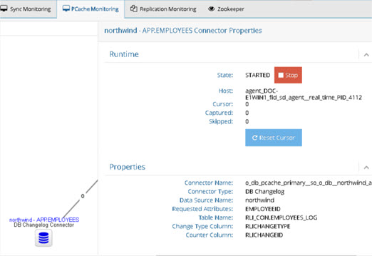
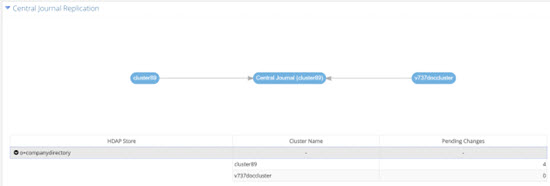
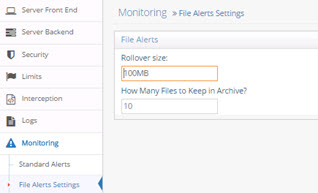
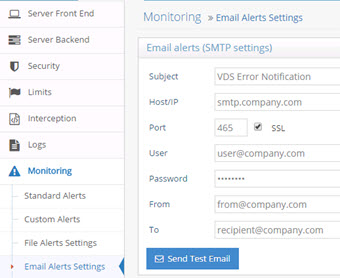

# PCache Monitoring Tab

The PCache Monitoring Tab can be used to monitor periodic and real-time persistent cache refresh.

On the PCache Monitoring Tab, a list of cache refresh topologies appears on the left. 

 is the symbol for a real-time refresh.

 is the symbol for a periodic refresh.

When you select a real-time refresh topology, the persistent cache refresh components are shown on the right where you can see the number of messages processed by each component. Clicking on a component allows you to see the status and access the properties. 

 
Figure 1: PCache Monitoring Tab – Real-time Refresh

When you select a periodic refresh topology, the persistent cache refresh components are shown on the right. The arrow between the periodic refresh process and the target cache indicates the numbers of insert, update, and delete operations that were processed. By clicking on the line, you can see the total numbers processed per operation type.

 
Figure 2: PCache Monitoring Tab – Periodic Refresh

From the Tools menu, you can start and stop the persistent cache refresh process.

Click the Logs menu to display the logs section at the bottom of the topology. From here you can view the logs associated with the components in the topology.

To enlarge the displayed topology, click  in the upper-right.

To reduce the size of the displayed topology, click  in the upper-right.

To automatically organize the display for all objects associated with the topology, click  in the upper-right.

For details about configuring persistent cache with periodic and real-time refresh, see the RadiantOne Deployment and Tuning Guide.

## Replication Monitoring Tab

RadiantOne Universal Directory (HDAP) stores across clusters support multi-master replication. This type of replication is referred to as inter-cluster replication. The state of inter-cluster replication can be monitored from the Replication Monitoring Tab.

### Central Journal Replication

The default, recommended replication model for RadiantOne Universal Directory (HDAP) stores is based on a publish and subscribe methodology. When writes occur on a site, the leader node publishes the changes into a central journal. The leader nodes on all other sites pick up the changes from the central journal and update their local store. These changes are then automatically replicated out to follower/follower-only nodes within the cluster. For more details on inter-cluster replication, please see the RadiantOne Deployment and Tuning Guide.

If inter-cluster replication is enabled, the clusters that are participating in replication can be viewed in the Central Journal Replication section. The topology depicts the connectivity between the clusters and the cluster housing the replication journal. If a red line is visible, this indicates a connection problem between a cluster and the replication journal.

More than one store per cluster can be participating in inter-cluster replication. The table shown in the Central Journal Replication section lists each store involved in replication. Then, for each cluster, the table shows the number of pending changes. An example is shown below.

 
Figure 3. 159: Replication Monitoring

## Push Mode Replication

To address a very small subset of use cases, namely where a global load balancer directs client traffic across data centers/sites, where the inter-cluster replication architecture might be too slow, you have the option to enable an additional, more real-time replication mode where changes can be pushed directly to intended targets. For example, an update made by a client to one data center might not be replicated to other data centers in time for the client to immediately read the change, if the read request it sent to a different data center than the update was. This is generally not an ideal load distribution policy when working with distributed systems. Load balancing is best deployed across multiple nodes within the same cluster on the same site/data center.

In any event, to address scenarios like this, a push replication mode can be used to send the changes directly to the intended targets. The targets must be other RadiantOne servers defined as LDAP data sources. For more details on Push Mode Replication, please see the RadiantOne Deployment and Tuning Guide.

If push mode replication is enabled, the clusters that are participating in replication can be viewed in the table in the Push Mode Replication section. The table lists, for each RadiantOne Universal Directory (HDAP) store, the clusters involved in replication. The source cluster, target cluster and connectivity status between them is shown.

# Monitoring and Alerts

When monitoring RadiantOne, you can configure alerts. These alerts may be in the form an email and/or logging to a file. These options are described in this section and can be configured from the Main Control Panel > Settings Tab > Monitoring section.

## Standard Alerts

Standard alerts come pre-configured for some of the most monitored aspects of RadiantOne which are: RadiantOne memory, connections, disk usage, disk latency, processing activity and data source availability. Some standard alerts are enabled (for File output) by default and the others can be enabled from Monitoring > Standard Alerts. 

For details on the standard alert options, please see the RadiantOne Monitoring and Reporting Guide.

## File Alert Settings

File alerts are enabled by default for some standard alerts which are associated with: RadiantOne memory, disk usage, and disk latency. These settings are in the Monitoring > Standard Alerts section.

File alerts can be enabled for custom alerts also. These settings are in the Monitoring > Custom Alerts section.

File alerts are logged in a CSV formatted file named alerts.log.

In the File Alerts Settings section, indicate a rollover file size and how many files to keep in the archive.

Figure 4: File Alert Settings

## Email Alert Settings

If you would like to receive email alerts for certain monitored activities, enter your SMTP settings (host, port, user, password, from email and to email) in the Email Alerts (SMTP Settings) section. Click Save when finished. If you would like to test your settings, click on Send Test Email. 

Figure 5: Email Alert Settings

>[!note] 
>For security and audit purposes, it is not advised to connect to your mail server anonymously (leaving user and password properties blank in the Email Alert Settings).**

## Custom Alerts

Standard Alerts are configured by default and are described in the one of the sections above. All other aspects of RadiantOne that you want to monitor can be configured as custom alerts in the Monitoring > Custom Alerts section. For details on custom alerts, please see the Monitoring and Reporting Guide.

>[!note] 
>This section is accessible only in [Expert Mode](01-introduction#expert-mode). 
